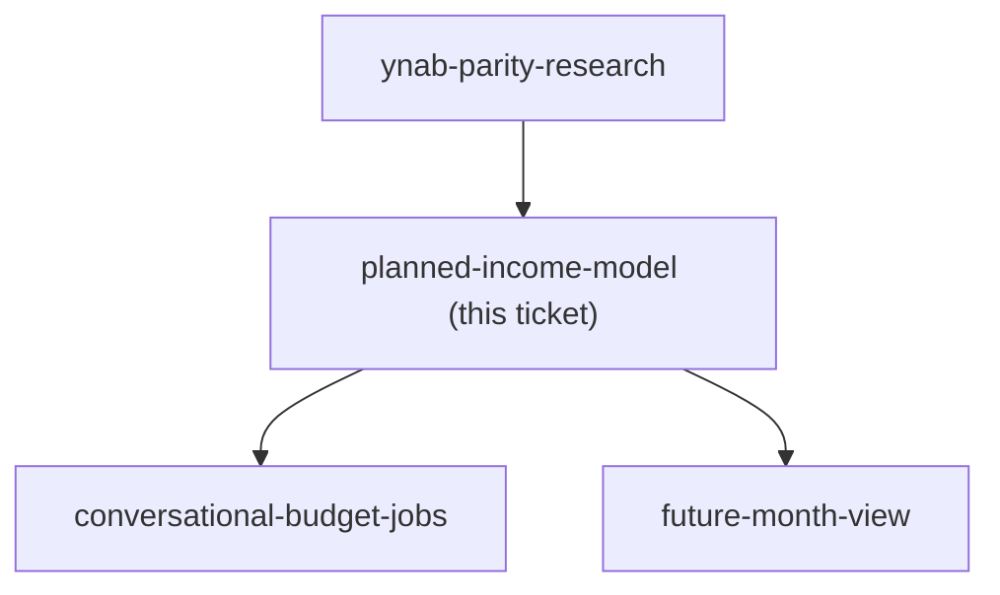

## Question

A future month needs to answer "salary X expected, Y budgeted, Z left" before the salary has arrived - which YNAB deliberately refuses to do. Decide how expected income is stored: a per-month figure per family, or a recurring salary rule that generates months, and does it carry an expected date? Decide the hard boundary: planned income must never enter the real current-month Ready-to-Assign, so what exactly does it feed, what happens to the planned figure when the actual salary transaction lands (is it reconciled, replaced, or left to drift), and what happens to a future month's assignments if the salary is smaller than planned or never arrives?

<!-- decision-map:graph:start -->

<!-- decision-map:graph:end -->
