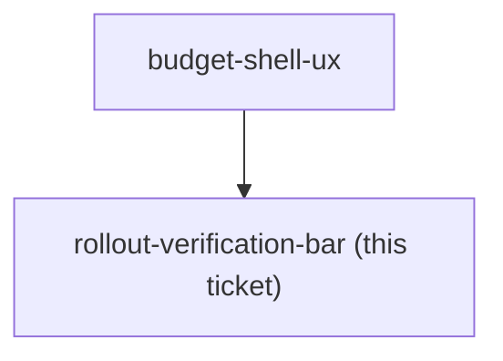

## Question

The destination is working in prod, prod deploys on push to main, and CLAUDE.md is explicit that the frontend has no component or visual test harness and that the review gates are blind to visual fidelity. Decide the verification bar for this rework: which Playwright specs must exist and pass before each increment ships, whether the four existing budget specs are enough or must be extended, what money-rule cases must have backend unit tests, and how a UI increment is checked against its approved mock before merge. Decide whether the rework ships incrementally behind the existing screens or lands as one switch-over, and how it gets rolled back if a money number turns out wrong in prod.

<!-- decision-map:graph:start -->

<!-- decision-map:graph:end -->
