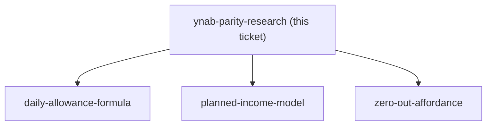
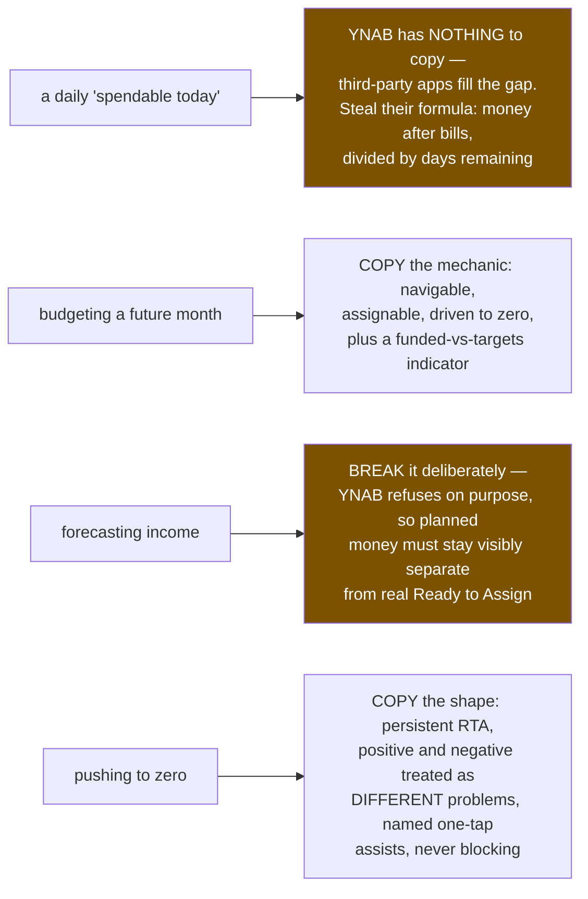

## Question

For the three things issue #99 asks for, document what YNAB itself actually does and why: (a) any 'available to spend' / daily-style number and how YNAB frames spending pace, (b) budgeting into future months before the income has arrived - what YNAB permits, what it refuses, and the reasoning behind the refusal, (c) how YNAB pushes you to zero (rule one), including what it shows when Ready-to-Assign is negative or positive. For each, state whether MenuNest should copy it, adapt it, or deliberately differ - given that MenuNest has already decided to model planned income, which YNAB refuses to do.

<!-- decision-map:graph:start -->

<!-- decision-map:graph:end -->

<!-- decision-map:resolution:start -->
## Resolution

Copy YNAB's future-month mechanic and its zero-out shape; break its no-forecast-income rule deliberately. It has no daily allowance to copy at all.

# Findings — YNAB parity: what to copy, what to deliberately break

Grounded on YNAB's own support docs (linked at the bottom), not recollection,
for the two claims that actually constrain #99.

## (a) A daily "spendable today" number — YNAB does not have one

There is no daily allowance feature in YNAB. Its pacing signals are per-category
`Available`, target progress, and the Inspector; the old *Age of Money* metric was
its closest thing to a pace signal and is not a daily figure. Searching YNAB's own
domain for a daily/safe-to-spend feature returns nothing; what turns up instead is
a cluster of **third-party apps built to fill exactly this gap** — SafeToSpend,
Neverbroke, Lumy for YNAB.

**The common third-party formula is worth stealing as a starting point:** money
left *after bills are covered*, divided across the days until the next paycheck.
Two things in it are decisions MenuNest must make explicitly:

1. It excludes bill-type envelopes. A daily number computed over *all* envelopes —
   including Rent and savings — is not spendable and will be wrong every month.
   `daily-allowance-formula` has to decide how that subset is chosen (a flag on the
   category? the group? a target type?).
2. It divides by **days until the next paycheck**, not days until month-end. #99
   has already fixed the budget month as the calendar month, so MenuNest's divisor
   should be days remaining in the calendar month — but note the divergence: the
   third-party consensus is that a paycheck cycle is the honest denominator.

**Verdict: nothing to copy. This is a deliberate addition, and the formula ticket
is genuinely open — there is no reference implementation to defer to.**

## (b) Budgeting into future months — YNAB permits it, but refuses forecast income

This is the sharpest constraint on the map, and both halves matter.

**What YNAB permits.** Future months are fully navigable and assignable. The
documented "get a month ahead" flow is: fund the current month to the end, switch
to the next month, and *keep assigning until Ready to Assign is $0.00 there*.
There is an "Assigned in Future Months" surface, and a per-month **pie icon showing
progress toward fully funding that month based on its targets**, filling as you
assign, with a checkmark at fully funded.

**What YNAB refuses.** The rule is stated flatly in their docs:

> "When using YNAB, you only assign the dollars you have on hand right now."

You do not assign future income. You assign *existing* money *to* future months.
Scheduled future income transactions do not appear in Ready to Assign.

**So #99 breaks YNAB deliberately.** "ตั้งค่า budget เดือนล่วงหน้า ว่าเงินเดือนออก
เท่าไหร่" is precisely the thing YNAB is designed to prevent, and the reason it
prevents it is real: budget against a salary that arrives smaller or later and every
downstream envelope is a lie, silently, with no signal.

**Recommendation for `planned-income-model` and `future-month-view`:**

- **Copy the mechanic**: a future month is navigable, assignable, and shows its own
  RTA that you drive to zero.
- **Copy the progress affordance**: the per-future-month funded-vs-targets
  indicator is a cheap, proven way to answer "budget แล้ว เหลือเท่าไหร่" at a glance.
- **Break the rule, but pay for it**: planned income must be a *visibly different
  kind of money* from real Ready to Assign — a separate line, separate treatment,
  never summed into the current month's RTA. The chart-time decision already says
  "kept separate"; YNAB's reasoning is why that separation is load-bearing rather
  than cosmetic.
- **Decide the reconciliation explicitly**: what happens when the real salary lands
  and differs from the plan. YNAB never has to answer this because it never
  forecasts. MenuNest does, and if that answer is left implicit the forecast will
  drift permanently out of sync with reality.

## (c) Pushing to zero — copy it almost exactly

YNAB's Ready to Assign (formerly To Be Budgeted) sits at the top of the plan,
always visible, and the target state is explicitly $0.00 — the future-month flow
above is worded as "assign until Ready to Assign is $0.00". Positive and negative
are treated as **different problems**, not one number with two colours: positive is
"you have money to give a job", negative is "you assigned more than you have" and
must be fixed. Neither state blocks you from using the app.

Its assist is a set of one-tap auto-assign choices — underfunded, assigned last
month, average assigned, reset available — rather than a single "do it for me"
button.

**Recommendation for `zero-out-affordance`:** this matches the chart-time decision
("loud but not blocking") almost exactly, so copy the shape: persistent RTA at the
top, distinct positive/negative treatments, and a small menu of named one-tap
suggestions rather than one opaque action. MenuNest already has `QuickAssignChips`
and `SuggestedFixCard` — that ticket should decide whether they are the basis for
this or get replaced, not design from zero.

## Caveat

YNAB ships UI changes continuously and its terminology has already moved once
(To Be Budgeted → Ready to Assign). The **rules** above are documented and stable;
specific wording and icon behaviour should be re-checked against the live product
before any of it is used as a literal design constraint.

## Sources

- [Getting a Month Ahead in YNAB: A Guide](https://support.ynab.com/getting-a-month-ahead-HJidy13C5)
- [Assigning Future Income in YNAB](https://support.ynab.com/en_us/assigning-future-income-an-overview-BJsTo0jCq)
- [Assigning Your Money in YNAB](https://support.ynab.com/en_us/assigning-your-money-a-guide-SypgkrNJi)
- [When the Month Rolls Over in YNAB](https://support.ynab.com/en_us/when-the-month-rolls-over-a-guide-rkyyd6qC9)
- [The Inspector in YNAB](https://support.ynab.com/en_us/the-inspector-an-overview-ryylY7OCq)

<!-- decision-map:resolution:end -->
