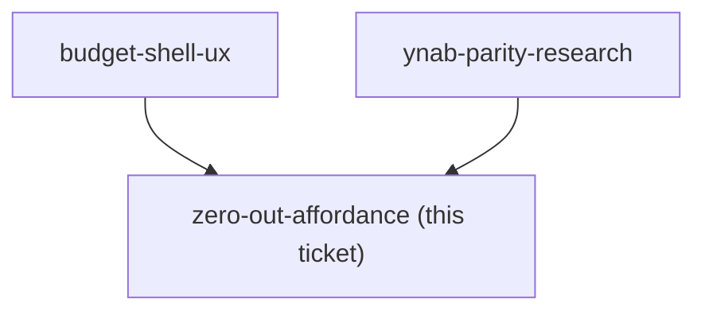

## Question

Zero-based budgeting is loud but never blocking - the user can always walk away with RTA non-zero. Decide what "loud" concretely is: what changes on screen when RTA is positive, and separately when it is negative (they are different problems); whether it follows the user off the budget page; and what the one-tap suggestions for placing a remainder actually suggest - underfunded targets, last month's pattern, or something else. Decide what happens at the moment RTA reaches exactly zero. Note there is a SuggestedFixCard and QuickAssignChips in the codebase already - decide whether they are the basis for this or are replaced.

<!-- decision-map:graph:start -->

<!-- decision-map:graph:end -->
