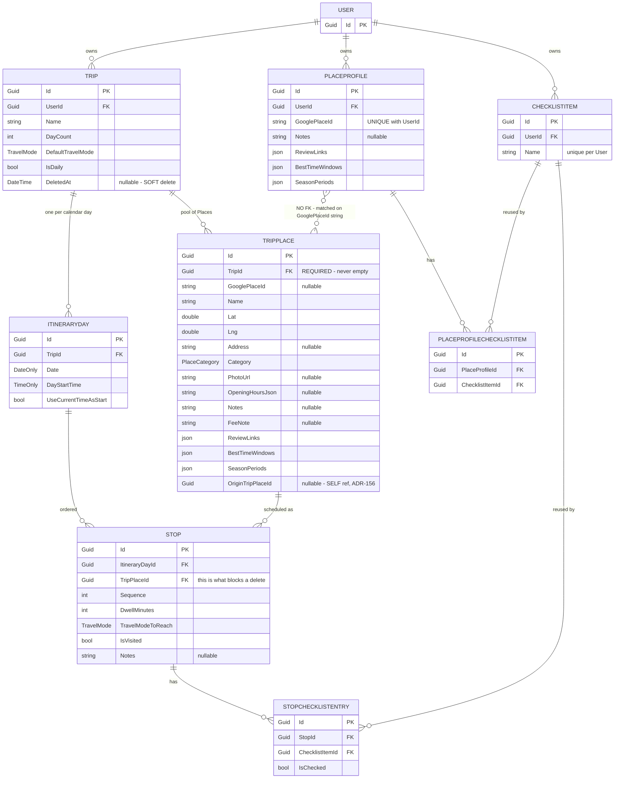

# Discover place delete — the current model, as evidence

**Date:** 2026-08-14
**Status:** Evidence gathered while charting a Decision map. **Decides nothing.**
**Why this exists:** the owner's objection — *"group places to show in discover is not
right way, we will need delete functionality for this discover too"* — is a claim about
the data model, so the model is written down here before any option is weighed.
**Read against:** `CONTEXT.md` (**Place**, **Trip**, **Stop**, **Place library**,
**Discover**, **Place profile**), ADR-147, ADR-155, ADR-156, ADR-063, ADR-065.

Everything below was read off `main` at `85b39fe`, from the entity classes in
`backend/src/MenuNest.Domain/Entities/` and `ListMyPlacesHandler`. No field is inferred.

---

## 1. The schema as it stands



Three properties of that picture matter more than the rest:

- **`Trip.DeletedAt` is the only soft delete in the whole diagram.** Everything else —
  `TripPlace`, `Stop`, `StopChecklistEntry` — is removed with `_db.X.Remove(...)`, which
  is a real `DELETE`.
- **`TripPlace.TripId` is required.** `TripPlace.Create` refuses an empty `TripId`, so a
  **Place** cannot exist outside a **Trip**. This is ADR-155, and it is the root of
  everything on this page.
- **`PlaceProfile` has no FK to `TripPlace`.** The two are joined on the
  `GooglePlaceId` *string*, in memory, at read time. So a Place with no `place_id` can
  reach no profile at all (ADR-148), and destroying every `TripPlace` row leaves the
  profile untouched (ADR-065, deliberate).

Note also there is **no `TripPlace` ↔ `ChecklistItem` edge**. A **Place checklist entry**
hangs off the **Stop** (`StopChecklistEntry`), not off the Place. Destroying a Stop
therefore destroys its **Checked** flags with it.

## 2. What one Discover pin actually is

No table holds "หอพักระยอง ฟอเรสท์". There are only N `TripPlace` rows that happen to
share a `GooglePlaceId`, collapsed in memory every time Discover is read
(`ListMyPlacesHandler`, one `GroupBy`).

```
  DATABASE                                DISCOVER  (read time only)

  TripPlace #a1                    ┐
   TripId → เที่ยวกาญจนบุรี          │
   GooglePlaceId = ChIJxyz          │
                                    │   GroupBy( GooglePlaceId
  TripPlace #b2                     ├──▶     ?? "tp:" + OriginTripPlaceId )
   TripId → ทริปญี่ปุ่น              │              │
   GooglePlaceId = ChIJxyz          │              ▼
                                    │      ┌─────────────────┐
  TripPlace #c3                     │      │ 📍  ONE pin     │
   TripId → ไปทะเล                  ┘      │ key = ChIJxyz   │
   GooglePlaceId = ChIJxyz                 │ trips[ 3 ]      │
                                           └─────────────────┘
                                     #a1 / #b2 / #c3 ids are NOT
                                     in the response at all
```

`DiscoverPlaceDto` carries `key` (a string), `trips[{tripId, tripName}]` and one
`originTripPlaceId`. It carries **no per-Trip `TripPlace` id**.

**That is the mechanical reason a delete button cannot be written today.** `PlaceSheet`
has no `placeId` to put into the existing
`DELETE /api/trips/{tripId}/places/{placeId}`.

## 3. The three edges that make "delete" hard

| # | Edge | Consequence |
|---|---|---|
| 1 | `TripPlace.TripId` **required** | A Place has no identity outside a Trip → one physical spot is N rows → Discover must group → the pin has no id. **This is the edge the owner is objecting to.** |
| 2 | `Stop.TripPlaceId` | `DeleteTripPlaceHandler` **refuses** when any Stop references the row: *"ลบไม่ได้ — สถานที่นี้ถูกจัดลงตารางแล้ว ลบจุดในแผนก่อน"*. Most Places on Discover are scheduled, so a naive reuse refuses almost every time. |
| 3 | `PlaceProfile` joined by string, no FK | Delete every `TripPlace` row and the **Place note**, **Review link**s, **Best-time window**s and **Season period**s all survive (ADR-065). The pin disappears; the data does not. |

Edges 2 and 3 stay whatever is decided about edge 1.

## 4. How edge 1 got there — this decision was already made twice

| Date | ADR | What was decided |
|---|---|---|
| 2026-08-04 | **ADR-147** | A captured Place lives in a **new user-scoped `SavedPlace`** — a Place with no Trip. Option E, "force the user to pick or create a trip", was **rejected**. |
| 2026-08-11 | **ADR-155** | The owner **reversed it**: *"ให้สร้างทริป ต้องผูกกับทริป"*, *"บังคับจริง — กลับคำ #54"*. `SavedPlace` was never built. Rejected option E became the chosen path. |
| — | **ADR-156** | The grouping key then needed a patch — `OriginTripPlaceId` — so a Place with no `place_id` keeps one identity across two Trips. |

ADR-155 lists **zero schema change and zero migration** as its headline benefit, and
notes that it *"dissolves"* the map's migration/backfill fog line rather than answering
it. Re-opening edge 1 brings that migration back.

## 5. The open question, as three screens

### A — do not group: one row = one pin

```
 ┌─ MAP ──────────────────────────────┐
 │   📍 หอพักระยอง ฟอเรสท์            │
 │   📍 หอพักระยอง ฟอเรสท์  ← stacked │
 │   📍 หอพักระยอง ฟอเรสท์  ← 3 Trips │
 └────────────────────────────────────┘
 ┌─ SHEET ────────────────────────────┐
 │ หอพักระยอง ฟอเรสท์                 │
 │ [🧳 เที่ยวกาญจนบุรี]                │
 │ [🗑 ลบจุดนี้]   ← this row only     │
 └────────────────────────────────────┘
```

Honest to the model. Delete needs no question. But the map grows stacked pins for every
place saved twice — which is what grouping was added to prevent.

### B — keep one pin, ask which Trip at delete time

```
 ┌─ SHEET ────────────────────────────┐
 │ หอพักระยอง ฟอเรสท์                 │
 │ [🧳 เที่ยวกาญจนบุรี] [🧳 ทริปญี่ปุ่น]│
 │ [🗑 ลบจุดนี้]                        │
 │   └→ เอาออกจากทริปไหน?              │
 │      ○ เที่ยวกาญจนบุรี               │
 │      ○ ทริปญี่ปุ่น                   │
 │      ○ ทุกทริป (2)                   │
 └────────────────────────────────────┘
```

Clean map, no model change, no migration. Needs only that `ListMyPlaces` also return the
per-Trip `TripPlace` id. Cost: one extra question on every delete.

### C — rebuild edge 1: a Place becomes the User's, not the Trip's

```
 ┌─ SHEET ────────────────────────────┐
 │ หอพักระยอง ฟอเรสท์                 │
 │ อยู่ในทริป: เที่ยวกาญจนบุรี, ญี่ปุ่น  │
 │ [🗑 ลบจุดนี้]                        │
 │   └→ ลบออกจากคลัง — หลุดทุกทริป      │
 └────────────────────────────────────┘
```

One pin because it genuinely is one row. Delete asks nothing. Cost: a new entity, a
`DbSet<>` on **all three** `IApplicationDbContext` implementers, an EF migration that
this repo applies **by hand** (issue #49 took Trips down by skipping that step), and a
backfill of every existing `TripPlace` — omit the backfill and the whole **Place
library** vanishes from Discover.

### The stake, made concrete

The same hotel is saved in **เที่ยวกาญจนบุรี** and in **ทริปญี่ปุ่น**. Today you press
delete on Discover.

- **A** — one pin goes, two remain in place. Three presses to be rid of it.
- **B** — you are asked which Trip. You keep control, but you must answer.
- **C** — it leaves both Trips at once. ทริปญี่ปุ่น loses a Stop without you opening it.

---

**Not decided here.** This page is the evidence the decision is made against. The choice
between A, B and C is the first ticket of the Decision map, and every other ticket —
what the confirmation says, whether a scheduled Stop blocks or cascades, whether the
**Place profile** survives — waits on it.
