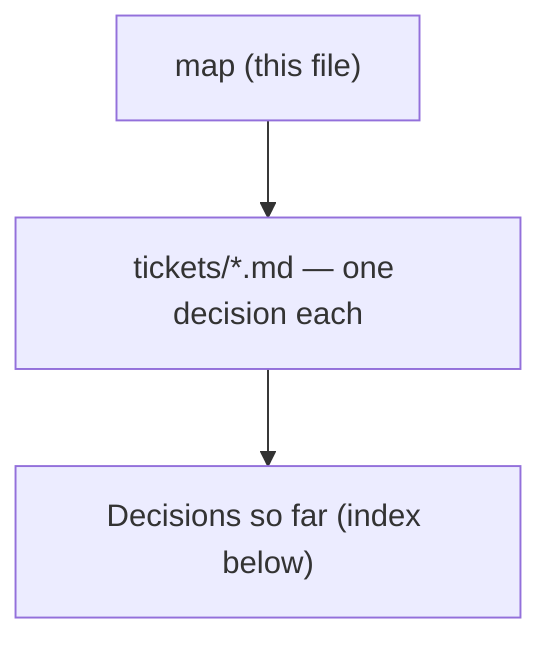

# Decision map - shortcut rail with undo/redo on the budget page (#106)

## Destination
The budget page carries a shortcut rail with working undo and redo, shipped to prod and matching a mock the user approved, built so trips and meal-plan can adopt the same rail later.

## Notes

<!-- decision-map:notes:start -->
- Tracking issue: https://github.com/ThodsaphonSonthiphin/MenuNest/issues/106 - every commit references it per CLAUDE.md, and new ADRs are named menunest-<number>-<slug>.md.
- The issue body is one annotated phone screenshot: a red sketch of ~3 stacked buttons down the RIGHT edge of /budget, beside the still-to-place card and the quick-assign chips. The title asks for shortcut buttons 'such as undo redo' and for a design.
- Settled at chart time and binding on every ticket: undo AND redo both; on-screen rail AND desktop Ctrl+Z / Ctrl+Shift+Z; budget page first but architected so other pages can adopt it; the destination is prod, not a design doc.
- There is NO undo infrastructure today - no audit, event or history entity anywhere in MenuNest.Domain/Entities. The only 'undo' is TransactionUndoToast.tsx, a 5-second delay-the-delete toast used on AccountDetailPage; it withholds the write rather than reversing a committed one.
- Already installed, so a library decision does not have to mean a new dependency: @syncfusion/ej2-buttons 33.1.49 ships Fab and SpeedDial (with RadialSettings), and @dnd-kit/core+modifiers+sortable+utilities is already used for drag-reorder in frontend/src/pages/trips.
- Gap to check before committing to Syncfusion: @syncfusion/react-buttons exposes a React floating-action-button but NO React SpeedDial wrapper, so a SpeedDial means mounting the vanilla EJ2 class by hand or adding @syncfusion/ej2-react-buttons.
- .bdg-fab is defined in BudgetPage.css but rendered only by AccountDetailPage.tsx - /budget itself has no FAB, so the bottom-right corner is free there and occupied on account-detail.
- Budget mutations a rail would have to reason about: set assigned amount, move money, cover overspending, quick-assign (fill targets / equally), transaction create/edit/delete, account CRUD.
- CLAUDE.md: the frontend has NO component/visual test harness, so tsc + build + vitest cannot catch a rendering bug. Any UI decision here must be verified interactively or against a docs/mocks/ file, and a new UI surface needs at least a smoke Playwright spec before it ships. Prod deploys on push to main.
- Slot rule, binding on every later ticket (menunest-191): a button earns a Shortcut rail slot ONLY by acting on the user's own recent acts. Everything else stays where its context already lives, because the existing one-tap controls know which Envelope is meant and a floating copy would have to ask. The rail is three slots - undo, redo, change history - and that is the whole rail.
- CONTEXT.md now defines Shortcut rail and Change history. Change history is deliberately NOT the /budget/transactions list (that holds only Budget transactions) and NOT the Budgeting event of menunest-181/185 (that names only the three acts re-freezing the Daily allowance). Use the glossary terms.
- Rail shape is settled and binding on mock-signoff and build-ship (menunest-192): ONE button resting bottom-right, tap expands three items vertically upward, NOT draggable, hides on scroll down and returns on scroll up or after ~1s idle. Two guards are part of the decision, not detail - it never hides while the dial is open, and it returns on idle so it cannot be lost mid-flick.
- Syncfusion SpeedDial has NO hide-on-scroll of its own, so that behaviour is roughly twenty lines MenuNest owns on top of the component library-choice picked. It does not overturn library-choice; it does add to build-ship. position=BottomRight and mode=Linear direction=Up ARE the component's own properties, so the corner and the expansion need no custom positioning.
- The rail-interaction prototype is at https://claude.ai/code/artifact/21ac73e6-a87a-4dbb-a3a5-70555a8e0202 - a throwaway grilling aid built on the app's own tokens, NOT the mock. mock-signoff still owes a docs/mocks/ file for the build to be diffed against.
- The approved mock is docs/mocks/budget-shortcut-rail-mock.html - three states plus a spec table of exact px, tokens, shadows and transforms. build-ship diffs its CSS against THAT table before merge. TRAP: do NOT diff against the older docs/mocks/budget-redesign-mock.html, which predates the current CSS and is dark-first with a different accent (#6366f1 vs the shipped #4f46e5); anyone comparing to it will chase a colour difference that is not a defect.
- YNAB precedent, live-verified 2026-08-29 and binding input for reversible-actions and change-history-view (NOT a decision - nobody has chosen it): YNAB undoes money movements and assignments and does NOT undo transactions; its iOS Recent Moves page lets you swipe left to undo ANY recent move, not only the last; redo is 'undo your undo', one step, not a long forward list; and it cannot restore a budget to a date. MenuNest copies YNAB deliberately, so departing from this needs a stated reason.
- TRAP for the SPA: RTK Query's api.util.updateQueryData(...).undo() is NOT user-facing undo. It rolls the cache back when a REQUEST FAILS. Same word, different job. Do not build the Undo button on it.
- Deleting a Budget transaction is a HARD delete today - DeleteTransactionHandler does _db.BudgetTransactions.Remove(tx) - while Trip, Drug, Photo and WritingEntry all carry a soft-delete flag. So undoing a delete would create a NEW record with a NEW id unless the model changes. This is the single most expensive fact on the map for reversible-actions.
- A 12-step interactive walkthrough of the mechanism is at docs/problem-description/2026-08-29-undo-redo-walkthrough.html - built because a text explanation failed once. Hand it to anyone who has to pick up this map cold.
- Storage is settled and binding on change-history-view and build-ship (menunest-194): a NEW server-side entity keyed to the Family, holding a window of min(7 days, since the 1st of the budget month) - a HARD cut at the month start, so an undo can never reach into a month already left. Per CLAUDE.md the new DbSet must be added to all THREE IApplicationDbContext implementers with its EF configuration in the SAME commit, and the migration applied to prod BY HAND.
- The project already runs hosted background services - MenuNest.Infrastructure/BackgroundServices/FollowUpDispatcher.cs - so pruning expired history rows can be a real scheduled delete rather than only a read-time filter. Implementation choice, not a decision.
- Change history is a SHEET over /budget on the existing budget-modal-overlay / budget-modal scaffolding (menunest-195), not a route. Every row carries its own Undo AND Redo, undo is not last-in-first-out, and an undone row stays on the list marked so it can be redone. An out-of-order undo may leave an Envelope negative and that is allowed - Overspent is already a first-class state in this app.
- One INFERENCE is riding on menunest-195 and is flagged there rather than asserted: that an undone row stays visible. Nobody stated it; it follows from per-row redo having nowhere to live otherwise. Cheap to overturn - do not treat it as a settled user answer.
- SUPERSEDES the earlier hard-delete note above. menunest-196 put transactions OUT of undo's scope, so the BudgetTransaction hard delete is no longer a problem this map has to solve: no soft-delete flag, no migration, no filter on every transaction query. The earlier line calling it 'the single most expensive fact on the map' is now false and stays only because chart is additive and never deletes.
- Undo's scope is settled and binding on stale-undo and build-ship (menunest-196). IN: set assigned amount, move money, cover overspending, quick-assign, everyday marks. OUT: Budget transaction create/edit/delete, balance correction (it IS a Budget transaction), and account / Envelope / group CRUD. Quick-assign is ONE history row that reverses every envelope it touched, not N rows.
- Departure from YNAB, with its reason on the record: everyday marks are undoable although YNAB has no equivalent. Marking an Everyday envelope is a Budgeting event (menunest-181), so a stray toggle silently re-freezes the Daily allowance, and its inverse is a single boolean.
- Staleness is settled and MUCH smaller than the map once feared (menunest-197). Only ONE case survives: the Envelope was deleted. A concurrent change by another Family member is NOT staleness - menunest-193 chose compensating writes precisely so 'subtract 300' stays correct whatever the figure is now. Do not re-open that as a problem.
- DeleteCategoryHandler refuses to delete an Envelope holding any Budget transaction ('hide it instead') and otherwise removes the Envelope WITH every MonthlyAssignment on it - so the money is already back in Ready to Assign and a naive undo would remove it TWICE. That is why a dead row is disabled rather than best-effort.
- Accepted rough edge for build-ship (menunest-197): the rail's Undo button can look pressable and then refuse, because the budget page does not carry the top history row's state. The Change history sheet does not have this problem - the server marks each row undoable at load.
- menunest-198 creates MenuNest's FIRST permission distinction. Before it, the app had none by explicit design - UserRelationship says outright that relationships have no effect on permissions, and Family.CreatedByUserId is never consulted for authorization anywhere. Every future feature now inherits a question it did not have: may the family head do this too?
- CORRECTS the whose-acts ticket's own text, which claimed the app has no notification mechanism. It has one: the REAL WebPushSender over VAPID is registered, not the NullWebPushSender placeholder, and FollowUpDispatcher drives it. What is missing is a general API - IWebPushSender exposes only SendFollowUpAsync(FollowUpPing). Notifying someone costs a new method on a working sender, not new infrastructure.
- Attribution on a history row is NOT new work: BudgetTransaction already carries CreatedByUserId and the transaction DTO already projects CreatedByDisplayName.
- Architecture is settled and binding on build-ship (menunest-199): a ShortcutRailProvider in AppLayout beside the ConfirmProvider already there, with the rail rendered in the shell and each page declaring its contents through a hook. A page that declares nothing gets no rail. Shared from day one: the shell, the expand, hide-on-scroll with its two guards, and the hook. NOT generalized: the slot contents (191), the history store (194/196), and the .bdg-fab corner.
- Two fog lines were DELETED BY HAND this session because they are now answered, not because they graduated into tickets. The concurrent-family-member line: menunest-193 chose compensating writes precisely so it is not a problem, and menunest-197 records that. The .bdg-fab collision line: menunest-199's opt-in means AccountDetailPage declares no rail, so nothing renders there and the fab is untouched.
- Keyboard is settled and binding on build-ship (menunest-200): Ctrl+Z and Cmd+Z both, INERT inside input/textarea/contenteditable and INERT while any budget dialog is open; the rail's labels show the binding on desktop widths only, platform-aware. Leaves EnvelopeCard's existing Escape=revert alone - Escape discards an edit not yet sent, Undo reverses one already committed.
- Build wrinkle handed to build-ship by menunest-200, deliberately not decided: 'is a dialog open' is NOT centrally known - the five budget dialogs are local useState inside their own components. Either the key handler checks the DOM for an open .budget-modal-overlay, or the dialogs register with the ShortcutRailProvider that menunest-199 adds anyway. The second is probably right for that reason.
- The desktop hide-on-scroll fog line below was written saying it had no obvious home. It has one now: build-ship is the only ticket left that could hold it, since keyboard-bindings is closed and is about key handling rather than scroll behaviour.
<!-- decision-map:notes:end -->

## Milestones

<!-- decision-map:milestones:start -->
- `rail-visible` see the button and press it open - rail UX decided and mocked, undo engine not yet built [library-choice, rail-contents, rail-interaction, mock-signoff]
<!-- decision-map:milestones:end -->

## Decisions so far

<!-- decision-map:decisions:start -->
#### rail-visible — see the button and press it open - rail UX decided and mocked, undo engine not yet built

- [Library - build the FAB and its expansion on Syncfusion, on dnd-kit, or by hand?](tickets/library-choice.md) — Syncfusion SpeedDialComponent - one new dep, but its CSS already ships via main.tsx:38. Not @dnd-kit: a free-floating FAB has no droppable.
- [Mock - produce the rail mock and get it signed off](tickets/mock-signoff.md) — Signed off: docs/mocks/budget-shortcut-rail-mock.html renders resting, expanded and hidden-on-scroll, with the exact CSS values build-ship is diffed against.
- [Rail contents - besides undo and redo, which shortcuts earn a slot?](tickets/rail-contents.md) — A history control, not a launcher: exactly three slots - undo, redo, change history - all working in v1, because every launcher candidate is already one contextual tap away.
- [Rail interaction - one button that expands, or an always-open rail, and can it be dragged?](tickets/rail-interaction.md) — One button bottom-right, tap expands the three items upward. Not draggable: it hides on scroll down instead, which solves the occlusion drag was for at none of drag's cost.

#### (unassigned)

- [Change history - what does the third slot show, and how far back?](tickets/change-history-view.md) — A sheet over /budget, not a route. Every row carries its own Undo and Redo, and an undone row stays on the list so it can be redone.
- [History - where does the undo/redo stack live, and does it survive a refresh?](tickets/history-storage.md) — A new server-side entity keyed to the Family, holding the last 7 days but hard-cut at the month start - so an undo can never reach into a month already left.
- [Keyboard - what do Ctrl+Z and Ctrl+Shift+Z do when focus is somewhere awkward?](tickets/keyboard-bindings.md) — Ctrl+Z and Cmd+Z fire on the budget page but are inert inside inputs and while any dialog is open. The rail labels show the binding on desktop only.
- [Architecture - how is the rail built so trips and meal-plan can adopt it without a rewrite?](tickets/rail-architecture.md) — A ShortcutRailProvider in AppLayout mirroring the ConfirmProvider already there; a page opts in via a hook. Opt-in also dissolves the .bdg-fab corner collision.
- [Reversible actions - which budget mutations join the undo stack, and which deliberately do not?](tickets/reversible-actions.md) — Undo covers five money-placement acts - assign, move, cover, quick-assign, everyday marks - and nothing else. Excluding transactions retires the hard-delete problem entirely.
- [Stale undo - what happens when the thing being undone is no longer there?](tickets/stale-undo.md) — Only one stale case survives the other ADRs - the Envelope was deleted. That row stays visible and disabled with its reason; the sheet checks at load, the rail button at press.
- [Undo - does it withhold a write that has not been sent, or reverse one already committed?](tickets/undo-semantics.md) — Undo sends the opposite write to the server, built from a command the app records when you act - never a restore of an old value. The 5-second delete toast is removed.
- [Whose acts - can one Family member undo another member's change?](tickets/whose-acts.md) — Change history shows every member's acts with names; you undo your own, the family head may undo anyone's. The head is a real transferable role - MenuNest's first permission distinction.
<!-- decision-map:decisions:end -->

## Not yet specified

<!-- decision-map:fog:start -->
- How a first-time user learns the rail exists at all - no evidence yet that discoverability is a real problem here.
- Whether undo/redo should also be reachable from the AI/MCP surface, or stay a UI-only affordance.
- Whether Change history should be reachable from anywhere other than the Shortcut rail - the month strip already carries a list icon to /budget/transactions, so two history-ish entry points may confuse rather than help.
- Whether the rail should hide on scroll on DESKTOP too, where Ctrl+Z exists, there is no thumb-reach problem and a mouse wheel scrolls for different reasons than a thumb flick. Small, but it has no obvious home yet - keyboard-bindings is about key handling and build-ship should not be inventing behaviour.
- Whether the recorded command line needs its own name in CONTEXT.md so reversible-actions, stale-undo and history-storage all say the same word for it - Change history already names the LIST, but not one entry in it.
- Whether the empty-history-on-the-1st consequence of menunest-194 needs any wording on screen, so a user opening Change history on the first of the month does not read it as a bug.
- Whether the Change history sheet covering the budget numbers actually bites in use - you press Undo and cannot see Ready to Assign move until you close it. menunest-195 names a partial bottom sheet as the escape, but the project has no such pattern and it would be new work.
<!-- decision-map:fog:end -->

## Out of scope

<!-- decision-map:scope:start -->
- Rolling the rail out to trips, meal-plan or health - budget only for this effort; those are a later effort with their own tickets.
- Re-architecting the domain into event sourcing or a general audit log.
- Undo for anything outside the budget feature.
- Replacing or removing the existing TransactionUndoToast delete flow on AccountDetailPage, unless a ticket here explicitly decides to.
- Putting launcher actions on the Shortcut rail - add transaction, move money, cover overspending, quick-assign, jump to today. Ruled out by menunest-191: each is already one CONTEXTUAL tap away, so a floating copy would be slower, not faster.
- A draggable rail, as issue #106 originally asked for - rejected by menunest-192 on prototype evidence, not taste: instant drag needs touch-action:none and kills scrolling from the button, hold-to-drag makes every deliberate drag slow, and a saved position lands off a narrower screen. Hide-on-scroll solves the occlusion it was meant to solve at none of that cost.
- Undoing an act performed in a previous budget month - made impossible by menunest-194's month cut, deliberately, to keep an undo from moving numbers the user considers settled.
- A /budget/history route - Change history is a sheet (menunest-195). Ruled out because opening a whole page from a floating button is a heavy gesture for a light correction, and the list is only days long.
- Undo for Budget transaction create / edit / delete, for a balance correction, and for account / Envelope / group create / edit / delete - all ruled out by menunest-196. A mistyped transaction is fixed by its own Edit button; a destructive structural act is guarded by a confirm dialog before it happens.
- Fixing quick-assign's non-atomic commit. QuickAssignDialog.tsx:122 already commits N sequential setAssigned requests with no batch endpoint and no transaction, so a failure at request 7 of 12 leaves the user half-assigned TODAY. Undo inherits this and adds none. It is a real pre-existing defect and deserves its own GitHub issue, not a ticket on this map.
<!-- decision-map:scope:end -->
