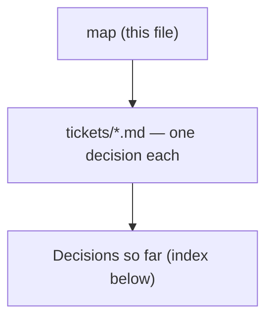

# Decision map - shortcut rail with undo/redo on the budget page (#106)

## Destination
The budget page carries a shortcut rail with working undo and redo, shipped to prod and matching a mock the user approved, built so trips and meal-plan can adopt the same rail later.

## Notes

<!-- decision-map:notes:start -->
- Tracking issue: https://github.com/ThodsaphonSonthiphin/MenuNest/issues/106 - every commit references it per CLAUDE.md, and new ADRs are named menunest-<number>-<slug>.md.
- The issue body is one annotated phone screenshot: a red sketch of ~3 stacked buttons down the RIGHT edge of /budget, beside the still-to-place card and the quick-assign chips. The title asks for shortcut buttons 'such as undo redo' and for a design.
- Settled at chart time and binding on every ticket: undo AND redo both; on-screen rail AND desktop Ctrl+Z / Ctrl+Shift+Z; budget page first but architected so other pages can adopt it; the destination is prod, not a design doc.
- There is NO undo infrastructure today - no audit, event or history entity anywhere in MenuNest.Domain/Entities. The only 'undo' is TransactionUndoToast.tsx, a 5-second delay-the-delete toast used on AccountDetailPage; it withholds the write rather than reversing a committed one.
- Already installed, so a library decision does not have to mean a new dependency: @syncfusion/ej2-buttons 33.1.49 ships Fab and SpeedDial (with RadialSettings), and @dnd-kit/core+modifiers+sortable+utilities is already used for drag-reorder in frontend/src/pages/trips.
- Gap to check before committing to Syncfusion: @syncfusion/react-buttons exposes a React floating-action-button but NO React SpeedDial wrapper, so a SpeedDial means mounting the vanilla EJ2 class by hand or adding @syncfusion/ej2-react-buttons.
- .bdg-fab is defined in BudgetPage.css but rendered only by AccountDetailPage.tsx - /budget itself has no FAB, so the bottom-right corner is free there and occupied on account-detail.
- Budget mutations a rail would have to reason about: set assigned amount, move money, cover overspending, quick-assign (fill targets / equally), transaction create/edit/delete, account CRUD.
- CLAUDE.md: the frontend has NO component/visual test harness, so tsc + build + vitest cannot catch a rendering bug. Any UI decision here must be verified interactively or against a docs/mocks/ file, and a new UI surface needs at least a smoke Playwright spec before it ships. Prod deploys on push to main.
<!-- decision-map:notes:end -->

## Milestones

<!-- decision-map:milestones:start -->
- `rail-visible` see the button and press it open - rail UX decided and mocked, undo engine not yet built [library-choice, rail-contents, rail-interaction, mock-signoff]
<!-- decision-map:milestones:end -->

## Decisions so far

<!-- decision-map:decisions:start -->
#### rail-visible — see the button and press it open - rail UX decided and mocked, undo engine not yet built

- [Library - build the FAB and its expansion on Syncfusion, on dnd-kit, or by hand?](tickets/library-choice.md) — Syncfusion SpeedDialComponent - one new dep, but its CSS already ships via main.tsx:38. Not @dnd-kit: a free-floating FAB has no droppable.
<!-- decision-map:decisions:end -->

## Not yet specified

<!-- decision-map:fog:start -->
- What undo means when another family member changed the same envelope in between - cannot be phrased sharply until undo-semantics lands.
- How a first-time user learns the rail exists at all - no evidence yet that discoverability is a real problem here.
- How the generalized rail coexists with the .bdg-fab already occupying the bottom-right corner of AccountDetailPage - needs rail-architecture first.
- Whether undo/redo should also be reachable from the AI/MCP surface, or stay a UI-only affordance.
<!-- decision-map:fog:end -->

## Out of scope

<!-- decision-map:scope:start -->
- Rolling the rail out to trips, meal-plan or health - budget only for this effort; those are a later effort with their own tickets.
- Re-architecting the domain into event sourcing or a general audit log.
- Undo for anything outside the budget feature.
- Replacing or removing the existing TransactionUndoToast delete flow on AccountDetailPage, unless a ticket here explicitly decides to.
<!-- decision-map:scope:end -->
