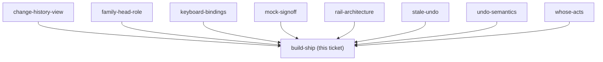

## Question

Implement the decided rail and the undo/redo engine, then ship to prod. Must include: a Playwright smoke spec for the rail on /budget (the only automatic gate that can catch a rendering bug, per CLAUDE.md), an interactive check on a real phone against the approved mock before pushing, and any EF entity plus its EF configuration landing in the SAME commit if history-storage chose a server-side store. Prod deploys on push to main, so the interactive check is not optional.

<!-- decision-map:graph:start -->

<!-- decision-map:graph:end -->

## Comment

## Split into three plans, and the first one is written

`build-ship` is not one session. From the eleven ADRs the work is a backend undo engine, a
family-head permission role, and a frontend rail plus history sheet - three subsystems, one
of which (the role) contains no budget code at all. Per `sp-writing-plans`' scope check, that
is three plans, not one.

| plan | scope | depends on |
|---|---|---|
| **1** | Budget change history + undo/redo engine (backend) | - |
| **2** | Family head role - `Family` field, `LeaveFamily` guard, `IWebPushSender` | - |
| **3** | Shortcut rail + Change history sheet (frontend) | 1 and 2 |

**Plan 1 is written:** `docs/superpowers/plans/2026-08-29-budget-undo-engine.md` - 8 tasks,
every step carrying real code, TDD throughout. It ships nothing visible, so every commit in it
is safe to deploy on push.

Plans 2 and 3 are deliberately NOT written yet: they will be sharper once plan 1's actual
shapes exist to reference.

### Two things plan 1 discovered that the ADRs did not say

- **The record must hold the DELTA, and `MonthlyAssignment.AdjustAmount(delta)` already
  exists.** `SetAssignedAmount` takes an ABSOLUTE amount, so the handler has to compute
  `newAmount - previous` itself. Recording the absolute would make undo a rollback, which
  menunest-193 forbids.
- **The FK from the history row to `BudgetCategory` must be `Restrict`, not `Cascade`**, or
  deleting an Envelope would delete the history row and menunest-197's "the row stays,
  disabled, saying why" becomes unreachable. The cost is a new guard in
  `DeleteCategoryHandler`: an Envelope with recorded history can no longer be deleted while
  that history is inside the window. That is a **behaviour change to an existing feature** and
  is flagged in the plan's self-review to go in the PR body.

### Claim released

This session wrote the plan; it did not build. The claim is cleared so `build-ship` returns to
the frontier for the sessions that execute plan 1.

