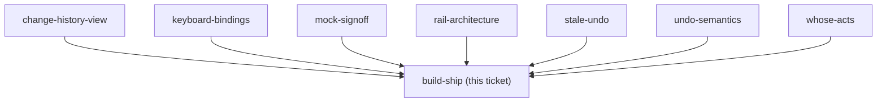

## Question

Implement the decided rail and the undo/redo engine, then ship to prod. Must include: a Playwright smoke spec for the rail on /budget (the only automatic gate that can catch a rendering bug, per CLAUDE.md), an interactive check on a real phone against the approved mock before pushing, and any EF entity plus its EF configuration landing in the SAME commit if history-storage chose a server-side store. Prod deploys on push to main, so the interactive check is not optional.

<!-- decision-map:graph:start -->

<!-- decision-map:graph:end -->
