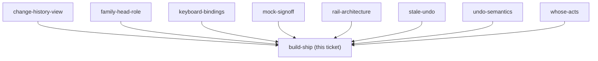
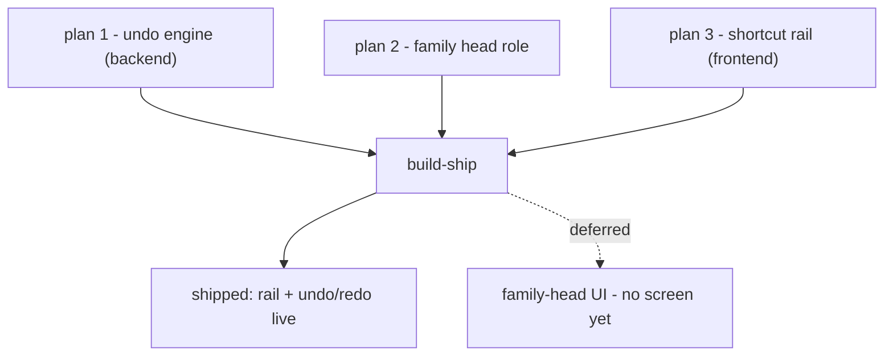

## Question

Implement the decided rail and the undo/redo engine, then ship to prod. Must include: a Playwright smoke spec for the rail on /budget (the only automatic gate that can catch a rendering bug, per CLAUDE.md), an interactive check on a real phone against the approved mock before pushing, and any EF entity plus its EF configuration landing in the SAME commit if history-storage chose a server-side store. Prod deploys on push to main, so the interactive check is not optional.

<!-- decision-map:graph:start -->

<!-- decision-map:graph:end -->

## Comment

## Split into three plans, and the first one is written

`build-ship` is not one session. From the eleven ADRs the work is a backend undo engine, a
family-head permission role, and a frontend rail plus history sheet - three subsystems, one
of which (the role) contains no budget code at all. Per `sp-writing-plans`' scope check, that
is three plans, not one.

| plan | scope | depends on |
|---|---|---|
| **1** | Budget change history + undo/redo engine (backend) | - |
| **2** | Family head role - `Family` field, `LeaveFamily` guard, `IWebPushSender` | - |
| **3** | Shortcut rail + Change history sheet (frontend) | 1 and 2 |

**Plan 1 is written:** `docs/superpowers/plans/2026-08-29-budget-undo-engine.md` - 8 tasks,
every step carrying real code, TDD throughout. It ships nothing visible, so every commit in it
is safe to deploy on push.

Plans 2 and 3 are deliberately NOT written yet: they will be sharper once plan 1's actual
shapes exist to reference.

### Two things plan 1 discovered that the ADRs did not say

- **The record must hold the DELTA, and `MonthlyAssignment.AdjustAmount(delta)` already
  exists.** `SetAssignedAmount` takes an ABSOLUTE amount, so the handler has to compute
  `newAmount - previous` itself. Recording the absolute would make undo a rollback, which
  menunest-193 forbids.
- **The FK from the history row to `BudgetCategory` must be `Restrict`, not `Cascade`**, or
  deleting an Envelope would delete the history row and menunest-197's "the row stays,
  disabled, saying why" becomes unreachable. The cost is a new guard in
  `DeleteCategoryHandler`: an Envelope with recorded history can no longer be deleted while
  that history is inside the window. That is a **behaviour change to an existing feature** and
  is flagged in the plan's self-review to go in the PR body.

### Claim released

This session wrote the plan; it did not build. The claim is cleared so `build-ship` returns to
the frontier for the sessions that execute plan 1.

<!-- decision-map:resolution:start -->
## Resolution

Shipped: rail, undo/redo and the head role are live in prod; the head has no UI yet

## Shipped to prod on 2026-08-29

All three plans are built, merged to `main`, deployed, and both migrations are applied
to the prod database by hand.

### What is live

| | |
|---|---|
| Rail | bottom-right, 3 slots, undo nearest the thumb (menunest-191/192) |
| Change history | sheet with per-row undo/redo, undone rows stay (menunest-195) |
| Undo | compensating write, never a rollback (menunest-193) |
| Window | min(7 days, since the 1st) - hard month cut (menunest-194) |
| Permission | family head may undo anyone (menunest-198/201) |
| Keyboard | Ctrl/Cmd+Z, inert in inputs and while a dialog is open (menunest-200) |
| Migrations | `AddBudgetChanges`, `AddFamilyHead` - both applied, backfill verified |

### The Playwright gate: it did not exist, and now it does

`playwright.config.ts` deliberately starts no backend. Budget specs written later assume a
real one, so they have failed on every run since 23 Aug - meaning CLAUDE.md's "only automatic
gate that can catch a rendering bug" was not actually running for /budget. The new spec is
mocked (`e2e/helpers/mockRoutes/budgetRoutes.ts`) and passes.

It immediately caught five defects that every other gate passed, all in the rail: the button
shipped Syncfusion's Material **pink** on an indigo page (equal specificity, lost on load
order); items painted raw text inside the 44px circle instead of an icon plus a label pill;
the gap to the main button was 22px not the mock's 12; `z-index: 40` copied from the mock put
the button UNDER the speed dial's own scrim; and the mobile rule hiding the keyboard hint
targeted a class the rendered markup does not contain.

**The general lesson, worth carrying to the next mockup-backed task:** a mock's numbers are
not self-applying when a component library positions and paints its own elements. Assert the
measured values in the e2e, not merely that something rendered.

### KNOWN GAP - the family head has no UI

`POST /api/families/head` and `FamilyMemberDto.IsHead` are live, but **nothing in the SPA
calls either** (verified: no `isHead` / `families/head` reference in `frontend/src`).

Consequence: menunest-201 rule 2 cannot be exercised by a user. The head is whoever the
backfill picked and **cannot be transferred**, because plan 3 was written before plan 2 and
scoped no screen for it. Prod today: 2 families, both headed by their creator.

This needs its own ticket: a head badge on the family screen, and a transfer control.

<!-- decision-map:resolution:end -->
