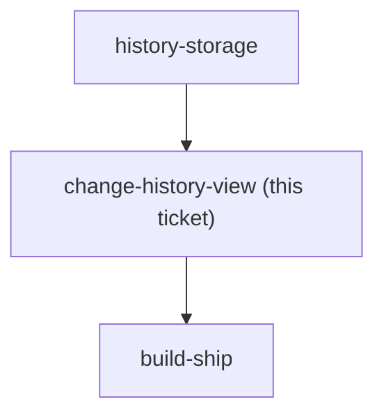

## Question

Shipping Change history in v1 (menunest-191) means building a screen that does not exist today. Decide what it lists and how far back it reaches. Concretely: does it show only acts the user can still undo, or every act including ones now beyond reach; does it cover only budget mutations or also transaction create/edit/delete; how far back does it go (a session, a day, the viewed month, forever); is each row itself actionable - tap to undo that specific act, or is it read-only with undo staying strictly last-in-first-out; and is it a full route like /budget/transactions or a sheet over the budget page. Note it is NOT the /budget/transactions list, which holds only Budget transactions - assigning, moving money and covering overspending appear in neither place today.

<!-- decision-map:graph:start -->

<!-- decision-map:graph:end -->

## Comment

## User input, 2026-08-29 — rows are individually actionable

Stated directly by the user while `undo-semantics` was being worked:

> "ควรมีให้กดเลือกได้ว่าจะรีดูหรืออันดูอันไหนเฉพาะในหน้า history"

So the Change history screen is **not** a read-only list, and undo is **not** strictly
last-in-first-out. Each row carries its own Undo / Redo, and the user picks the row.

This matches YNAB, which MenuNest copies deliberately: its iOS "Recent Moves" page lets
you swipe left to undo **any** recent move, not only the most recent one.

**Not yet decided, and this input creates it:** selective undo can produce a state a
strict stack never could. Undo entry #3 while #4 still stands, and #4 may depend on #3 -
assign B300 to an Envelope, then move B200 out of it, then undo only the assign, and the
Envelope lands at -B200.

MenuNest already renders an overspent Envelope as a first-class state (the budget page
carries an "Overspent" filter chip), so a negative result is displayable rather than
catastrophic - but whether to allow it, refuse it, or cascade the undo forward is an open
question this ticket owes.

Recorded as a comment rather than a resolution: this ticket is still blocked behind
`history-storage`, and nobody has claimed it.

## Comment

## User input, 2026-08-29 — an out-of-order undo may leave an Envelope negative, and that is allowed

Follow-up to the comment above. Selective undo can produce a state a strict stack never
could: assign B300 to an Envelope, move B200 out of it, then undo only the assign, and
the Envelope lands at -B200.

Put to the user with three options - allow it, refuse the row with an explanation, or
cascade the undo forward through everything after it.

Answer: **allow it.** The Envelope simply shows as overspent.

The reasoning offered and accepted: MenuNest already treats an overspent Envelope as an
ordinary, first-class state - the budget page carries an "Overspent" filter chip - so a
negative figure the user can see and fix themselves beats a row whose Undo button refuses
to work, or an undo that silently reverses acts the user did not select.

Still a comment, not a resolution: this ticket remains blocked behind `history-storage`
and unclaimed. Whoever claims it inherits these two answers.

