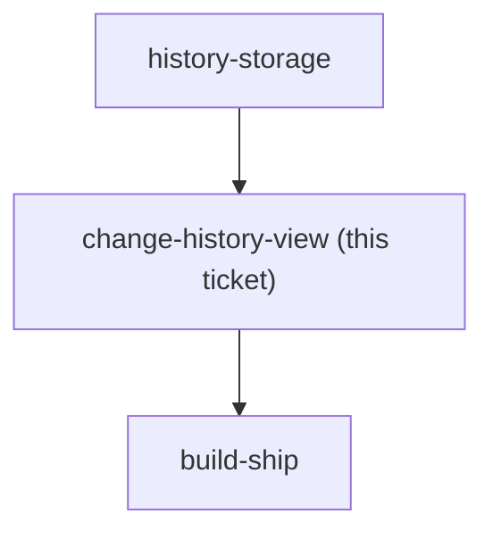

## Question

Shipping Change history in v1 (menunest-191) means building a screen that does not exist today. Decide what it lists and how far back it reaches. Concretely: does it show only acts the user can still undo, or every act including ones now beyond reach; does it cover only budget mutations or also transaction create/edit/delete; how far back does it go (a session, a day, the viewed month, forever); is each row itself actionable - tap to undo that specific act, or is it read-only with undo staying strictly last-in-first-out; and is it a full route like /budget/transactions or a sheet over the budget page. Note it is NOT the /budget/transactions list, which holds only Budget transactions - assigning, moving money and covering overspending appear in neither place today.

<!-- decision-map:graph:start -->

<!-- decision-map:graph:end -->
