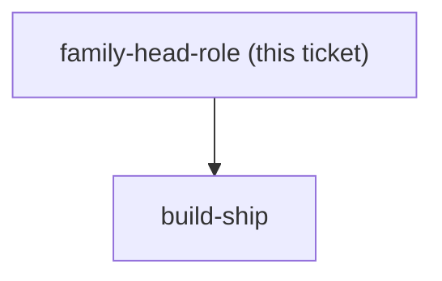
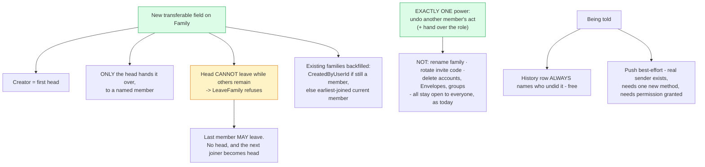

## Question

menunest-198 gave the family head the power to undo any member's act, and chose a real transferable role over Family.CreatedByUserId. That role does not exist yet and is a piece of work in its own right, not a detail of the rail. Decide: who may transfer the role - only the current head, or any member; what happens when the head leaves the Family, is removed, or deletes their account; whether every Family has a head from the moment it is created and who it is for families that already exist; whether the head gains any other power or strictly this one; whether the role is visible to other members and where; and whether a member is NOTIFIED when the head undoes their act - the push channel is real and registered but IWebPushSender exposes only SendFollowUpAsync(FollowUpPing), so this means a new method rather than new infrastructure. Note this is the app's FIRST permission concept, so whatever shape is chosen here is the precedent every later feature will be measured against.

<!-- decision-map:graph:start -->

<!-- decision-map:graph:end -->

<!-- decision-map:resolution:start -->
## Resolution

A transferable field on Family: creator is first head, only the head hands it over, and the head cannot leave until they do. Exactly one power - undo another member's act.

Detail: docs/adr/menunest-201-the-family-head-is-a-transferable-role-with-exactly-one-power.md

Recorded in **menunest-201**, which holds the reasoning and the rejected options.
This ticket records only what the answer changes.

## Two facts from the code shaped every rule

- **Nobody can be removed from a Family by anyone else.** The use cases are `CreateFamily`,
  `JoinFamily` and `LeaveFamily` — self-service only. So the ticket's "or is removed" case
  does not exist; only "leaves".
- **`LeaveFamilyHandler` does not touch `Family.CreatedByUserId`**, and the Family row
  survives an empty family. That field can therefore *already* point at someone who left,
  which is the hard evidence behind menunest-198 refusing to use it as the head.

## The decision that was a real fork

**The head cannot leave while other members remain** — `LeaveFamily` refuses until they hand
over. The alternative, auto-passing to the longest-standing member, has no dead end but hands
someone authority they never asked for and may not notice.

For the app's **first** permission concept, "authority is always taken deliberately" is the
better precedent, and nobody is stranded: hand over, then leave.

## Confirming exchange

- Head leaving — **"ต้องยกตำแหน่งก่อน"**, over auto-transfer and over leaving the Family
  headless.
- Being told — **"แถวประวัติเสมอ + push ถ้าเปิดไว้"**, over history-only and over requiring
  push before an undo is allowed.
- Scope of power — **"อำนาจเดียว"**, over bundling family settings and over bundling
  destructive deletes.

## One thing derived, not asked

**Where the role is shown.** `/family` already lists members, so the badge belongs there.
Flagged as derived so a later session can move it without thinking a decision is being
overturned.

## What build-ship inherits

- A new field on `Family` and a migration, applied to prod **by hand** per CLAUDE.md.
- **A guard inside `LeaveFamilyHandler`** — the first behavioural change this map makes to an
  existing, unrelated use case. It needs its own test.
- A new method on `IWebPushSender`, which stops that interface being single-purpose to the
  health domain.
- Attribution on the Change history row, which menunest-195 already left room for.

<!-- decision-map:resolution:end -->
