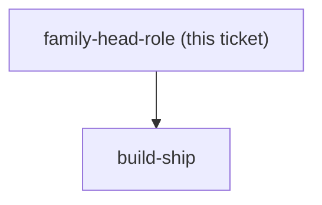

## Question

menunest-198 gave the family head the power to undo any member's act, and chose a real transferable role over Family.CreatedByUserId. That role does not exist yet and is a piece of work in its own right, not a detail of the rail. Decide: who may transfer the role - only the current head, or any member; what happens when the head leaves the Family, is removed, or deletes their account; whether every Family has a head from the moment it is created and who it is for families that already exist; whether the head gains any other power or strictly this one; whether the role is visible to other members and where; and whether a member is NOTIFIED when the head undoes their act - the push channel is real and registered but IWebPushSender exposes only SendFollowUpAsync(FollowUpPing), so this means a new method rather than new infrastructure. Note this is the app's FIRST permission concept, so whatever shape is chosen here is the precedent every later feature will be measured against.

<!-- decision-map:graph:start -->

<!-- decision-map:graph:end -->
