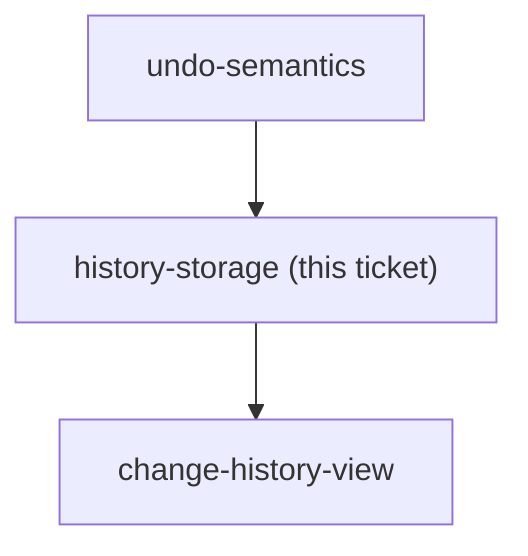
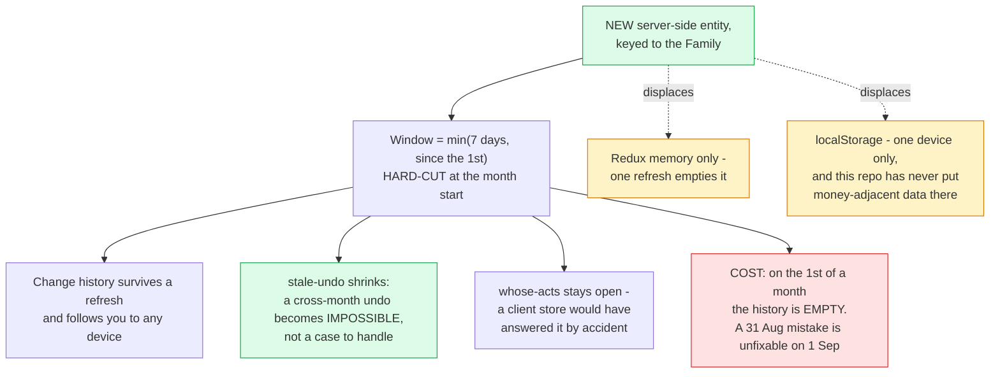

## Question

Where is the undo/redo history kept: React/Redux memory only (dies on refresh, simplest), localStorage or IndexedDB (survives refresh on one device, can go stale against the server), or a server-side record so it follows the user across devices (most work, needs a new entity - the domain has none today). Decide the store, how deep the stack goes, and what happens to it when the user switches month on the MonthStrip or navigates away from /budget.

<!-- decision-map:graph:start -->

<!-- decision-map:graph:end -->

<!-- decision-map:resolution:start -->
## Resolution

A new server-side entity keyed to the Family, holding the last 7 days but hard-cut at the month start - so an undo can never reach into a month already left.

Detail: docs/adr/menunest-194-the-undo-history-lives-on-the-server-and-never-crosses-a-month.md

Recorded in **menunest-194**, which holds the reasoning and the rejected options.
This ticket records only what the answer changes.

## What decided it

Not a fresh preference — an **earlier decision on this same map**. menunest-191 put Change
history in the rail in v1, and that alone rules out both client-side stores: in memory the
list dies on any refresh, in localStorage it is empty on every other device. A history
screen that is usually empty is not a feature.

Two facts from the code backed it up:

- `localStorage` in this SPA appears only in auth, the pomodoro timer, the writing timer
  and a health prompt. **No money-adjacent data has ever been kept there**, and there is no
  `redux-persist`.
- A client-only store would have **silently answered `whose-acts`**: a record that never
  leaves your device cannot know what another Family member did. That would have decided a
  ticket by accident instead of asking it.

## The user improved the recommendation

Seven rolling days was the recommendation. The user answered **"เจ็ดวันแต่ตัดเดือน"** —
seven days, but the month cuts it.

Read back to them against a concrete case (today 2 September, mistake made 31 August) with
the two possible meanings separated, and confirmed as the **hard cut at the month start**:
history never reaches into a previous month at all, not even by switching the MonthStrip.

That is better than what was recommended. A budget month is a closed period in this app, so
an undo reaching backwards would move numbers the user considers settled. It removes an
entire class of case from `stale-undo` rather than asking that ticket to handle it.

## The cost, not glossed

**On the first day of each month the history is empty.** A mistake made on 31 August cannot
be undone on 1 September by any route. This was named before the choice and accepted
knowingly.

## What this leaves for other tickets

- `change-history-view` is **now unblocked** — it already carries two user answers as
  comments (rows are individually actionable; an out-of-order undo may leave an Envelope
  negative, which is allowed).
- `stale-undo` gets smaller: cross-month staleness is now impossible by construction. It
  still owns the deleted Envelope, the already-edited figure and the concurrent change.
- `build-ship` inherits a new entity, which per CLAUDE.md must be added to **all three**
  `IApplicationDbContext` implementers with its EF configuration **in the same commit**, and
  a migration applied to prod **by hand**.
- Pruning may be a real background delete rather than a read filter:
  `MenuNest.Infrastructure/BackgroundServices/FollowUpDispatcher.cs` shows hosted background
  services already run in this project. Implementation choice, not decided here.

<!-- decision-map:resolution:end -->
