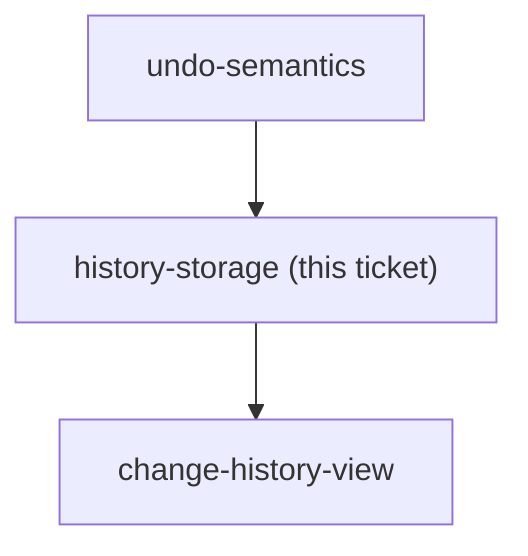

## Question

Where is the undo/redo history kept: React/Redux memory only (dies on refresh, simplest), localStorage or IndexedDB (survives refresh on one device, can go stale against the server), or a server-side record so it follows the user across devices (most work, needs a new entity - the domain has none today). Decide the store, how deep the stack goes, and what happens to it when the user switches month on the MonthStrip or navigates away from /budget.

<!-- decision-map:graph:start -->

<!-- decision-map:graph:end -->
