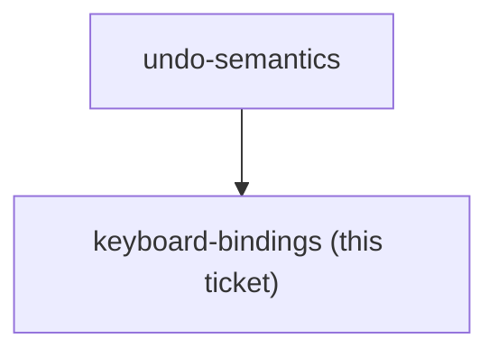

## Question

Desktop keyboard shortcuts are in scope. Decide: which element must be focused for the binding to fire, and what happens when the caret is inside a text input or a number field where the browser's own native undo is expected; what happens while one of the budget dialogs is open (MoveMoney, QuickAssign, CoverOverspending, Transaction, AddAccount); whether Cmd+Z must work on macOS alongside Ctrl+Z; and whether the rail must visibly show the binding so the two surfaces do not feel like separate features.

<!-- decision-map:graph:start -->

<!-- decision-map:graph:end -->
