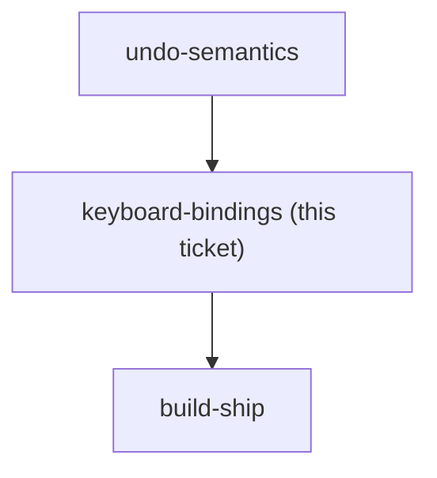
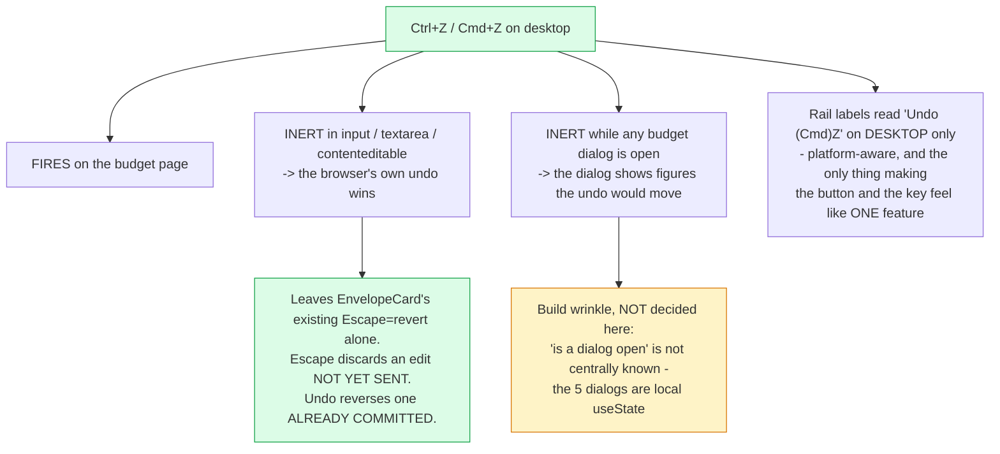

## Question

Desktop keyboard shortcuts are in scope. Decide: which element must be focused for the binding to fire, and what happens when the caret is inside a text input or a number field where the browser's own native undo is expected; what happens while one of the budget dialogs is open (MoveMoney, QuickAssign, CoverOverspending, Transaction, AddAccount); whether Cmd+Z must work on macOS alongside Ctrl+Z; and whether the rail must visibly show the binding so the two surfaces do not feel like separate features.

<!-- decision-map:graph:start -->

<!-- decision-map:graph:end -->

<!-- decision-map:resolution:start -->
## Resolution

Ctrl+Z and Cmd+Z fire on the budget page but are inert inside inputs and while any dialog is open. The rail labels show the binding on desktop only.

Detail: docs/adr/menunest-200-ctrl-z-is-inert-in-inputs-and-while-a-dialog-is-open.md

Recorded in **menunest-200**, which holds the reasoning and the rejected options.
This ticket records only what the answer changes.

## One part of the ticket was not a real question

The ticket asked whether Cmd+Z must work on macOS "alongside" Ctrl+Z. It was not put to the
user as a choice: the developer's own machine is a Mac, so Ctrl-only would ship a feature that
does not work where it is written. Stated as forced rather than asked.

## What decided the rest

Two facts from the code:

- **This is the app's first global keyboard shortcut.** Everything today is local — Enter to
  send in the AI chat, Enter to add a checklist item, Escape to leave add-place mode,
  Enter/Escape on the envelope's inline amount input. A precedent, though a much smaller one
  than menunest-198's first permission role.
- **`EnvelopeCard.tsx:92` already binds Escape to revert** that inline input. Escape discards
  an edit **not yet sent**; Undo reverses one **already committed**. Keeping Ctrl+Z out of
  inputs is what stops the two from arguing — and it means the in-field need was already met
  before this feature existed.

## Confirming exchange

- When it is inert — **"ในช่องกรอก + ตอนกล่องเปิด"**, chosen over inputs-only and over firing
  everywhere.
- The rail labels — **"บอก เฉพาะเดสก์ท็อป"**, so the button and the shortcut read as one
  feature on desktop and the hint is not noise on a phone.

## What this leaves for build-ship

**"Is a dialog open?" is not centrally known.** The five budget dialogs are local `useState`
inside their own components and nothing tracks them. Either the handler checks the DOM for an
open `.budget-modal-overlay`, or the dialogs register with the `ShortcutRailProvider` that
menunest-199 is adding anyway. The second is probably right for exactly that reason, but the
ADR deliberately leaves it to the build.

Also inherited: the label must be platform-aware, ⌘ on macOS and Ctrl elsewhere.

<!-- decision-map:resolution:end -->
