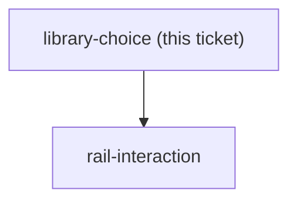
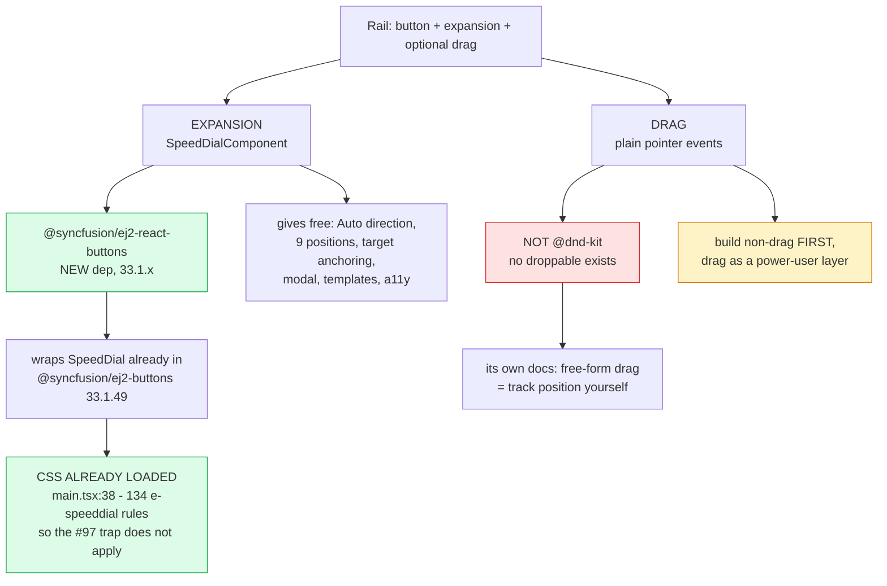

## Question

Which library should build a floating action button that expands into a set of shortcut buttons, and optionally can be dragged? Constraints: React 19 + Vite 8 + TypeScript 6; @syncfusion/ej2-buttons 33.1.49 is ALREADY installed and ships Fab and SpeedDial with RadialSettings, but @syncfusion/react-buttons ships only a React floating-action-button and no React SpeedDial wrapper; @dnd-kit/core + modifiers + sortable + utilities are ALREADY installed and already used for drag-reorder on the trips page. Report: what the installed Syncfusion SpeedDial can and cannot do (expansion direction, positioning, a11y, mounting the vanilla EJ2 class from React), whether @dnd-kit is a sane basis for a draggable FAB or is the wrong tool for a single free-dragging element, what the credible alternatives are and what each would cost as a new dependency, and what the known UX hazards of a draggable FAB on touch are (drag-versus-scroll, position persistence, occlusion). Recommend one, with the trade-off stated.

<!-- decision-map:graph:start -->

<!-- decision-map:graph:end -->

<!-- decision-map:resolution:start -->
## Resolution

Syncfusion SpeedDialComponent - one new dep, but its CSS already ships via main.tsx:38. Not @dnd-kit: a free-floating FAB has no droppable.

## The answer

## Recommendation

Use **Syncfusion `SpeedDialComponent`** for the rail's button-and-expansion, and do
**not** use `@dnd-kit` for the drag. Treat drag as a separate, optional layer built on
plain pointer events - and only if `rail-interaction` decides drag is worth its cost.

## What is already in the tree (verified in node_modules, not from memory)

| Package | Installed? | Relevance |
|---|---|---|
| `@syncfusion/ej2-buttons` 33.1.49 | **yes** | ships the `Fab` and `SpeedDial` classes plus `RadialSettings`, `SpeedDialItem`, `SpeedDialAnimationSettings` (`src/floating-action-button/`, `src/speed-dial/`) - vanilla EJ2, no React wrapper |
| `@syncfusion/react-buttons` 33.1.44 | **yes** | new pure-React Syncfusion line. Has `floating-action-button`. **No speed-dial** - so the plain FAB is available in React today, the expansion is not |
| `@syncfusion/ej2-react-buttons` | **no** - absent from node_modules AND from package-lock.json (0 hits) | this is the package that exports `SpeedDialComponent` for React |
| `@dnd-kit/core` + `modifiers` + `sortable` + `utilities` | **yes** | already used for itinerary drag-reorder in `frontend/src/pages/trips` |

So the gap is exactly one package: `@syncfusion/ej2-react-buttons`. That is a **new
dependency**, but a low-risk one - the repo already carries four sibling
`@syncfusion/ej2-react-*` packages (`navigations`, `richtexteditor`,
`barcode-generator`, `interactive-chat`) at the same 33.1.x line, so it is the family
already in use rather than a new vendor.

## The #97 stylesheet trap does NOT apply here - verified

CLAUDE.md records that #97 shipped visibly broken because a required Syncfusion
stylesheet import was missing. That failure mode is already closed for this component:

- `frontend/src/main.tsx:38` already imports `@syncfusion/ej2-buttons/styles/material.css`
- that file already contains **134 `e-speeddial` rules and 46 `e-fab` rules**

The SpeedDial's CSS is therefore loaded before a single line of rail code is written.
No new stylesheet import is needed. (Still worth an interactive check, because
CLAUDE.md is right that no automated gate can see this.)

## What SpeedDial can actually do (from the vendor docs, Aug 2026)

- `mode`: **Linear** (items in a straight line) or **Radial** (circular fan).
- `direction` for Linear: `Left` / `Right` / `Up` / `Down` / **`Auto`** - Auto picks a
  direction that keeps the items on screen given the button's position.
- `position`: nine values - `TopLeft`, `TopCenter`, `TopRight`, `MiddleLeft`,
  `MiddleCenter`, `MiddleRight`, `BottomLeft`, `BottomCenter`, `BottomRight`.
- **`target`**: anchors the component to an arbitrary container element instead of the
  viewport, with `refreshPosition()` to re-place it after a resize or layout change.
- `modal` + `target` for a scrim behind the open state.
- `itemTemplate` / `popupTemplate` for custom item rendering;
  `openIconCss` / `closeIconCss` / `content` to change the resting and open icons.
- Events: `created`, `beforeOpen`.

**`target` is the finding that matters most downstream.** It means the rail does not
have to be a viewport-global fixed element: each page can anchor its own instance.
That is directly relevant to `rail-architecture` (budget first, generalize later) and
to the fog line about colliding with `.bdg-fab` on AccountDetailPage.

## Why not @dnd-kit for the drag

`@dnd-kit` is a *drag-and-drop* library: draggables that land on droppables. A
free-floating FAB has no droppable. dnd-kit's own docs and its "Free Form Drag"
discussion (#1180) confirm that for free-form dragging **you must track the element's
position yourself** in an `onDragEnd` handler on `DndContext` - the library gives you
the pointer plumbing and nothing else.

So dnd-kit here means: a `DndContext` provider, a `useDraggable`, and then all the
actual position logic hand-written anyway. That is roughly the same work as a plain
`pointerdown`/`pointermove`/`pointerup` handler, but with an extra abstraction in the
middle. It is *installed*, so it costs no new dependency - it is simply the wrong
shape for the job. The one thing it would genuinely buy is consistency with the trips
page's drag idiom, which is a weak reason on its own.

## Drag hazards - evidence for rail-interaction to weigh, not a decision

The published UX literature is consistently negative on draggable FABs:

- **Drag versus scroll.** On a scrollable page a vertical drag is ambiguous with a
  scroll. Disambiguating needs a press-and-hold delay, which makes every drag feel slow
  and every accidental long-press move the button.
- **System gesture conflict.** A FAB near a screen edge collides with OS back/home
  gestures - and the sketch puts this rail hard against the right edge.
- **Contrast.** WCAG 3:1 for a non-text control is hard to hold when the button can be
  dragged over any background; the budget page has white cards, a coloured progress
  bar and grey chrome.
- **Occlusion.** A FAB already covers content; a movable one covers *unpredictable*
  content, and the user is the one who has to fix it.
- **Accessibility.** Drag needs a non-drag alternative (keyboard or a settings toggle),
  which is a second surface to build and test.
- **Position persistence.** A remembered position has to survive rotation and a
  different screen size, or the button lands off-screen.

The standing industry recommendation is to **build the non-drag version first and add
drag as a power-user layer**, which fits the chosen `rail-visible` milestone exactly.

## Alternatives considered and rejected

- **`@syncfusion/react-buttons` FAB + hand-rolled expansion.** Zero new dependencies
  and stays on the newer pure-React line. Rejected as the default because it means
  hand-writing the open/close animation, focus trap, outside-click dismissal, Auto
  direction and a11y wiring that SpeedDial already ships - and the CSS for those is
  already loaded and would go unused.
- **MUI / Chakra / Radix speed dial.** Would introduce a second design-system vendor
  into a codebase that has standardised on Syncfusion. Not worth it for one component.
- **Fully hand-rolled rail (no library).** Viable and honest if `rail-contents` lands
  on undo/redo only - two buttons in a fixed column barely needs a component. Keep this
  as the fallback if `rail-interaction` rejects the expand-on-tap pattern.

## Left for a live check

Whether the Syncfusion licence in use covers adding another `@syncfusion/ej2-react-*`
package is not answerable from outside the repo - it almost certainly does, since four
siblings are already shipped, but confirm before `build-ship` installs it.

<!-- decision-map:resolution:end -->
