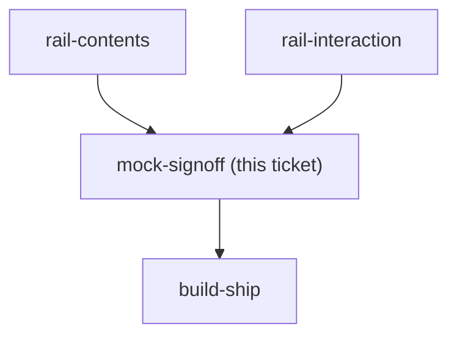
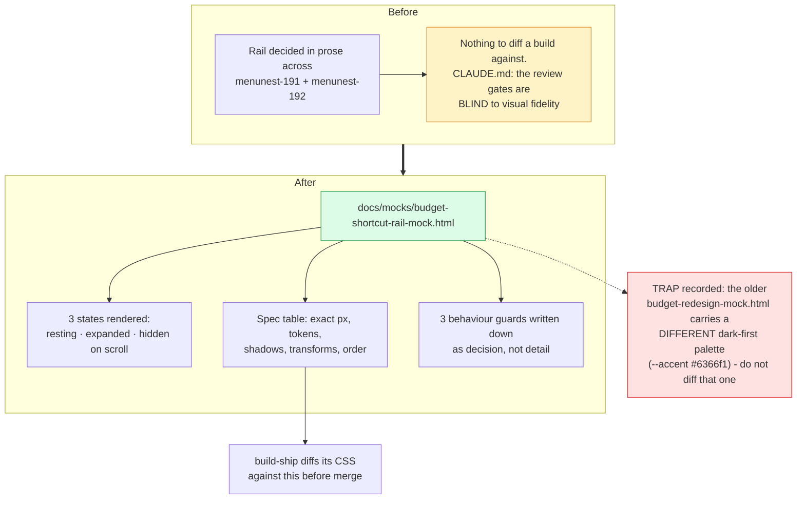

## Question

Produce a docs/mocks/ HTML mock of the budget page carrying the decided rail, in both its resting and expanded states, using the real budget tokens and colours, and get explicit sign-off. CLAUDE.md is emphatic that the review gates are blind to visual fidelity, so this mock is the artifact build-ship is later diffed against - not a sketch to be improved during implementation.

<!-- decision-map:graph:start -->

<!-- decision-map:graph:end -->

<!-- decision-map:resolution:start -->
## Resolution

Signed off: docs/mocks/budget-shortcut-rail-mock.html renders resting, expanded and hidden-on-scroll, with the exact CSS values build-ship is diffed against.

Detail: docs/mocks/budget-shortcut-rail-mock.html

The mock is at **`docs/mocks/budget-shortcut-rail-mock.html`** (canonical, in the repo).
A viewing copy, generated from that file rather than written twice so the two cannot
drift, is published at
https://claude.ai/code/artifact/7ed91d2e-e3b9-45fd-8342-d2de925c53f2

## Why it carries a spec table and not only pictures

CLAUDE.md is explicit that SDD review, whole-branch review and `/scrutinize` all pass
without rendering anything, and records #46 shipping a planner that diverged visibly
from its approved mock straight through every gate. A picture alone is not diffable, so
the mock carries the checkable half too: exact sizes, tokens, shadows, spacing,
expansion mode, item order and the hide transform.

## A trap found while building it

`docs/mocks/budget-redesign-mock.html` — the obvious file to compare against — predates
the current CSS and is **dark-first with a different accent** (`#6366f1` against the
shipped `#4f46e5`). Anyone diffing the new rail against that file would chase a colour
difference that is not a defect. The new mock says so at the top of its own stylesheet
and again in the resolution above.

## Confirming exchange

Put to the user before signing: most of the numbers in the spec table — 52px / 44px,
10px and 12px spacing, `translateY(96px)`, the 900ms idle return, the 40px scroll
threshold — were **chosen by the assistant**, derived from the prototype the user
approved but never seen by them as numbers, so signing off meant accepting those too.

Answer: **"เซ็นรับ ปิดตั๋ว"**.

## What this closes and what it does not

- Milestone `rail-visible` is now complete: the rail's look and behaviour are decided,
  rendered and signed.
- The mock deliberately shows the **Change history button, not its screen** — that is
  `change-history-view`, still blocked behind `history-storage`.
- No dark theme is drawn, because the app declares "single palette, no dark mode".
- `build-ship` still owes a Playwright smoke spec: per CLAUDE.md it is the only
  automatic gate that can catch a rendering bug, and it only catches one for pages a
  spec actually exercises.

<!-- decision-map:resolution:end -->
