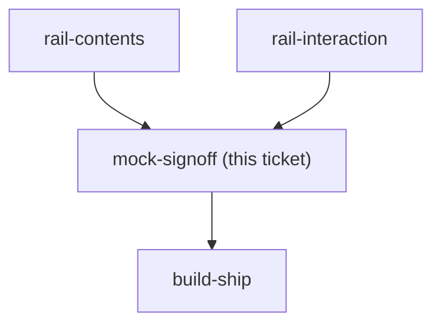

## Question

Produce a docs/mocks/ HTML mock of the budget page carrying the decided rail, in both its resting and expanded states, using the real budget tokens and colours, and get explicit sign-off. CLAUDE.md is emphatic that the review gates are blind to visual fidelity, so this mock is the artifact build-ship is later diffed against - not a sketch to be improved during implementation.

<!-- decision-map:graph:start -->

<!-- decision-map:graph:end -->
