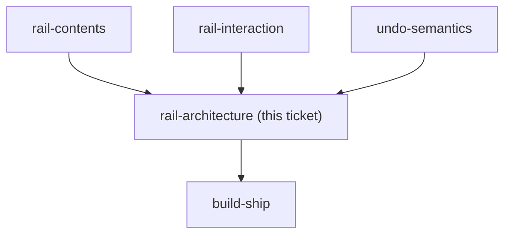
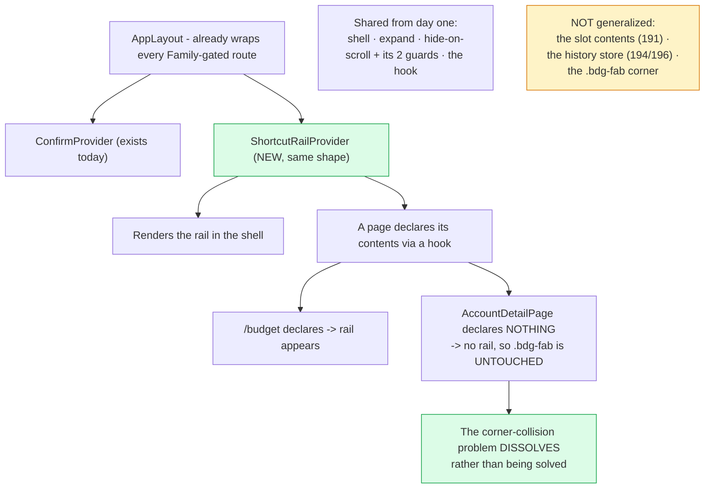

## Question

The rail ships on /budget first but must be built to generalize. Decide the shape: a shared presentational shell plus a per-page action registry, a React context each page feeds, or a route-aware global component. Decide where the undo stack lives relative to that split - one global stack or one per page - and how the generalized rail will avoid colliding with .bdg-fab, which already occupies the bottom-right corner on AccountDetailPage. Name what is deliberately NOT generalized now, so this does not turn into a framework before the second page exists.

<!-- decision-map:graph:start -->

<!-- decision-map:graph:end -->

<!-- decision-map:resolution:start -->
## Resolution

A ShortcutRailProvider in AppLayout mirroring the ConfirmProvider already there; a page opts in via a hook. Opt-in also dissolves the .bdg-fab corner collision.

Detail: docs/adr/menunest-199-the-shortcut-rail-is-a-provider-in-applayout-that-pages-opt-into.md

Recorded in **menunest-199**, which holds the reasoning and the rejected options.
This ticket records only what the answer changes.

## Most of this ticket answered itself once the code was read

Three of its four parts closed without a question being asked:

| the ticket asked | what closed it |
|---|---|
| where the undo stack lives - global or per page | **menunest-194** already made it one server-side store keyed to the Family |
| how to avoid colliding with `.bdg-fab` on AccountDetailPage | **opt-in dissolves it** - that page declares no rail, so none renders and the fab is untouched |
| what is deliberately not generalized | follows from **menunest-191, 194 and 196** rather than being a fresh choice |

Only the attachment shape was genuinely open.

## What decided the shape

`AppLayout` already wraps every Family-gated route and already holds **`ConfirmProvider`** — a
`createContext` provider handing a cross-cutting UI capability to any page that asks. The rail
is the same kind of thing, so the answer was to use the pattern sitting three lines above
rather than invent one.

The rejected alternative worth naming is the route-aware global: the shell would have to know
every page's name, which points the dependency the wrong way.

## Confirming exchange

**"Provider ใน AppLayout หน้าประกาศเอา"**, chosen over a plain component inside `BudgetPage`
and over a route-aware global.

The plain-component option was not merely cheaper - it would have contradicted the chart-time
answer *"budget ก่อน แต่ออกแบบให้ขยายได้"*, which is what put this ticket on the map at all.

## What this leaves for other tickets

- `build-ship` gains: one provider in `AppLayout` beside `ConfirmProvider`, one hook, one call
  from `BudgetPage`. That is the whole price of generalizing.
- A page that forgets to declare gets **no** rail rather than a broken one - the right failure
  direction, and worth a line in the e2e spec.

<!-- decision-map:resolution:end -->
