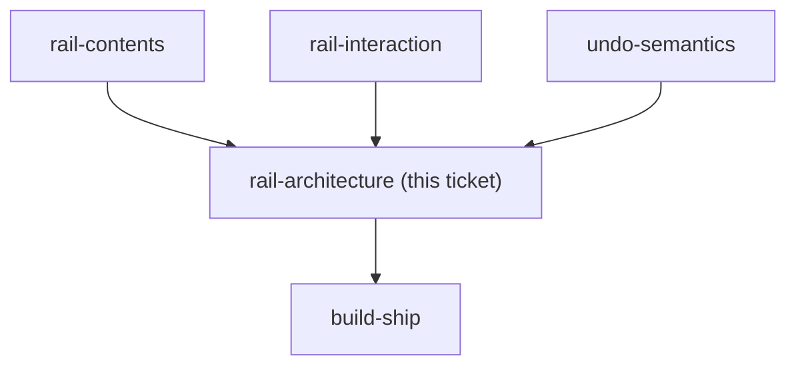

## Question

The rail ships on /budget first but must be built to generalize. Decide the shape: a shared presentational shell plus a per-page action registry, a React context each page feeds, or a route-aware global component. Decide where the undo stack lives relative to that split - one global stack or one per page - and how the generalized rail will avoid colliding with .bdg-fab, which already occupies the bottom-right corner on AccountDetailPage. Name what is deliberately NOT generalized now, so this does not turn into a framework before the second page exists.

<!-- decision-map:graph:start -->

<!-- decision-map:graph:end -->
