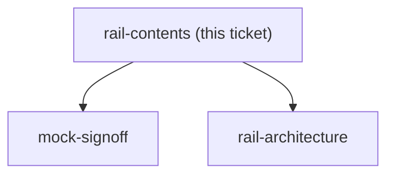
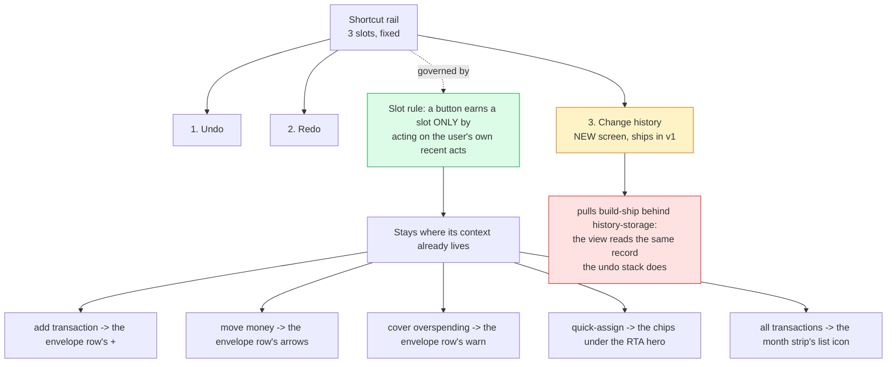

## Question

The sketch shows roughly three stacked buttons, and undo/redo were given in the issue as examples rather than as the full list. Decide exactly which actions sit on the rail and in what order - candidates include add transaction, quick-assign, move money, cover overspending, jump to today - and decide the hard question underneath: is this rail purely a history control (undo/redo only, so its meaning is obvious) or a general quick-action launcher that happens to contain undo? Set a maximum count, because a rail that grows without a rule becomes a second menu.

<!-- decision-map:graph:start -->

<!-- decision-map:graph:end -->

<!-- decision-map:resolution:start -->
## Resolution

A history control, not a launcher: exactly three slots - undo, redo, change history - all working in v1, because every launcher candidate is already one contextual tap away.

Detail: docs/adr/menunest-191-the-shortcut-rail-is-a-history-control-not-a-launcher.md

Recorded in **menunest-191**, which holds the reasoning and the rejected options.
This ticket records only what the answer changes.

## What decided it

The finding that turned the question: **every launcher candidate is already exactly one
tap away on `/budget`, and every one of those taps is contextual.** The `＋` on the
groceries envelope row already knows you mean groceries; a floating `＋` does not, so it
would need an extra screen to ask. Putting those actions on the rail would make them
*slower*, not faster. Undo, redo and change history are the inverse — they act on "the
last thing you did", which belongs to no envelope, so a floating control is their correct
home rather than a duplicate of one.

## Confirming exchange

Four questions, four answers, all from the user:

1. Is the rail a history control or a launcher? — **"ที่อยู่ของ undo/redo เท่านั้น"**
2. What rule caps it? — **"3 ปุ่ม ช่องที่สามคือประวัติ"**
3. Does the history button work in v1, or is the slot reserved? — **"ทำตั้งแต่ v1"**
4. In what order? — **"undo → redo → ประวัติ"**

The third answer is the expensive one and was given knowing the cost: it was put to the
user that change history reads the same record the undo stack does, so shipping it in v1
pulls `build-ship` behind `history-storage`, which is itself still behind
`undo-semantics`.

## What this leaves for other tickets

- **Not decided here:** whether three buttons justify a tap-to-expand rail at all, or
  whether they simply sit open — that is `rail-interaction`.
- **Newly sharp:** what Change history lists and how far back it reaches. Fog until this
  ticket; statable now, and graduated into its own ticket in the same session.
- **Glossary:** `CONTEXT.md` gains **Shortcut rail** and **Change history**, the latter
  written specifically to keep it apart from **Budget transaction** and from the
  **Budgeting event** of menunest-181/185.

<!-- decision-map:resolution:end -->
