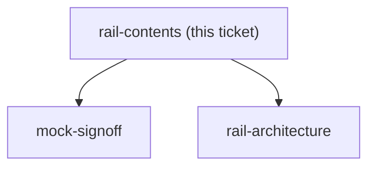

## Question

The sketch shows roughly three stacked buttons, and undo/redo were given in the issue as examples rather than as the full list. Decide exactly which actions sit on the rail and in what order - candidates include add transaction, quick-assign, move money, cover overspending, jump to today - and decide the hard question underneath: is this rail purely a history control (undo/redo only, so its meaning is obvious) or a general quick-action launcher that happens to contain undo? Set a maximum count, because a rail that grows without a rule becomes a second menu.

<!-- decision-map:graph:start -->

<!-- decision-map:graph:end -->
