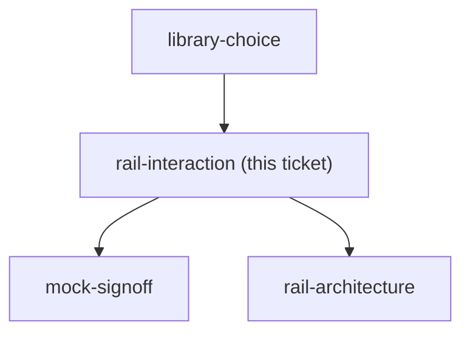
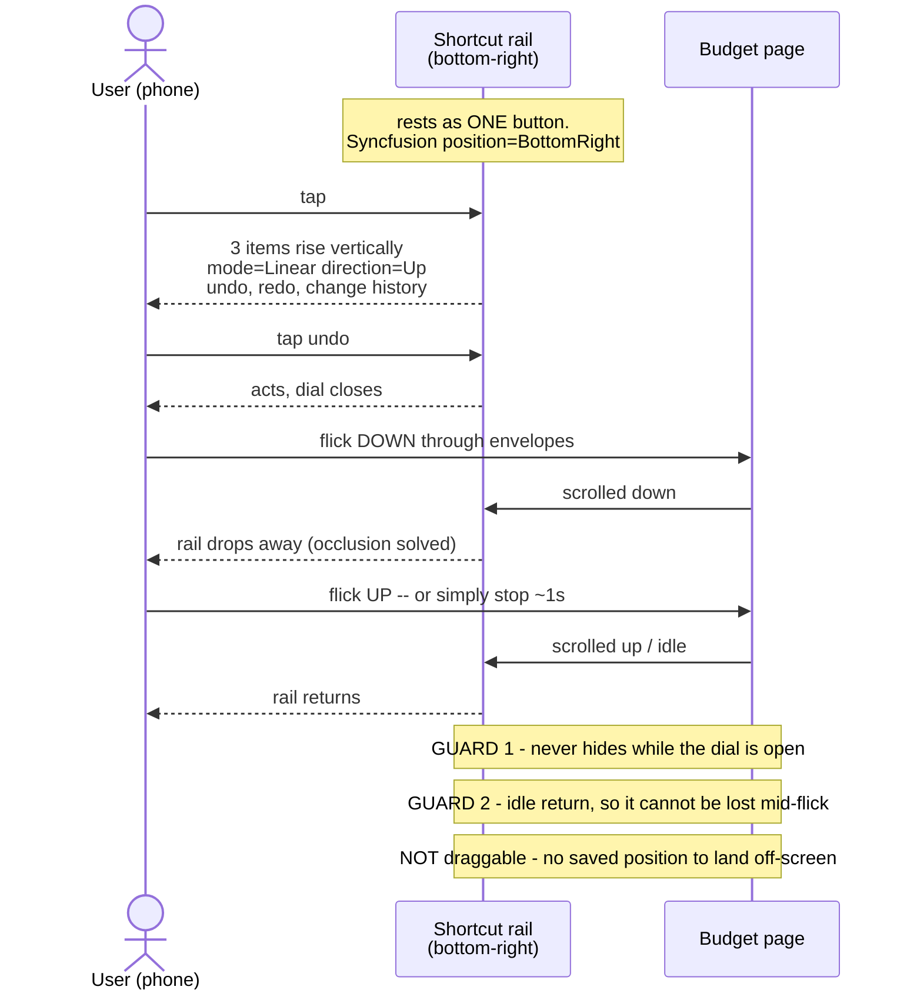

## Question

Build a cheap throwaway prototype of two or three candidate rails on top of the real /budget layout and react to them on a phone. It must answer: does the rail rest as a single FAB that expands on tap (speed dial) or sit permanently expanded; does it expand vertically, radially or as a sheet; where does it rest by default; and is it draggable. The user asked for draggable specifically - the prototype must actually test drag against scroll on a real phone, and must show what happens to the remembered position on a different screen size. Carry the library recommendation from library-choice into the prototype rather than deciding it again.

<!-- decision-map:graph:start -->

<!-- decision-map:graph:end -->

## Comment

## Prototype artifact

https://claude.ai/code/artifact/21ac73e6-a87a-4dbb-a3a5-70555a8e0202

Claude Design (the preferred mockup home, ADR 0032) was unavailable this session -
`DesignSync` requires `/design-login` from an interactive session - so this is
fallback 2, a rendered Artifact. That turned out to suit the ticket: the Question
requires testing drag against scroll **on a real phone**, and an Artifact is a URL
the user can open there.

Palette, type and spacing are lifted verbatim from
`frontend/src/pages/budget/BudgetPage.css`, and the content is the issue
screenshot's own figures (B2,460.81 still to place, 88%, Make / cash accounts),
so a reaction to the page is a reaction to the RAIL rather than to unfamiliar
styling. The app is deliberately light-only per that file, so the prototype is too.

What it puts under test:

- **A - always open**: three buttons, no expand step.
- **B - tap, opens up**: one button at rest, items rise vertically. This is
  Syncfusion SpeedDial `mode=Linear direction=Up`, carrying library-choice's answer.
- **C - tap, fans out**: Syncfusion `mode=Radial`.
- **Drag off / instant / hold 250ms**: `instant` sets `touch-action:none` on the
  button, which is *exactly* what steals the scroll; `hold` leaves it alone until a
  250ms press, so a swipe from the button still scrolls but every deliberate drag
  feels slow. The trade-off is meant to be felt, not read.
- **Narrower frame**: shrinks the viewport without moving the saved position, so a
  position remembered on a wide screen visibly lands off a narrow one.

<!-- decision-map:resolution:start -->
## Resolution

One button bottom-right, tap expands the three items upward. Not draggable: it hides on scroll down instead, which solves the occlusion drag was for at none of drag's cost.

Detail: docs/adr/menunest-192-the-shortcut-rail-hides-on-scroll-rather-than-being-dragged.md

Recorded in **menunest-192**, which holds the reasoning and the rejected options.
This ticket records only what the answer changes.

## What decided it

A throwaway prototype on the real budget layout, used on a phone - the only place
this question could be settled. Three rails and three drag modes went under the thumb.

**Drag lost on evidence, not on taste.** The prototype made both halves felt: instant
drag needs `touch-action: none`, so a thumb on the button can no longer scroll the page
at all; a 250 ms hold keeps scrolling but turns every deliberate drag into a wait.
Shrinking the frame then put a position saved on a wide screen outside a narrow one.

The reframe that resolved it: **what drag was for was occlusion** - "the button covers
something I want". Hide-on-scroll solves precisely that, with no drag-versus-scroll
conflict, no remembered position, and nothing to land off-screen.

## Confirming exchange

Four answers, all from the user, each after using the prototype on a phone:

1. Rest and expansion — **"B · กดแล้วกางขึ้นบน"**
2. Draggable? — **"ไม่ลาก + ซ่อนตอนเลื่อนลง"**
3. Resting position — **"มุมล่างขวา"**
4. After round 2 rendered hide-on-scroll — **"ยืนยัน ปิดตั๋วได้"**

Round 2 exists because hide-on-scroll was invented during this grilling and had never
been seen. A behaviour cannot be judged from a sentence, so it was rendered to the same
artifact URL and confirmed on the phone before the ticket closed.

## What this leaves for other tickets

- **Undo now costs two taps.** Accepted knowingly; variant A stays the escape hatch if
  two taps proves wrong in use.
- **Syncfusion SpeedDial has no hide-on-scroll** — roughly twenty lines MenuNest owns on
  top of the component `library-choice` chose. Does not overturn that choice; does add
  to `build-ship`.
- `position=BottomRight` and `mode=Linear direction=Up` are the component's own
  properties, so no custom positioning is needed.
- **Still fog:** the bottom-right corner is free on `/budget` but taken by `.bdg-fab` on
  AccountDetailPage. That stays `rail-architecture`'s problem, unchanged by this ticket.
- **Not the mock.** This artifact is a grilling aid. `mock-signoff` still owes a
  `docs/mocks/` file for the build to be diffed against.
- **CONTEXT.md unchanged on purpose:** the meaning of **Shortcut rail** did not move,
  only its rendering did, and the glossary holds no implementation detail.

<!-- decision-map:resolution:end -->
