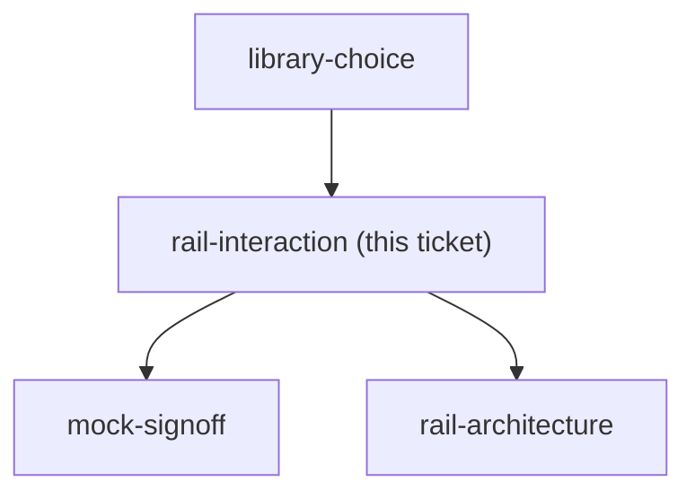

## Question

Build a cheap throwaway prototype of two or three candidate rails on top of the real /budget layout and react to them on a phone. It must answer: does the rail rest as a single FAB that expands on tap (speed dial) or sit permanently expanded; does it expand vertically, radially or as a sheet; where does it rest by default; and is it draggable. The user asked for draggable specifically - the prototype must actually test drag against scroll on a real phone, and must show what happens to the remembered position on a different screen size. Carry the library recommendation from library-choice into the prototype rather than deciding it again.

<!-- decision-map:graph:start -->

<!-- decision-map:graph:end -->
