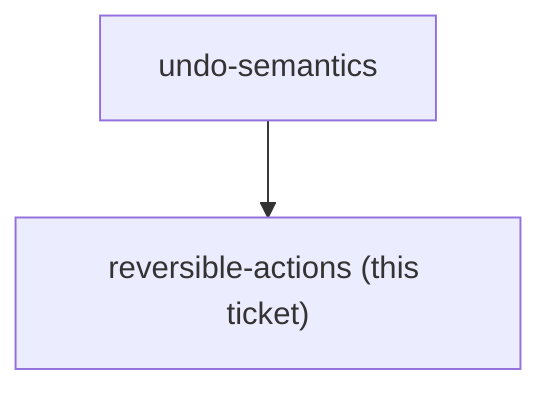
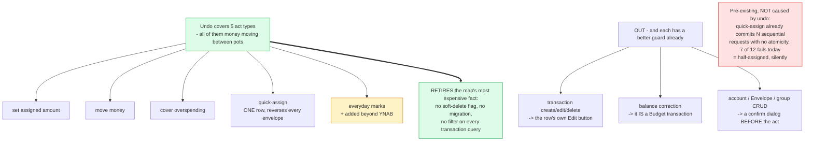

## Question

Of the budget mutations that exist - set assigned amount, move money, cover overspending, quick-assign fill-targets, quick-assign equally, transaction create, transaction edit, transaction delete, account create/edit/delete - which ones does Undo cover? Name each one in or out, with the reason. Bulk actions matter most: quick-assign touches many envelopes in one press, so decide whether undoing it is one stack entry or many, and whether a destructive action like account delete should be undoable at all or should keep a confirm dialog instead.

<!-- decision-map:graph:start -->

<!-- decision-map:graph:end -->

<!-- decision-map:resolution:start -->
## Resolution

Undo covers five money-placement acts - assign, move, cover, quick-assign, everyday marks - and nothing else. Excluding transactions retires the hard-delete problem entirely.

Detail: docs/adr/menunest-196-undo-covers-money-placement-not-transactions-or-structure.md

Recorded in **menunest-196**, which holds the reasoning and the rejected options.
This ticket records only what the answer changes.

## The biggest thing this ticket did was remove work

The map has carried this note since `undo-semantics`: deleting a **Budget transaction** is a
hard delete (`_db.BudgetTransactions.Remove(tx)`), with no soft-delete flag, unlike `Trip`,
`Drug`, `Photo` and `WritingEntry`. It was described as *the single most expensive fact on the
map*.

Putting transactions out of scope **retires it**. No soft-delete column, no migration, no
filter on every transaction query — and the thing it would have bought is a second way to fix
a mistyped transaction, next to the Edit button that already sits on the row.

## What decided each line

| act | in / out | why |
|---|---|---|
| set assigned amount, move money, cover overspending | **in** | money between pots; the inverse is symmetric by construction |
| quick-assign | **in**, as ONE row | one press should be one undo |
| everyday marks | **in** | departs from YNAB deliberately: it is a Budgeting event, so a stray toggle silently moves the Daily allowance, and its inverse is one boolean |
| transaction create / edit / delete | **out** | the row already has Edit; and delete is the hard-delete problem above |
| balance correction | **out** | it IS a Budget transaction (CONTEXT.md), so this falls out of the rule rather than being a separate call |
| account / Envelope / group CRUD | **out** | structural and destructive - the right guard is a confirm before, not an undo after |

## A defect found while deciding, which is NOT this feature's

`QuickAssignDialog.tsx:122` commits the plan as `for (const a of plan) { await setAssigned(...) }`
— one request per envelope, no batch endpoint, no transaction around them. **Today**, if
request 7 of 12 fails, the user is half-assigned and nothing says so.

Undo inherits this exposure and adds none: a reversal loop is no less atomic than the forward
loop already is. Named so that nobody later reads a partial undo as an undo bug. Fixing it
means a batch endpoint, which belongs in its own issue rather than on this map.

## Confirming exchange

- The line — **"ใช่ เส้นนี้"**, on money-in-envelopes plus everyday marks, with transactions
  and structural CRUD both out.
- Bulk handling — **"หนึ่งรายการ ย้อนทีละซอง"**, chosen over a new atomic batch endpoint and
  over splitting the press into N rows.

## What this leaves for other tickets

- `stale-undo` gets a bounded problem: five act types, none of which create or destroy a row.
- `build-ship` needs no schema change for undo, and inherits the quick-assign reversal loop
  with its known non-atomicity.
- `whose-acts` and `keyboard-bindings` are untouched by this.

<!-- decision-map:resolution:end -->
