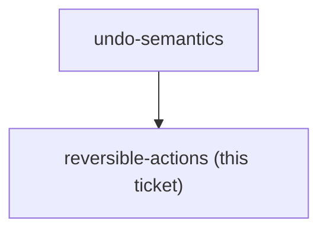

## Question

Of the budget mutations that exist - set assigned amount, move money, cover overspending, quick-assign fill-targets, quick-assign equally, transaction create, transaction edit, transaction delete, account create/edit/delete - which ones does Undo cover? Name each one in or out, with the reason. Bulk actions matter most: quick-assign touches many envelopes in one press, so decide whether undoing it is one stack entry or many, and whether a destructive action like account delete should be undoable at all or should keep a confirm dialog instead.

<!-- decision-map:graph:start -->

<!-- decision-map:graph:end -->
