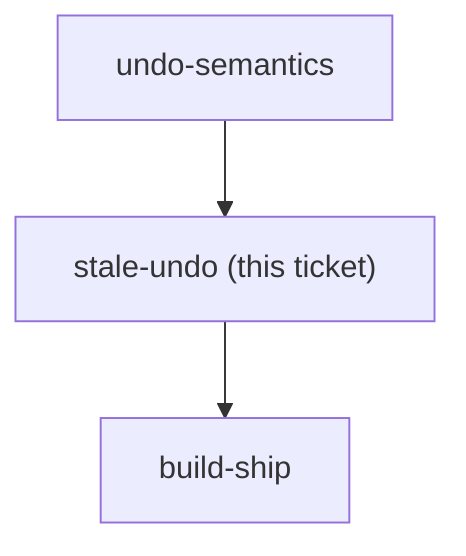

## Question

An undo can become invalid between being recorded and being pressed: the month rolled over, the envelope or account was deleted, the transaction was already edited, or another family member changed the same number. Decide the behaviour for each case - refuse and explain, apply a best-effort partial undo, or silently drop the entry from the stack - and decide whether the rail should visibly disable Undo when the top entry has gone stale, or only fail at press time.

<!-- decision-map:graph:start -->

<!-- decision-map:graph:end -->
