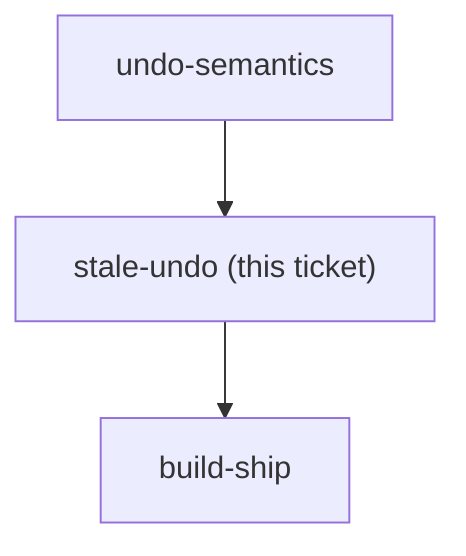
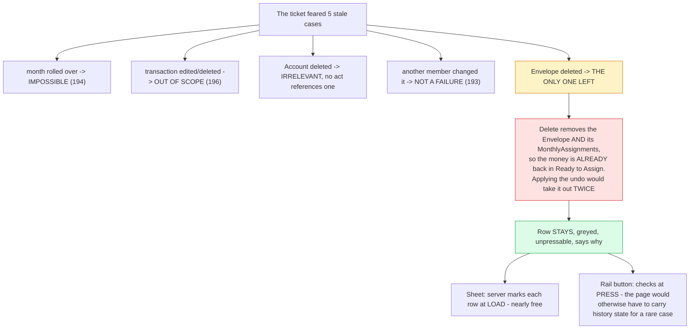

## Question

An undo can become invalid between being recorded and being pressed: the month rolled over, the envelope or account was deleted, the transaction was already edited, or another family member changed the same number. Decide the behaviour for each case - refuse and explain, apply a best-effort partial undo, or silently drop the entry from the stack - and decide whether the rail should visibly disable Undo when the top entry has gone stale, or only fail at press time.

<!-- decision-map:graph:start -->

<!-- decision-map:graph:end -->

<!-- decision-map:resolution:start -->
## Resolution

Only one stale case survives the other ADRs - the Envelope was deleted. That row stays visible and disabled with its reason; the sheet checks at load, the rail button at press.

Detail: docs/adr/menunest-197-a-stale-undo-row-stays-visible-and-disabled.md

Recorded in **menunest-197**, which holds the reasoning and the rejected options.
This ticket records only what the answer changes.

## Most of this ticket was already answered by other tickets

It was written before `history-storage` and `reversible-actions` were resolved, and both
narrowed it. Four of its five cases are closed by menunest-194, menunest-196 and
menunest-193 — see the table in the ADR. Only "the Envelope was deleted" survived.

The one that is worth naming loudly: **a concurrent change by another Family member is not
staleness at all.** menunest-193 chose compensating writes precisely so that "subtract ฿300"
stays correct no matter what the figure is now. Anyone re-reading this ticket's original
question should not treat that line as an open problem.

## What decided the one real case

`DeleteCategoryHandler` refuses to delete an Envelope holding any Budget transaction, and
otherwise removes the Envelope together with every `MonthlyAssignment` on it. So the money is
already back in Ready to Assign before the undo is pressed, and applying the recorded inverse
would remove it a second time. The failure is double-counting, not a missing target — which
is why "best effort" was never viable.

It also makes the case rare: it needs create-Envelope, assign, delete-Envelope inside seven
days and one month.

## Confirming exchange

- The dead row — **"อยู่ต่อ กดไม่ได้ บอกเหตุผล"**, chosen over dropping it silently and over
  recreating the Envelope.
- Where the check lives — **"ตอนโหลดแผ่น ปุ่ม rail ตรวจตอนกด"**, after the asymmetry and its
  cost were put plainly.

## What this leaves for other tickets

- `build-ship` inherits one accepted rough edge: the rail's Undo button can look pressable and
  then refuse, because the budget page does not carry the top row's state.
- The undo engine is now fully specified. `whose-acts`, `rail-architecture` and
  `keyboard-bindings` are the only decisions left before the build.

<!-- decision-map:resolution:end -->
