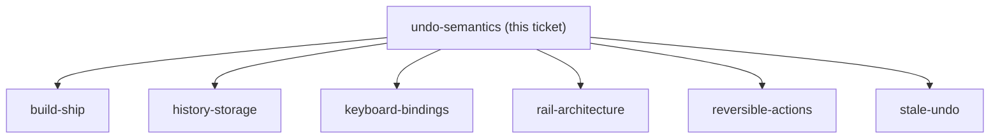
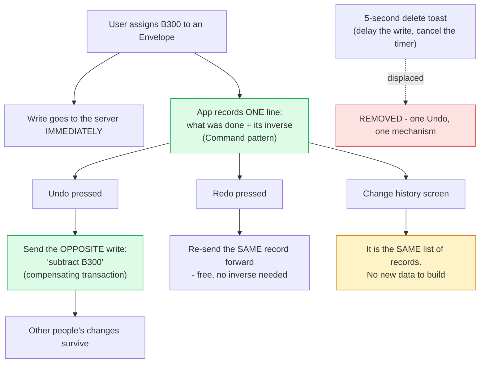

## Question

What does pressing Undo actually do? Option A extends the existing TransactionUndoToast pattern: the mutation is held client-side for N seconds and Undo simply cancels it before it is sent - cheap, no backend, but undo is only possible for a few seconds and only for actions the client can defer. Option B reverses a committed mutation by issuing a compensating write - undo works long after the fact, but every budget mutation needs a defined inverse and the domain has no history to reverse from today. Redo is in scope, which means whichever option is chosen must also be able to re-apply what was undone. Decide A, B, or a hybrid, and say explicitly what happens to the existing 5-second delete toast.

<!-- decision-map:graph:start -->

<!-- decision-map:graph:end -->

<!-- decision-map:resolution:start -->
## Resolution

Undo sends the opposite write to the server, built from a command the app records when you act - never a restore of an old value. The 5-second delete toast is removed.

Detail: docs/adr/menunest-193-undo-sends-a-compensating-transaction-not-a-rollback.md

Recorded in **menunest-193**, which holds the reasoning, the rejected options and the
worked example. This ticket records only what the answer changes.

## The ticket asked A, B or hybrid. A was already dead

The ticket offered option A (hold the write, extend today's toast) against option B
(reverse a committed write). A was **not** re-opened as a free choice, because
menunest-191 had already put Redo and Change history in v1 and neither is possible under
A: after the window there is nothing left to redo, and one pending command is not a
history. That was said out loud rather than presented as a menu.

So the real work of this ticket was **B, made concrete** — and the fact that B is not a
rollback.

## What decided it

Three findings from the code, then one worked example:

1. Today's Undo reverses nothing. `AccountDetailPage.tsx` **delays** the DELETE for five
   seconds; pressing Undo cancels a timer and the server never hears about it.
2. `DeleteTransactionHandler` does `_db.BudgetTransactions.Remove(tx)` — a hard delete.
   `Trip`, `Drug`, `Photo` and `WritingEntry` all carry a soft-delete flag; `BudgetTransaction`
   does not.
3. `BudgetAccount` carries a rowversion concurrency token, so two writers are already a
   real, handled scenario in this codebase.

The example that settled it (a Family has two members, both budgeting the same month):
assign B300, another member assigns B100, then undo. A rollback to "B0" destroys the other
member's B100; a compensating "subtract B300" leaves it standing.

## Confirming exchange

The mechanism was taught before it was decided. An interactive walkthrough was built for
it — `docs/problem-description/2026-08-29-undo-redo-walkthrough.html`, 12 steps, diagram
mode — because a text explanation had already failed once and the user asked for the
industry standard rather than an opinion.

Two answers, both from the user:

- The old 5-second toast — **"Remove it"**, so there is one Undo button with one behaviour.
- The mechanism — **"ยืนยัน ปิดตั๋ว"** on: Undo sends a compensating transaction built from
  a recorded command, not a restore of an old value.

## A scope error I made and corrected

Mid-ticket I began asking **which acts** Undo should cover, using a YNAB finding (YNAB
undoes money placement, not transactions). That is `reversible-actions`, a different
ticket. The question was withdrawn and the YNAB finding carried onto the map's notes
instead, so the next session gets the research without inheriting the confusion.

## What this leaves for other tickets

- `reversible-actions` — which acts qualify, and what to do about the hard delete in (2)
  above. The YNAB precedent is on the map notes.
- `stale-undo` — a record whose target moved, was deleted, or was edited first.
- `history-storage` — where the records live and whether they survive a refresh.
- `change-history-view` — already carries two user answers as comments: rows are
  individually actionable, and an out-of-order undo may leave an Envelope negative, which
  is allowed.
- **CONTEXT.md deliberately unchanged.** "Compensating transaction" and "Command pattern"
  are implementation vocabulary, and the glossary holds domain language only.

<!-- decision-map:resolution:end -->
