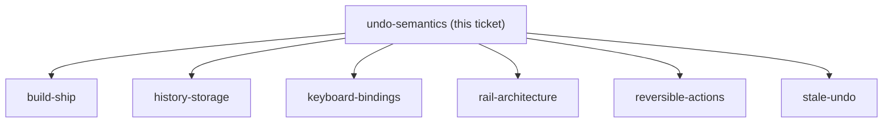

## Question

What does pressing Undo actually do? Option A extends the existing TransactionUndoToast pattern: the mutation is held client-side for N seconds and Undo simply cancels it before it is sent - cheap, no backend, but undo is only possible for a few seconds and only for actions the client can defer. Option B reverses a committed mutation by issuing a compensating write - undo works long after the fact, but every budget mutation needs a defined inverse and the domain has no history to reverse from today. Redo is in scope, which means whichever option is chosen must also be able to re-apply what was undone. Decide A, B, or a hybrid, and say explicitly what happens to the existing 5-second delete toast.

<!-- decision-map:graph:start -->

<!-- decision-map:graph:end -->
