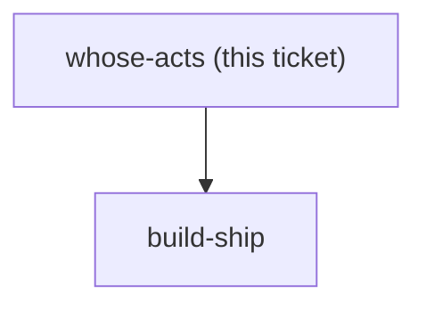

## Question

menunest-193 decided HOW undo works and reversible-actions decides WHICH acts it covers. Neither decides WHOSE acts. A Family has more than one member and both budget the same month, which is the exact scenario that made the compensating-transaction decision necessary. Decide: does the Shortcut rail undo only the acts this user performed, or any recent act by anyone in the Family; does Change history list everyone's acts or only yours; and if it lists everyone's, does a row show who did it. Note the stakes are asymmetric - undoing your own act is a correction, undoing someone else's is an intervention, and the app has no notification mechanism to tell them it happened.

<!-- decision-map:graph:start -->

<!-- decision-map:graph:end -->
