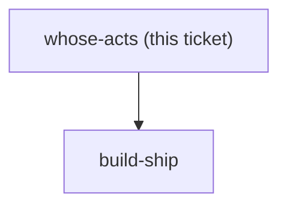
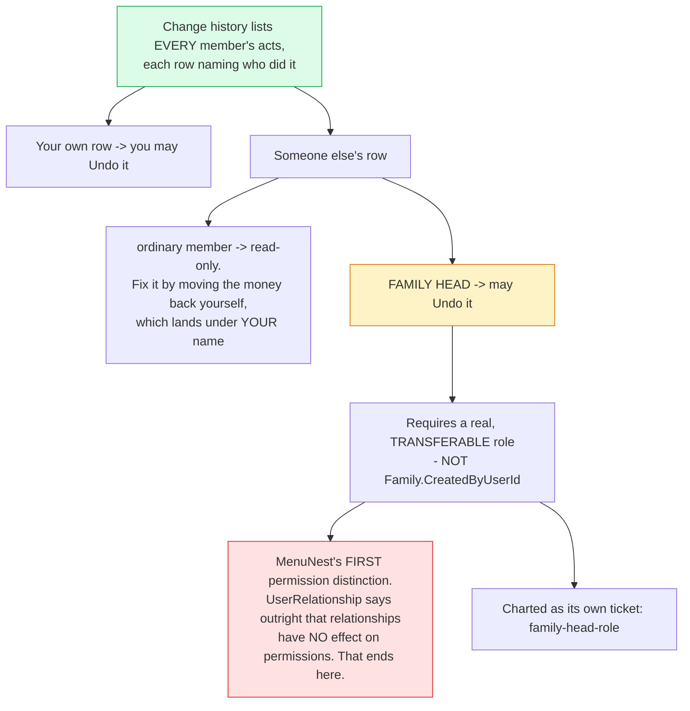

## Question

menunest-193 decided HOW undo works and reversible-actions decides WHICH acts it covers. Neither decides WHOSE acts. A Family has more than one member and both budget the same month, which is the exact scenario that made the compensating-transaction decision necessary. Decide: does the Shortcut rail undo only the acts this user performed, or any recent act by anyone in the Family; does Change history list everyone's acts or only yours; and if it lists everyone's, does a row show who did it. Note the stakes are asymmetric - undoing your own act is a correction, undoing someone else's is an intervention, and the app has no notification mechanism to tell them it happened.

<!-- decision-map:graph:start -->

<!-- decision-map:graph:end -->

<!-- decision-map:resolution:start -->
## Resolution

Change history shows every member's acts with names; you undo your own, the family head may undo anyone's. The head is a real transferable role - MenuNest's first permission distinction.

Detail: docs/adr/menunest-198-everyone-sees-the-history-and-the-family-head-may-undo-anyone.md

Recorded in **menunest-198**, which holds the reasoning and the rejected options.
This ticket records only what the answer changes.

## The recommendation was not taken, and that is on the record

The recommendation was **see everyone's, undo only your own** — no permission concept needed,
and a wrong move by another member is still fixable through the ordinary controls. The user
chose a family-head privilege instead, stated it twice, and it stands.

Before writing it up, the consequence was put to them once: **MenuNest has no roles at all
today, by explicit design.** `UserRelationship` carries the comment *"stored as metadata only
— it has no effect on permissions"*, and `Family.CreatedByUserId` is never consulted for
authorization anywhere — EF configuration and entity construction only. This decision creates
the app's first privilege distinction. The answer stood, so it is built.

## What was decided

- Change history lists **every** member's acts, each row naming who did it.
- A member may undo **their own**.
- The **family head** may undo anyone's.
- The head is a **real, transferable role** — `Family.CreatedByUserId` was offered as the free
  option and rejected, because it records who happened to create the Family rather than who
  runs the money.

## Two facts that changed the costing

- **Attribution is already built.** `BudgetTransaction` carries `CreatedByUserId` and the
  transaction DTO already projects `CreatedByDisplayName`. Naming the actor on a history row
  is not new work.
- **This ticket's own text was wrong and is corrected.** It asserted the app "has no
  notification mechanism". It has one: the real `WebPushSender` over VAPID is registered, not
  the `NullWebPushSender` placeholder, and `FollowUpDispatcher` drives it. What is missing is a
  *general* API — `IWebPushSender` exposes only `SendFollowUpAsync(FollowUpPing)`. So notifying
  someone costs a new method on a working sender, not new infrastructure.

## Deliberately deferred to the new ticket

Whether the person is **told** their act was undone. It is only a question because the head
can act on others, so it belongs with the role rather than here.

## What this leaves for other tickets

- **`family-head-role`** — newly charted, blocking `build-ship`: who may transfer the role,
  what happens when the head leaves or is removed, whether the head gains any other power,
  whether the role is visible, and the notification question above.
- Every future feature now inherits a question it did not have before: *may the head do this
  too?* That is the cost of the first role, paid once.

<!-- decision-map:resolution:end -->
