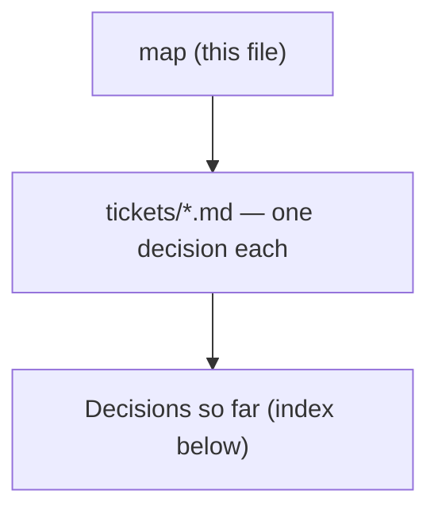

# Decision map - Trip CRUD: edit every field, and delete (#50)

## Destination
Trip editing and deletion are usable in the MenuNest SPA on production: every field the create dialog collects (name, destination, start date, day count, default travel mode) can be changed on an existing trip, a trip can be deleted, and neither path silently destroys scheduled stops.

## Notes
Frontend-heavy: PUT and DELETE /api/trips/{id} already exist and so do the RTK hooks - useDeleteTripMutation has zero call sites today, and useUpdateTripMutation is used only by TripDateEditor, which changes the start date and nothing else. Touching the backend is allowed if needed; apply any EF migration by hand per CLAUDE.md. Consult dev-workflows:grill-then-plan for each grilling ticket, superpowers:subagent-driven-development to execute, and docs/mocks plus the MenuNest Claude Design project for any UI mock. Standing preferences: inline-SVG icons and never emoji; Thai UI copy; commit referencing #50; stage explicit paths only. The SPA has no component or visual test harness and the review gates are blind to visual fidelity, so verify interactively before pushing. Once the frontier empties, hand to grill-then-plan, then SDD, then interactive verification on prod.

## Decisions so far

<!-- decision-map:decisions:start -->
- [Edit surface - where does editing an existing trip live, and how does it commit?](tickets/edit-surface.md) — A dedicated EditTripDialog - sibling to CreateTripDialog, sharing its .create-trip-dialog CSS class, NOT a mode on it (create and edit diverge seven ways, incl. dropping the isDaily switch per ADR-137). Opened only from the trip-detail header via an inline-SVG pencil icon on both desktop topbar and mobile header; TripsPage is untouched and the card's fate is left entirely to delete-ux. Commits staged behind an explicit save per ADR-138, dirty-diffed so an unchanged save issues no PUT (updateTrip invalidates TripItinerary on every call, which re-bills Routes+Weather), errors local with the dialog staying open on failure, cancel closes with no warning. TripDateEditor SURVIVES alongside - start date is the one field with two editors - and needs no change, because it passes dayCount through unchanged so it is never a Shrink and ADR-140's guard cannot fire on it.
- [Existing patterns - which edit, commit and destructive-confirm conventions should a trip-edit surface inherit?](tickets/existing-edit-patterns.md) — A shared useConfirm() destructive modal already exists and is mounted app-wide via AppLayout - but the entire Trips feature uses ZERO confirmations, every destructive trips action fires on first tap. ADR-013 mandates commit-on-change and its stated rationale (a mis-pick is cheap to re-pick) does not transfer to a field that destroys stops; ADR-085's own tie-breaker (single field -> autosave) fails for a multi-field form; ADR-137 forbids putting IsDaily on the full-replace UpdateTrip. The trip card is a single button so a secondary action needs it unwrapped, and dialogs are portaled so page-scoped trips tokens do not resolve - the two existing dialog families are teal and orange and do not match.
- [Field change effects - what does editing each Trip field actually destroy or silently alter?](tickets/field-change-effects.md) — Shrinking dayCount hard-deletes the trailing days and DB-cascades their Stops (IsVisited, notes, dwell, day start time, use-current-time all go, unrecoverably); checklist entries, TripPlaces and profiles survive. A startDate move destroys nothing but silently re-derives weather, season and opening-hours flags. defaultTravelMode re-costs nothing and only affects new stops. TripDetailPage can compute the at-risk stop count from cache it already holds; TripsPage cannot - TripDto carries nothing below the trip row.
- [Shrinking the day count destroys scheduled stops - confirm, block, or allow?](tickets/shrink-data-loss.md) — Confirm-and-proceed, but only when stops are really at risk: the day-count field is STAGED (never commit-on-change - ADR-013's cheap-re-pick rationale fails on an unrecoverable field) and one confirm fires on save naming the day range, the stop count, the place names and any already-visited stops. The control is live ONLY where the itinerary is already cached (never fetch getItinerary just to price a confirm - that re-bills Routes+Weather), and is disabled while the count is unknown rather than defaulting to zero. Guard also lands server-side: UpdateTripCommand gains a trailing AllowStopLoss=false and refuses a stop-destroying shrink with a message naming count+days; MCP exposes the flag so the agent path stops being silent.
<!-- decision-map:decisions:end -->

## Not yet specified

<!-- decision-map:fog:start -->
- Whether duplicating a trip belongs in this effort - the C of CRUD that #50 does not name, and that was not ruled out.
- Whether editing or deleting several trips at once belongs here, which would mean a list-management mode.
- Whether #50 reaches Place and Stop CRUD, which already have their own UI, or stops at the trip record itself.
- Whether the trips list needs sorting or search once its cards carry actions.
<!-- decision-map:fog:end -->

## Out of scope

<!-- decision-map:scope:start -->
- Restoring a deleted trip - no undo toast, no trash bin, no restore endpoint. Deletion is final from the user's point of view; the DB keeps the soft-deleted row only as a data-retention detail.
- Moving the daily on/off toggle into the edit surface - DailyToggle stays where it is on the trip detail header, so the edit form never sets IsDaily.
- Per-trip day or stop counts on the trips-list API - ADR-139 rules them out for #50. The day-count control is restricted to surfaces that already hold the itinerary in cache, so no list surface ever needs a count, and firing getItinerary just to price a confirm would re-bill Google Routes + Weather against ADR-042. Revisit only if a list-card action must itself warn before destroying stops.
- Editing a trip from the trips-list card - ADR-141 puts the edit affordance in the trip-detail header only (desktop topbar + mobile header), because ADR-139 means a card-launched edit could never change the day count, and the card is a single button so a nested button would be invalid HTML. TripsPage is left untouched by the edit work. This rules out a card EDIT action only - whether the card gains a DELETE action, and is therefore unwrapped, remains delete-ux's call.
<!-- decision-map:scope:end -->
