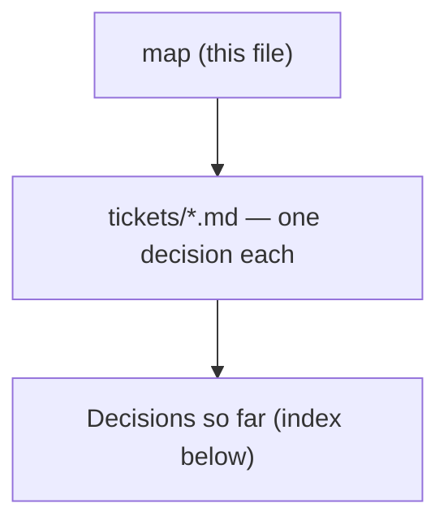

# Decision map - Trip CRUD: edit every field, and delete (#50)

## Destination
Trip editing and deletion are usable in the MenuNest SPA on production: every field the create dialog collects (name, destination, start date, day count, default travel mode) can be changed on an existing trip, a trip can be deleted, and neither path silently destroys scheduled stops.

## Notes
Frontend-heavy: PUT and DELETE /api/trips/{id} already exist and so do the RTK hooks - useDeleteTripMutation has zero call sites today, and useUpdateTripMutation is used only by TripDateEditor, which changes the start date and nothing else. Touching the backend is allowed if needed; apply any EF migration by hand per CLAUDE.md. Consult dev-workflows:grill-then-plan for each grilling ticket, superpowers:subagent-driven-development to execute, and docs/mocks plus the MenuNest Claude Design project for any UI mock. Standing preferences: inline-SVG icons and never emoji; Thai UI copy; commit referencing #50; stage explicit paths only. The SPA has no component or visual test harness and the review gates are blind to visual fidelity, so verify interactively before pushing. Once the frontier empties, hand to grill-then-plan, then SDD, then interactive verification on prod.

## Decisions so far

<!-- decision-map:decisions:start -->
- [Daily trips - what does the edit surface offer when IsDaily is set?](tickets/daily-trip-editing.md) — On a daily trip EditTripDialog shows all five fields but renders วันเริ่ม and จำนวนวัน DISABLED with their own reasons, never hidden: วันเริ่ม displays today (the treatment TripDateEditor already applies when locked) because the persisted start date is displayed NOWHERE in the SPA - dailyCard has no date row, TripDateEditor is always locked on a daily trip, and GetItinerary projects the date to today - so an editable field there would save successfully and change nothing observable. จำนวนวัน displays 1 with copy saying a daily trip is always single-day, deliberately different from ADR-139 disabled-because-unknown. DailyToggle keeps refusing non-destructively per ADR-133, but its message now names the cost (current day count, and that stops on the removed days go with them) and points at แก้ไข, built from TripDto data already present; it never performs the Shrink itself. The same-tab race is impossible because the dialog is modal, and a cross-tab or MCP flip lands on Reschedule domain guard, which ADR-141 already routes into the dialog error line. Separately and repo-wide (ADR-145): all backend exception messages stay English with no translation layer, so Reschedule keeps its message and ADR-140 refusal is English; the four Thai DomainExceptions in Trips are a known deviation, not precedent.
- [Delete a trip - affordance, confirmation, and where the user lands afterwards](tickets/delete-ux.md) — Delete is a footer action of EditTripDialog - matching both existing trips-delete affordances, which also live in a dialog footer - so TripsPage is never touched and its card never needs unwrapping. Confirmed via the shared useConfirm (destructive:true) naming three things: the trip by name, 'N วัน · M จุดแวะ' for identity (free, since ADR-139 already requires the itinerary cached), and the Discover consequence - deleting a trip also removes its places from ไปไหนดี, because deleteTrip invalidates MyPlaces and ListMyPlacesHandler filters DeletedAt == null. The copy must NOT claim the stops are deleted: DeleteTripHandler is a pure soft delete and every day, stop, place and checklist entry survives. On success navigate to /trips with no toast (there is no shared toast system, and the trip's absence is the feedback); staying put would hit TripDetailPage's existing not-found guard, which reads as an error. The button reads as destructive, deliberately breaking the muted .se-delete precedent, because unlike removing a stop or place this is not recoverable.
- [Visual mock for the trip edit and delete surface, approved before any code](tickets/edit-mock.md) — APPROVED as drawn. The mock lives in Claude Design -> 'MenuNest design system' -> Screens -> 'Issue #50 - Trip edit & delete' (project 8d8d4c81, path screens/issue-50-trip-edit-delete.html, registered in _ds_manifest.json); DS-only, matching the issue-46/47/49 precedent, not docs/mocks. Six panels built from the real .create-trip-dialog CSS rather than approximated: pencil entry in BOTH headers with TripDateEditor still inline beside it; the dialog's normal state; the three disabled-with-a-reason cases drawn SIDE BY SIDE (daily / count-unknown / past-dated-has-nothing-disabled) so the implementer cannot build one and reuse its wording; the shrink confirm naming days+count+place names+the มาแล้ว tag; the delete confirm naming the trip, 'N วัน · M จุดแวะ' and the Discover consequence without claiming stops are deleted; and the save-failure state with the English backend message. Two implementation constraints the mock pins: .ctd-actions must change from flex-end to space-between because ลบทริป sits hard LEFT, and the red-outline delete treatment is deliberate per ADR-143 (a reviewer who 'fixes' it to match the muted .se-delete is undoing a decision). The mock surfaced one live question and it was decided: useConfirm has ZERO custom CSS anywhere in frontend/src, so the two confirms render raw Syncfusion (8px, square buttons) against the dialog's 22px teal - a THIRD visual family alongside teal and orange. Left default, because useConfirm is mounted app-wide via AppLayout and used by Budget/Health, so restyling it either hits every caller with no visual test harness or needs a Trips-only variant; now an out-of-scope line. No ADR - the confirm call is cheaply reversible and everything else is already carried by ADR-138..146.
- [Edit surface - where does editing an existing trip live, and how does it commit?](tickets/edit-surface.md) — A dedicated EditTripDialog - sibling to CreateTripDialog, sharing its .create-trip-dialog CSS class, NOT a mode on it (create and edit diverge seven ways, incl. dropping the isDaily switch per ADR-137). Opened only from the trip-detail header via an inline-SVG pencil icon on both desktop topbar and mobile header; TripsPage is untouched and the card's fate is left entirely to delete-ux. Commits staged behind an explicit save per ADR-138, dirty-diffed so an unchanged save issues no PUT (updateTrip invalidates TripItinerary on every call, which re-bills Routes+Weather), errors local with the dialog staying open on failure, cancel closes with no warning. TripDateEditor SURVIVES alongside - start date is the one field with two editors - and needs no change, because it passes dayCount through unchanged so it is never a Shrink and ADR-140's guard cannot fire on it.
- [Existing patterns - which edit, commit and destructive-confirm conventions should a trip-edit surface inherit?](tickets/existing-edit-patterns.md) — A shared useConfirm() destructive modal already exists and is mounted app-wide via AppLayout - but the entire Trips feature uses ZERO confirmations, every destructive trips action fires on first tap. ADR-013 mandates commit-on-change and its stated rationale (a mis-pick is cheap to re-pick) does not transfer to a field that destroys stops; ADR-085's own tie-breaker (single field -> autosave) fails for a multi-field form; ADR-137 forbids putting IsDaily on the full-replace UpdateTrip. The trip card is a single button so a secondary action needs it unwrapped, and dialogs are portaled so page-scoped trips tokens do not resolve - the two existing dialog families are teal and orange and do not match.
- [Field change effects - what does editing each Trip field actually destroy or silently alter?](tickets/field-change-effects.md) — Shrinking dayCount hard-deletes the trailing days and DB-cascades their Stops (IsVisited, notes, dwell, day start time, use-current-time all go, unrecoverably); checklist entries, TripPlaces and profiles survive. A startDate move destroys nothing but silently re-derives weather, season and opening-hours flags. defaultTravelMode re-costs nothing and only affects new stops. TripDetailPage can compute the at-risk stop count from cache it already holds; TripsPage cannot - TripDto carries nothing below the trip row.
- [A trip whose start date is already past - may its start date or day count be edited at all?](tickets/past-dated-trip-edits.md) — A past-dated trip is FULLY editable - name, day count and travel mode change normally, and its date may still move FORWARD - but a Backdate (a Reschedule whose NEW date lands in the past) is refused. What is governed is where the date LANDS, never which direction it moved, so the relational 'shift backward' test 14 Nov->12 Nov stays valid. UpdateTripHandler throws when StartDate CHANGES to a date before UtcNow.AddDays(-1) - the same floor and the same explanatory comment as RetimeStopToHourHandler, giving one past-date semantic across both writers of Trip.StartDate; an unchanged date always passes, which is what keeps renaming a past trip working under the full-replace PUT. Server-side only, NO override flag (the ADR-140 AllowStopLoss shape was rejected) and MCP inherits the refusal. Both pickers - EditTripDialog's and TripDateEditor's - set minDate={today} so the guard is a backstop nobody normally reaches; this AMENDS ADR-142, whose 'needs no change' was verified against ADR-140 only. Day count carries no past-specific restriction and the edit surface shows nothing past-specific. Chosen for cross-handler consistency AGAINST the evidence: create has no past-date rule at all, Retime's guard exists to stop a SILENT move rather than a past one, and the 'silent degradation' premise is false - moving forward past 240h flips weather to No-data identically.
- [Shrinking the day count destroys scheduled stops - confirm, block, or allow?](tickets/shrink-data-loss.md) — Confirm-and-proceed, but only when stops are really at risk: the day-count field is STAGED (never commit-on-change - ADR-013's cheap-re-pick rationale fails on an unrecoverable field) and one confirm fires on save naming the day range, the stop count, the place names and any already-visited stops. The control is live ONLY where the itinerary is already cached (never fetch getItinerary just to price a confirm - that re-bills Routes+Weather), and is disabled while the count is unknown rather than defaulting to zero. Guard also lands server-side: UpdateTripCommand gains a trailing AllowStopLoss=false and refuses a stop-destroying shrink with a message naming count+days; MCP exposes the flag so the agent path stops being silent.
<!-- decision-map:decisions:end -->

## Not yet specified

<!-- decision-map:fog:start -->
- (none)
<!-- decision-map:fog:end -->

## Out of scope

<!-- decision-map:scope:start -->
- Restoring a deleted trip - no undo toast, no trash bin, no restore endpoint. Deletion is final from the user's point of view; the DB keeps the soft-deleted row only as a data-retention detail.
- Moving the daily on/off toggle into the edit surface - DailyToggle stays where it is on the trip detail header, so the edit form never sets IsDaily.
- Per-trip day or stop counts on the trips-list API - ADR-139 rules them out for #50. The day-count control is restricted to surfaces that already hold the itinerary in cache, so no list surface ever needs a count, and firing getItinerary just to price a confirm would re-bill Google Routes + Weather against ADR-042. Revisit only if a list-card action must itself warn before destroying stops.
- Editing a trip from the trips-list card - ADR-141 puts the edit affordance in the trip-detail header only (desktop topbar + mobile header), because ADR-139 means a card-launched edit could never change the day count, and the card is a single button so a nested button would be invalid HTML. TripsPage is left untouched by the edit work. This rules out a card EDIT action only - whether the card gains a DELETE action, and is therefore unwrapped, remains delete-ux's call.
- Sorting or search on the trips list - the question was conditional on the cards carrying actions, and they never will in #50. ADR-141 puts edit in the trip-detail header and ADR-143 puts delete in the EditTripDialog footer, so TripsPage is not touched at all and its card stays a single navigating button.
- Editing or deleting several trips at once, and any trips-list management mode - both edit and delete now live in the trip-detail dialog (ADR-141, ADR-143), so multi-select on the list is not part of #50. A future effort that wants it would first have to unwrap the trip card.
- Normalising the four Thai DomainException messages in Trips, and any frontend translation layer or ProblemDetails error-code contract - ADR-145 makes English the rule for every backend message and rejects the translation layer on cost (getErrorMessage passes detail through verbatim today, so there is no mechanism to build on). The four Thai messages stay as a known deviation; #50 neither retrofits them nor builds the machinery that would let a backend guard speak Thai.
- Disabling CreateTripDialog's start-date field when the daily switch is on - ADR-144 records the divergence (create lets you pick a start date a daily trip will never display, edit does not) but #50's destination is editing and deleting an existing trip, not correcting the create dialog. Revisit if the two dialogs are ever unified.
- Adding a past-date bound to CreateTripDialog - ADR-146 guards a Backdate on the EDIT path only, and knowingly leaves create able to produce a past-dated trip (CreateTripValidator has no date rule and its DatePicker is unbounded, so a trip starting in 2020 is three taps away). This is the same create/edit divergence ADR-144 already accepted for the daily start date, left standing for the same reason: #50's destination is editing and deleting an existing trip, not correcting the create dialog. The guard prevents accidents; it does not enforce an invariant, and it is deliberately bypassable. Revisit if the two dialogs are ever unified.
- Restyling the shared useConfirm modal, in any form - globally or as a Trips-only variant. The edit-mock grilling found it has ZERO custom CSS anywhere in frontend/src, so it renders raw Syncfusion (8px corners, square buttons) against EditTripDialog's 22px teal - a third visual family alongside the teal and orange dialog families existing-edit-patterns already found. It is mounted app-wide via AppLayout and used by Budget, Health and others, so a global restyle changes every caller's confirms with no visual test harness anywhere, and a Trips-only variant adds a prop to a shared component to fix a mismatch #50 did not create. The approved mock draws the confirms default on purpose. Revisit as its own visual-consistency effort, never as a rider on a feature issue.
- Duplicating a trip - the C of CRUD the map's fog left open, now closed OUT. Issue #50's body is 'แก้ทุกอย่าง เช่น ไปพักกี่วัน รวมถึงลบได้' (edit everything, e.g. how many days; including being able to delete) - it names U and D only, and the title's word CRUD is not a scope grant. C already exists in full (CreateTripDialog + CreateTripHandler), so a duplicate is not a CRUD gap being filled but a new feature: grep for Duplicate|Clone|Copy(Trip|Stop|Place) across backend/src returns ZERO, so it would need a new command, handler, validator, MCP tool and UI affordance. It would also have to decide first what a copy actually contains - days, stops, dwell, day start times, use-current-time, IsVisited, checklist entries, TripPlaces, review links, seasons, best-time windows, place profiles - which is a destination of its own, not a rider on this one. Revisit as its own issue.
- Place and Stop CRUD - #50 stops at the trip record itself, because Places and Stops are already complete at BOTH layers. Backend: AddStop / UpdateStop / RemoveStop / ReorderStops / RetimeStopToHour / RetimeStopToWeather and AddTripPlace / UpdateTripPlace / DeleteTripPlace / ListTripPlaces under backend/src/MenuNest.Application/UseCases/Trips. Frontend: StopEditorDialog.tsx and PlaceEditorDialog.tsx. Nothing is missing, so there was never a decision here - the destination names only the five fields the create dialog collects, plus deleting the trip. Revisit only if a specific gap in the stop or place editors is found, and then as its own issue.
<!-- decision-map:scope:end -->
