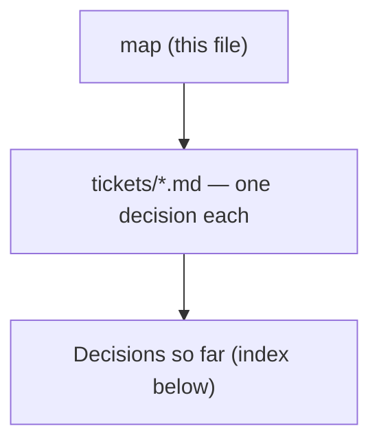

# Decision map - CanUndo ignores who is allowed to undo (#108)

## Destination
An ordinary member of a two-person family opens Change history, or presses the shortcut rail's Undo, and is never offered a control that will fail: the server decides who may act on each row, the sheet says why when they may not, and menunest-198's rule stays in exactly one place.

## Notes

<!-- decision-map:notes:start -->
- Tracking issue: https://github.com/ThodsaphonSonthiphin/MenuNest/issues/108 - `bug`, `Refs #106`, a follow-up on the shipped `shortcut-rail-106` map rather than a new feature. Every commit references it per CLAUDE.md, and any new ADR is named menunest-<number>-<slug>.md.
- Every fact below was read from the working tree at `7f3bf62` on 2026-09-01, or is carried forward with its own provenance from `docs/runbooks/2026-08-29-open-head-ui-issues.md`, which measured prod on 2026-08-29.
- SETTLED BEFORE CHARTING, binding on every ticket - the rule goes in the SERVER's `CanUndo`, not the SPA. menunest-198 put the permission in one seam on purpose (`UndoChangeHandler`'s own comment: *"This is the single seam where that widening lives - do not scatter the rule"*), and the runbook says outright: *"Do not fix Issue 2 by disabling the button in the SPA - that duplicates menunest-198 in a second place."* No ticket re-opens this.
- SETTLED BEFORE CHARTING - the sheet keeps showing every member's rows. menunest-198 split visibility from authority deliberately: seeing who moved the money is the valuable half and needs no permission. Nothing here hides a row.
- The defect is one expression. `ListChangesHandler.cs:19` discards the caller - `var (_, familyId) = await _users.RequireFamilyAsync(ct)` - and line 78 sets `CanUndo: !gone`, where `gone` is menunest-197's deleted-Envelope case and the only input.
- The SPA trusts that flag completely, in three places, and none of them checks anything else: `ChangeHistorySheet.tsx:71` and `:79` disable the Undo and Redo buttons on it, `:52` puts the `is-dead` class on the row, and `latestUndoable.ts:12`/`:17` pick the rail's targets from it.
- The server-side head check ALREADY EXISTS TWICE, identically: `UndoChangeHandler.cs:36-45` and `RedoChangeHandler.cs:34-43`, each running `_db.Families.AnyAsync(f => f.Id == familyId && f.HeadUserId == user.Id)`. `Families` is already on `IApplicationDbContext`, so the fix's read is a THIRD copy of a query that works, not a new capability - one extra round trip per history load, no migration, no new endpoint.
- There is ONE flag for TWO buttons. `BudgetChangeDto` carries `CanUndo` and `BlockedReason` and there is no `CanRedo`; `ChangeHistorySheet` renders whichever button the row's `isUndone` calls for and disables it on the same boolean. Whether the permission fix keeps that shape is `redo-symmetry`'s to decide, not the implementer's.
- "Dead" and "not yours" would render IDENTICALLY unless a ticket says otherwise: `BudgetPage.css:911` dims any `.is-dead` row to `opacity:.55` and `:915` prints `.bdg-history-blocked` in `var(--red)`. One is permanent and true for everyone; the other is temporary and false for the head standing next to you.
- LANGUAGE GAP, and ADR-145 does not close it. Every string the sheet composes is Thai - `describeChange` returns `ใส่ ฿300 เข้า ค่ากิน` and the buttons read ยกเลิก / ทำซ้ำ - but `BlockedReason` arrives from the server in English (*"That envelope was deleted."*) and is rendered verbatim at `ChangeHistorySheet.tsx:62`. ADR-145 rules on messages **thrown** from the backend and says the line is "where the string is authored"; `BlockedReason` is display copy on a DTO, thrown by nothing, and sits in the gap. A second blocked reason doubles down on whichever way this goes.
- The rail's behaviour CHANGES for an ordinary member the moment the fix lands, and nobody has chosen the new behaviour. `latestUndoable` takes the newest row with `!isUndone && canUndo`; once `canUndo` carries ownership it will skip a colleague's newer change and arm on the member's own older one. Pressing Undo would then reverse something from two days ago. That is `rail-reach-past`.
- menunest-197 accepted, on the record, that the rail's Undo "can look pressable and then refuse" because the budget page does not carry the top row's state. That acceptance was about the deleted-Envelope case, which is RARE. The permission case is not rare - in a two-member family roughly half the rows are somebody else's - so the accepted rough edge does not automatically cover it.
- LIVE TODAY AND NOT CREATED BY THIS FIX: the head undoes my change, the row is still mine, so `canUndo` stays true and `RedoChangeHandler` lets me redo it - and the head can undo it again. menunest-201 gave the head exactly one power and never said whether it survives a redo. The fix makes this the one cross-member control still enabled, which is why `redo-symmetry` holds it.
- The runbook's blocker - *"Both need a two-member family, which prod does not have"* - is true for PROD verification only, and is not a blocker on the build. The backend rule is unit-testable today: `HeadUndoesAnyoneTests` already seeds a second member (`other`) and a third (`third`) and repoints `fx.UserProvisioner`, which is the exact fixture the issue asks to copy.
- The rendering half is testable too, and CLAUDE.md says it must be: the SPA has no component test harness, and `frontend/e2e/helpers/mockRoutes/budgetRoutes.ts:179-212` mocks the whole history response, so a foreign blocked row is a fixture edit. The fixture already names a second member - `undoneByDisplayName: 'มาลี'` on `chg-1`.
- The fix only ever NARROWS what is offered, so no existing test should turn red: every case in `ListChangesHandlerTests` calls as `fx.User`, who created the family and is therefore its head, and `budget.shortcut-rail.spec.ts` asserts one Undo and one Redo against a fixture whose rows are all `user-1`'s.
- Prod is dormant on this: 2 families, 1 member each, measured by direct SQL on 2026-08-29. Nothing is broken for a live user today and nothing will be until a second person joins. That sets the urgency, not the correctness.
- The sibling issue #107 (the head role has no UI) is NOT on this map. It is a separate ticket with its own screen work, and this map depends on none of it - `Family.HeadUserId` is already populated and already read by both handlers.
<!-- decision-map:notes:end -->

## Milestones

<!-- decision-map:milestones:start -->
- `two-member-safe` an ordinary member is never offered a control that will fail, and the head still sees every one enabled [canundo-consumers-audit, blocked-row-treatment, rail-reach-past, redo-symmetry, fix-and-verify]
<!-- decision-map:milestones:end -->

## Decisions so far

<!-- decision-map:decisions:start -->
#### two-member-safe — an ordinary member is never offered a control that will fail, and the head still sees every one enabled

- [What does `canUndo` mean today, who reads it, and what exactly does a second member break?](tickets/canundo-consumers-audit.md) — Three SPA consumers trust one flag; the head check already exists twice server-side so the fix is a third copy, no migration. Two things the issue does not mention: "dead" and "not yours" render identically, and a member can already redo what the head undid.
<!-- decision-map:decisions:end -->

## Not yet specified

<!-- decision-map:fog:start -->
- Whether the head should be told that a member tried to undo their change and was refused - nothing anywhere records a refused attempt today, and menunest-201's push notification fires only on a completed undo.
- Whether `BlockedReason` should become a code rather than a sentence, so the SPA composes the copy. ADR-145 rejected exactly that (an error-code contract in ProblemDetails) as new cross-cutting infrastructure - but it rejected it for THROWN messages, and a DTO field is a much smaller surface. Named here so `blocked-row-treatment` can decline it deliberately rather than by not noticing.
- Whether the family head badge that #107 will add should also appear on a Change history row, so a member can see WHO the "or the family head" in a blocked reason actually is. Neither map owns this.
- How this interacts with a member LEAVING the family. `Family.HeadUserId` can point at a former member, and menunest-201's `LeaveFamily` guard only stops the head from leaving while others remain - it says nothing about the rows an ordinary member leaves behind, which would become undoable by nobody but the head.
- Whether undo/redo ever reach the MCP surface. Carried over unanswered from the `shortcut-rail-106` map; if they do, the permission rule needs a second enforcement point and `CanUndo` stops being the only thing a client can trust.
<!-- decision-map:fog:end -->

## Out of scope

<!-- decision-map:scope:start -->
- Any UI for the family head role - the badge, the transfer control, the `POST /api/families/head` call. That is issue #107 and it is a separate effort with its own screens.
- Widening what the head may do. menunest-201 fixed the role at exactly one power plus handing it over, and nothing here re-opens that.
- Hiding another member's rows from the sheet. menunest-198 chose visibility for everyone deliberately, separately from the authority to act.
- Duplicating the permission rule in the SPA. Ruled out before charting - it is the specific failure the single-seam design in `UndoChangeHandler` exists to prevent, and the runbook names it as the wrong fix.
- Retrofitting the four Thai `DomainException` messages ADR-145 recorded as a known deviation. `blocked-row-treatment` may decide the language of a DTO field; it does not re-open ADR-145.
- Verifying either issue against a live two-member prod family. Prod has none, creating one is not this map's work, and both the backend rule and the rendering are provable without it.
<!-- decision-map:scope:end -->
