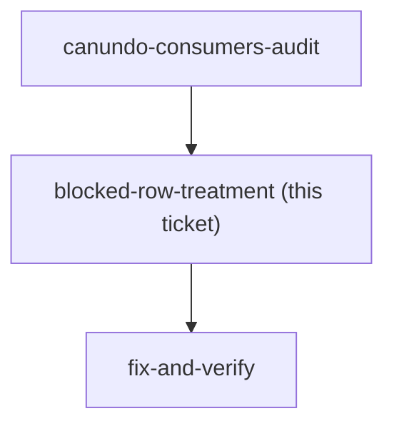
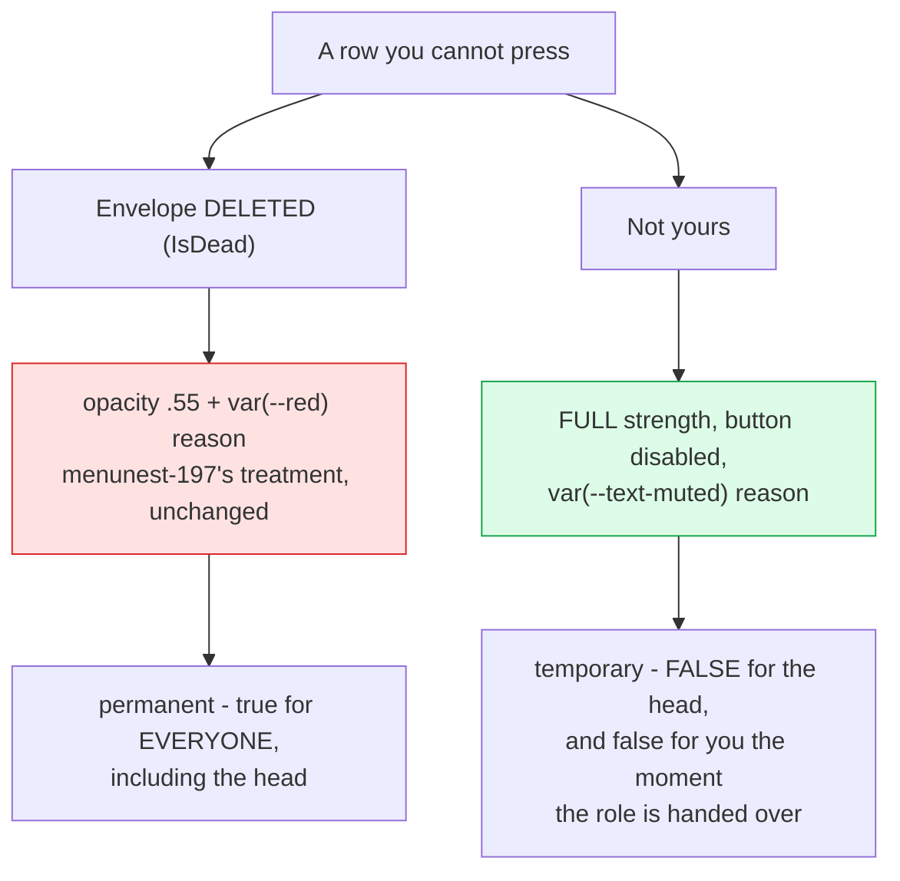

## Question

Once `CanUndo` carries menunest-198, a row can be unpressable for two unrelated reasons and
the sheet renders them identically today: `.is-dead` at `opacity:.55` with a red line
underneath. **A deleted Envelope is permanent and true for everyone. "Not yours" is temporary
and false for the head standing next to you** — the same row is live in their hands, and it
becomes live in yours the moment the role is handed over.

Decide three things:

1. **Treatment** — does a not-yours row reuse menunest-197's dead-row look, get its own
   quieter treatment (button disabled, row NOT greyed, since the row itself is perfectly
   valid), or say nothing at all and just render a disabled button?
2. **Copy** — the issue suggests *"Only &lt;name&gt; or the family head can undo this."* Does it
   name the author, given the row already prints their name one line above? Does it name the
   head, whom the member currently has no way to identify — #107 has not shipped the badge?
3. **Language** — every string the sheet composes is Thai; `BlockedReason` arrives from the
   server in English and is printed verbatim. ADR-145 governs *thrown* messages and leaves a
   DTO display field in a gap. Either the new reason is English and the gap is confirmed as
   deliberate, or it is Thai and English display copy on a DTO becomes the deviation, or the
   field becomes a code and the SPA composes both sentences — which is the shape ADR-145
   rejected for exceptions, on a far smaller surface.

<!-- decision-map:graph:start -->

<!-- decision-map:graph:end -->

## What is already fixed and not up for grabs

- The rule lives in the server's `CanUndo`. Settled before charting; the runbook names the
  SPA duplication as the wrong fix.
- The row stays visible with its author's name. menunest-198 split seeing from acting on
  purpose.
- menunest-197's deleted-Envelope row keeps its wording and its treatment. This ticket adds a
  case; it does not re-litigate that one.

## Evidence to put in front of the decision

- `BudgetPage.css:911` — `.bdg-history-row.is-dead { opacity: .55; }`
- `BudgetPage.css:915` — `.bdg-history-blocked { font-size: 11px; color: var(--red); … }`
- `ChangeHistorySheet.tsx:52/61` — the class and the reason line, both hung off `!canUndo`
- `ChangeHistorySheet.tsx:62` — `{r.blockedReason}` rendered raw, no mapping
- ADR-145 — English for thrown messages; "the line is where the string is authored"; SPA-
  composed copy stays Thai
- The row already prints `{r.userDisplayName}` at `ChangeHistorySheet.tsx:57`

## Cost of each language option, so the answer is not free-floating

| option | what it costs |
|---|---|
| English sentence, like today | nothing. An English line under a Thai row, twice instead of once. |
| Thai sentence on the DTO | nothing mechanically — but Thai UI copy now lives in the Application layer, which is the thing ADR-145 refused for exceptions. |
| Code + Thai in the SPA | a `BlockedReason` enum, a switch in `ChangeHistorySheet`, and menunest-197's existing sentence retrofitted. Small, but it makes the DTO a contract the SPA must keep in step. |

<!-- decision-map:resolution:start -->
## Resolution

A not-yours row keeps full strength with its button disabled and a MUTED reason line —
greying stays reserved for menunest-197's permanent dead row. The reason names the head, not
the author, and stays English, confirming the ADR-145 gap as deliberate.

Detail: `docs/adr/menunest-216-canundo-carries-both-rules-and-redo-belongs-to-whoever-undid-it.md`

## The three answers

**Treatment — its own, quieter one.** `.is-dead` at `opacity:.55` now hangs off `IsDead`
alone, never off "you may not act". A not-yours row renders normally with its button
disabled and a reason line in `var(--text-muted)` — a new `.bdg-history-note`, not
`.bdg-history-blocked`'s `var(--red)`. Red is an alarm; being asked not to touch somebody
else's money is not one.

**Copy — name the head, not the author.** The row already prints `{r.userDisplayName}` one
line above, so repeating it would be the second time the sheet says the same name in three
lines. *"Only the family head can undo someone else's change."* The member currently has no
way to identify who that is — #107 has not shipped the badge — and that is a gap in #107, not
a reason to write a worse sentence here. It is on the map's fog.

**Language — English, as today.** ADR-145 was read and found genuinely not to cover this: it
rules on messages **thrown** from the backend, and `BlockedReason` is display copy on a DTO
that nothing throws. The gap is now confirmed as deliberate rather than left ambiguous. The
code-plus-Thai option was declined on the cost named in the ticket's own table — it makes the
DTO a contract the SPA must keep in step, for two sentences.

## What this hands on

- `fix-and-verify` inherits a **new CSS class**, and CLAUDE.md is explicit that neither `tsc`,
  `npm run build` nor vitest can see whether it renders. The Playwright assertion is not
  optional here — it is the only gate that can tell a muted line from a red one.
- `IsDead` on the DTO is what makes this decidable at all: without it the SPA would have to
  infer permanence from the reason **string**, which ADR-145 forbids.
<!-- decision-map:resolution:end -->
