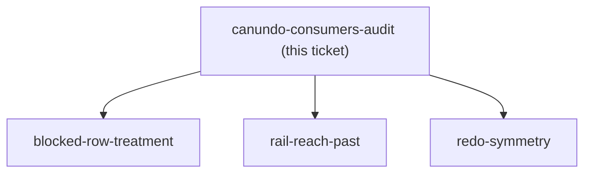
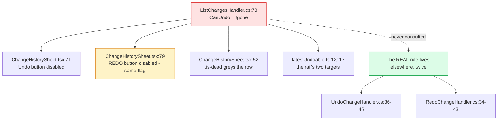

## Question

Issue #108 asserts a defect and proposes a fix. Before grilling anything, establish from the
code what `CanUndo` actually promises, every place that promise is consumed, what the server
already enforces, and what a second family member would really see. Find what the issue
does **not** say, and find out what is provable without a two-member family.

<!-- decision-map:graph:start -->

<!-- decision-map:graph:end -->

<!-- decision-map:resolution:start -->
## Resolution

Three SPA consumers trust one flag; the head check already exists twice server-side so the
fix is a third copy, no migration. Two things the issue does not mention — "dead" and "not
yours" render identically, and a member can already redo what the head undid.

Read from the working tree at `7f3bf62` on 2026-09-01.



## What `CanUndo` promises, and what it delivers

`ListChangesHandler.cs:19` resolves the caller and throws them away —
`var (_, familyId) = await _users.RequireFamilyAsync(ct)` — then line 78 computes
`CanUndo: !gone`. `gone` is menunest-197's deleted-Envelope case and is the **only** input.

The DTO's own doc comment (`BudgetChangeDto.cs`) says `CanUndo` "carries menunest-197's
rule", and the SPA's type comment at `api.ts:645` repeats it: *"false when the envelope was
deleted"*. So the flag is honestly named and honestly documented — it never claimed to carry
menunest-198. The defect is that **three consumers read it as if it did**.

## Every consumer, and the fact that none checks anything else

| where | what it does with the flag |
|---|---|
| `ChangeHistorySheet.tsx:71` | `disabled={!r.canUndo \|\| busy}` on ยกเลิก |
| `ChangeHistorySheet.tsx:79` | `disabled={!r.canUndo \|\| busy}` on ทำซ้ำ — **the same flag** |
| `ChangeHistorySheet.tsx:52` | adds `is-dead` to the row |
| `ChangeHistorySheet.tsx:61` | prints `blockedReason` under the row text |
| `latestUndoable.ts:12` / `:17` | picks the rail's undo and redo targets |

There is no `isHead`, no `userId` comparison and no `currentUser` anywhere in
`frontend/src/pages/budget`. The SPA has nothing else to go on, which is what makes moving
the rule into the flag the cheap fix rather than merely the tidy one.

## The server already enforces it — twice, identically

`UndoChangeHandler.cs:36-45` and `RedoChangeHandler.cs:34-43` each run

```csharp
var isHead = await _db.Families.AnyAsync(f => f.Id == familyId && f.HeadUserId == user.Id, ct);
```

`Families` is already on `IApplicationDbContext`. So the proposed read in
`ListChangesHandler` is a **third copy of a query that works** — one extra round trip per
history load, no new entity, no migration, no endpoint, no `DbSet` to add to the four
`IApplicationDbContext` implementers CLAUDE.md warns about. Blast radius: one handler, and
the two comments that document the flag.

## Two findings the issue does not mention

**1. "Dead" and "not yours" would look the same.** `BudgetPage.css:911` dims any `.is-dead`
row to `opacity:.55` and `:915` prints `.bdg-history-blocked` in `var(--red)`. Reusing that
treatment says the same thing about two very different states: a deleted Envelope can never
be undone by anyone, ever, while "not yours" is false for the head sitting next to you and
stops being true the moment the role is handed over. The issue proposes a second
`BlockedReason` and stops there; the treatment is undecided. → `blocked-row-treatment`

**2. A member can already redo what the head undid.** The head undoes my change;
`change.UserId` is still mine; so `CanUndo` stays true under the proposed formula and
`RedoChangeHandler`'s own check passes. I press ทำซ้ำ, the head presses ยกเลิก again. This is
live today and is **not created by the fix** — but the fix makes it the one cross-member
control still enabled, which is a different thing from being buried among broken ones.
menunest-201 fixed the head at exactly one power and never said whether it survives a redo.
→ `redo-symmetry`

## A third thing the issue gets right but understates

The issue says `latestUndoable` / `latestRedoable` "need no change: they already filter on
`canUndo`". True — and that is precisely why the rail's **behaviour changes** without anyone
choosing the new behaviour. `latestUndoable` takes the newest row with `!isUndone &&
canUndo`, so it will start skipping a colleague's newer change and arming on the member's own
older one. Press Undo, reverse something from two days ago, with no indication that the
newest change was passed over. menunest-197 accepted that the rail "can look pressable and
then refuse" — but for a case it called rare. In a two-member family roughly half the rows
are somebody else's. → `rail-reach-past`

## What is provable without a two-member family

The runbook records *"Both need a two-member family, which prod does not have"* as the
blocker on verification. That is true of **prod** and of nothing else.

- **The backend rule** is unit-testable now. `HeadUndoesAnyoneTests` seeds a second member
  (`other`), a third (`third`), and repoints `fx.UserProvisioner.RequireFamilyAsync` — the
  exact fixture the issue asks to copy. Note that `fx.User` created the family and is
  therefore the head, so an "ordinary member" case must repoint the provisioner or it
  silently tests the head.
- **The rendering** is e2e-testable now, and CLAUDE.md requires it: the SPA has no component
  test harness, so `tsc` + `build` + vitest cannot see a greyed row. The Playwright fixture
  at `frontend/e2e/helpers/mockRoutes/budgetRoutes.ts:179-212` mocks the whole history
  response, so a foreign blocked row is a fixture edit. It already names a second member —
  `undoneByDisplayName: 'มาลี'` on `chg-1`.
- **Nothing existing should turn red.** The fix only narrows. Every `ListChangesHandlerTests`
  case calls as `fx.User` (the head), and `budget.shortcut-rail.spec.ts` asserts one Undo and
  one Redo against a fixture whose rows all belong to `user-1`.

## The language gap, found here and handed on

Everything the sheet composes is Thai — `describeChange` returns `ใส่ ฿300 เข้า ค่ากิน`, the
buttons read ยกเลิก and ทำซ้ำ — but `BlockedReason` arrives from the server in English
(*"That envelope was deleted."*) and is rendered verbatim at `ChangeHistorySheet.tsx:62`.

ADR-145 does **not** settle this. It rules on messages *thrown* from the backend and states
the line is "where the string is authored, not who reads it" — but `BlockedReason` is display
copy on a DTO that nothing throws, and the ADR's own carve-out keeps SPA-composed copy Thai.
Adding a second reason doubles down on whichever side of that gap this lands.
→ `blocked-row-treatment`

## Urgency, measured

Prod has 2 families with 1 member each (direct SQL, 2026-08-29, via the runbook). Nothing is
broken for a live user today. The first `JoinFamily` breaks it. That sets how soon, not
whether.

<!-- decision-map:resolution:end -->
