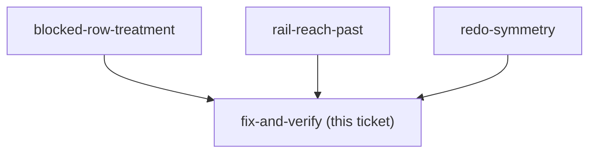

## Question

Implement whatever the three grilling tickets decide, cover it, and get it to prod. The shape
is already known and is small; what is not yet known is the copy, the treatment, the rail's
behaviour and whether the flag splits.

<!-- decision-map:graph:start -->

<!-- decision-map:graph:end -->

## The shape, as far as the audit settles it

- `ListChangesHandler.cs:19` stops discarding the caller; read `Family.HeadUserId` **once**
  outside the row loop, not per row.
- `CanUndo = !gone && (r.UserId == user.Id || user.Id == headUserId)`, with the two blocked
  cases producing different `BlockedReason`s. Order matters: a deleted Envelope on somebody
  else's row should say the Envelope thing, because that one is true for the head too.
- One handler, one DTO comment, two SPA comments. **No migration, no new endpoint, no new
  `DbSet`** — so CLAUDE.md's four-implementer rule and its manual-migration rule are both
  inert here. Say that in the commit body so a reviewer does not go looking.

## Coverage owed

- **Backend** — the case the issue names: an ordinary member listing history that contains
  another member's change gets `canUndo:false` on that row and `canUndo:true` on their own;
  the head gets `true` on both. Copy the fixture from `HeadUndoesAnyoneTests`, which already
  seeds `other` and `third` and repoints `fx.UserProvisioner`. **Trap:** `fx.User` created the
  family and is therefore the head, so a test that does not repoint the provisioner is
  silently testing the head and will pass either way.
- **Frontend e2e, required by CLAUDE.md** — vitest runs in `environment: 'node'` with no DOM,
  so nothing but Playwright can see a greyed row or a disabled button. Add a foreign blocked
  row to the fixture at `frontend/e2e/helpers/mockRoutes/budgetRoutes.ts:179-212` and assert
  the treatment `blocked-row-treatment` chooses. The fixture already names a second member
  (`undoneByDisplayName: 'มาลี'`), so it does not have to invent one.
- **`latestUndoable`** — a pure lib module with a real vitest suite already
  (`latestUndoable.test.ts`), so whatever `rail-reach-past` decides is unit-testable there
  regardless of which way it goes.
- **Regression** — nothing existing should turn red, because the fix only narrows: every
  `ListChangesHandlerTests` case calls as the head, and `budget.shortcut-rail.spec.ts` runs on
  a fixture whose rows all belong to `user-1`. A red test here means the change went wider
  than intended.

## Verification, and the runbook's blocker

The runbook records *"Both need a two-member family, which prod does not have"* as what is
owed. That is the blocker on **prod** verification and on nothing else — the backend rule and
the rendering are both provable in CI, as above. What genuinely cannot be checked until a
second person joins is the end-to-end article: a real member seeing a real disabled row.

Decide with the user whether that is a release gate or a note on the issue. It should not
silently become the reason the fix waits.

## Is an ADR owed?

Probably yes, and small — this changes what `CanUndo` *means*, which two shipped ADRs
(menunest-197, menunest-198) both document from their own side, and a later reader hitting the
flag needs one place that says it now carries both rules. Mint the number per CLAUDE.md's
global-max scan and name it `menunest-<n>-<slug>.md`.

## Commit and ship notes

- Reference the issue per CLAUDE.md: `(closes #108)` on the commit that finishes it, `(#108)`
  on any partial.
- Stage explicit paths. Never `git add -A` — `daily-state.md` is tracked and usually dirty.
- The pre-commit hook runs the **whole** suite (backend build + test, `tsc --noEmit`,
  `npm run build`), so every commit must leave everything green, not just this feature's tests.
- Pushing to `main` deploys to prod. Ask first.
