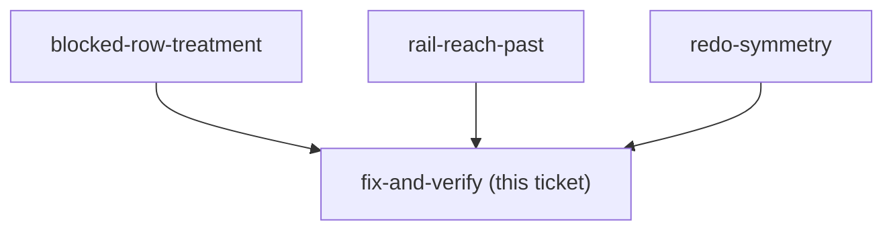

## Question

Implement whatever the three grilling tickets decide, cover it, and get it to prod. The shape
is already known and is small; what is not yet known is the copy, the treatment, the rail's
behaviour and whether the flag splits.

<!-- decision-map:graph:start -->

<!-- decision-map:graph:end -->

## The shape, now that the three grillings are closed

Everything below is specified by **menunest-216**. Read it before starting; this section is
its build list, not a second source of truth.

**`ListChangesHandler`** — stop discarding the caller at line 19; read `Family.HeadUserId`
**once** outside the row loop, not per row. Then per row:

```
isHead   = user.Id == headUserId
IsDead   = gone                                            // menunest-197, unchanged
CanUndo  = !gone && !r.IsUndone && (r.UserId == user.Id         || isHead)
CanRedo  = !gone &&  r.IsUndone && (r.UndoneByUserId == user.Id || isHead)
```

Order the reasons: a deleted Envelope on somebody else's row says the **Envelope** thing,
because that one is true for the head too.

**`RedoChangeHandler`** — its check moves from `change.UserId` to `change.UndoneByUserId`,
and its message is reworded: *"You can only redo your own changes."* stops being true of the
rule it now enforces. This is a real behaviour change, not a DTO one, and it is the part of
the build most easily missed.

**`BudgetChangeDto`** — `CanUndo`, `CanRedo`, `IsDead`, `BlockedReason`. `IsDead` is what
lets the SPA tell permanent from temporary without matching the reason string, which ADR-145
forbids. Mirror all four into `api.ts`.

**`ChangeHistorySheet`** — `is-dead` hangs off `isDead` alone; the undo button off `canUndo`,
the redo button off `canRedo`. New `.bdg-history-note` in `var(--text-muted)` for a
not-yours reason, beside the existing `.bdg-history-blocked` in `var(--red)`.

**`latestUndoable.ts`** — `latestRedoable` reads `canRedo`. `latestUndoable` is unchanged;
its reach-past behaviour is accepted (menunest-216 §6) and needs a test, not a fix.

**No migration, no new endpoint, no new `DbSet`** — CLAUDE.md's four-implementer rule and its
manual-migration rule are both inert here. Say so in the commit body so a reviewer does not
go looking.

## Coverage owed

- **Backend** — the case the issue names: an ordinary member listing history that contains
  another member's change gets `canUndo:false` on that row and `canUndo:true` on their own;
  the head gets `true` on both. Copy the fixture from `HeadUndoesAnyoneTests`, which already
  seeds `other` and `third` and repoints `fx.UserProvisioner`. **Trap:** `fx.User` created the
  family and is therefore the head, so a test that does not repoint the provisioner is
  silently testing the head and will pass either way.
- **Backend, the redo rule** — the loop that no longer closes: the head undoes the member's
  change, the member gets `canRedo:false` on it, and a redo call throws. The head still gets
  `canRedo:true`. This is the case the issue does not ask for and menunest-216 §2 requires.
- **Frontend e2e, required by CLAUDE.md** — vitest runs in `environment: 'node'` with no DOM,
  so nothing but Playwright can see a greyed row or a disabled button. Add a foreign blocked
  row to the fixture at `frontend/e2e/helpers/mockRoutes/budgetRoutes.ts:179-212` and assert
  **both** treatments: a dead row carries `is-dead`, a not-yours row does **not**. That
  distinction is the whole of `blocked-row-treatment` and it is invisible to every other gate.
  The fixture already names a second member (`undoneByDisplayName: 'มาลี'`), so it does not
  have to invent one.
- **`latestUndoable`** — a pure lib module with a real vitest suite already
  (`latestUndoable.test.ts`). Two cases owed: `latestRedoable` reads `canRedo`, and
  `latestUndoable` skips a foreign newer row to arm on an older own one — the accepted
  reach-past behaviour, pinned so a later reader does not "fix" it.
- **Regression** — nothing existing should turn red, because the fix only narrows: every
  `ListChangesHandlerTests` case calls as the head, and `budget.shortcut-rail.spec.ts` runs on
  a fixture whose rows all belong to `user-1`. A red test here means the change went wider
  than intended.

## Verification, and the runbook's blocker

The runbook records *"Both need a two-member family, which prod does not have"* as what is
owed. That is the blocker on **prod** verification and on nothing else — the backend rule and
the rendering are both provable in CI, as above. What genuinely cannot be checked until a
second person joins is the end-to-end article: a real member seeing a real disabled row.

Decide with the user whether that is a release gate or a note on the issue. It should not
silently become the reason the fix waits.

## The ADR is written

`docs/adr/menunest-216-canundo-carries-both-rules-and-redo-belongs-to-whoever-undid-it.md`.
Number minted 2026-09-01 against a global max of 215. It holds all four answers and their
rejected options; this ticket holds only the build list.

## Commit and ship notes

- Reference the issue per CLAUDE.md: `(closes #108)` on the commit that finishes it, `(#108)`
  on any partial.
- Stage explicit paths. Never `git add -A` — `daily-state.md` is tracked and usually dirty.
- The pre-commit hook runs the **whole** suite (backend build + test, `tsc --noEmit`,
  `npm run build`), so every commit must leave everything green, not just this feature's tests.
- Pushing to `main` deploys to prod. Ask first.
