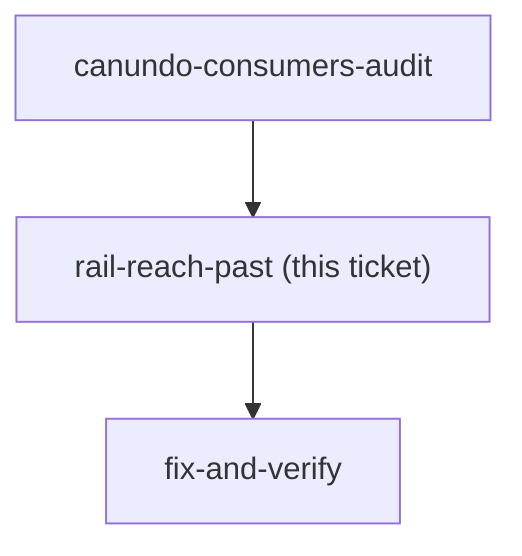

## Question

`latestUndoable` takes the newest row with `!isUndone && canUndo`. Today `canUndo` means only
"the Envelope still exists", so the rail arms on the newest change in the family. The moment
ownership moves into that flag, the rail **skips** a colleague's newer change and arms on the
member's own older one — silently, with no indication that anything was passed over.

Concretely, in a two-member family: มาลี assigns ฿500 an hour ago, I assigned ฿300 yesterday.
I press the rail's Undo expecting to reverse "the last thing", and I reverse yesterday's ฿300.

The issue treats this as the fix working correctly — *"`latestUndoable` / `latestRedoable`
then need no change"* — which is true of the code and undecided as behaviour. Choose:

- **Reach past** (what the fix does for free): the rail always undoes the newest thing *I* may
  undo. Never fails, never explains, occasionally reverses something surprisingly old.
- **Stop at the newest row**: the rail's Undo is disabled, or refuses on press, whenever the
  newest change is not mine. Honest about what "undo" means, but the rail goes dark whenever a
  colleague is active — which in a two-person family is often.
- **Reach past, but say so**: the rail arms on my older row and the press names what it did
  (*"ยกเลิก: ใส่ ฿300 เข้า ค่ากิน"*). Costs a surface the budget page does not have — there is no
  shared toast system in this app.

<!-- decision-map:graph:start -->

<!-- decision-map:graph:end -->

## Why menunest-197's accepted rough edge does not already cover this

menunest-197 accepted on the record that the rail's Undo "can look pressable and then refuse",
because making it look dead would mean the budget page carrying the top history row's state.
That acceptance was priced against a case the ADR called **rare** — it needs create-Envelope,
assign and delete-Envelope inside seven days and one month.

The permission case is not rare. In a two-member family roughly half the rows are somebody
else's. Whatever menunest-197 bought, it did not buy this, and re-using its reasoning without
saying so would be inheriting a price that was quoted for a different thing.

## The one asymmetry worth putting plainly

The head is unaffected either way: every row is theirs to undo, so the rail behaves for them
exactly as it does today. This decision only ever changes what an **ordinary member** gets.
There is no option here that makes the two experiences the same.

## Evidence

- `latestUndoable.ts:12` — `rows.find(r => !r.isUndone && r.canUndo)`
- `latestUndoable.ts:17` — the same shape for redo
- `BudgetPage.tsx:41-42` — both targets computed on every render from the same query the sheet
  uses, so the page already has the data to do any of the three options
- `latestUndoable.ts` doc comment — records that skipping a `canUndo:false` row was a
  deliberate menunest-197 choice, written when the only skippable row was a dead one
- menunest-197, "The check is deliberately asymmetric" — the accepted rough edge and its
  stated price
- There is no toast system: `docs/decision-map/trip-crud-50/tickets/delete-ux.md` records
  *"there is no shared toast system"* as the reason a delete gets no confirmation message
