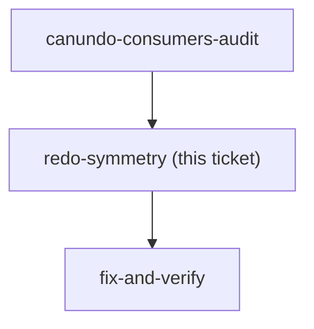

## Question

`BudgetChangeDto` carries one flag, `CanUndo`, and `ChangeHistorySheet` disables **both** the
ยกเลิก and the ทำซ้ำ button on it. So whatever this fix puts in that flag lands on redo too,
whether or not anyone chose it.

That matters because of a case that is **live today** and that the fix will leave as the one
cross-member control still enabled:

> The head undoes my change. The row's `UserId` is still mine, so it stays `canUndo: true`.
> I press ทำซ้ำ. `RedoChangeHandler`'s own check passes — it is my change. The head presses
> ยกเลิก again.

menunest-201 gave the head exactly one power and never said whether that power survives a
redo. Decide:

1. **Does the head's undo stick?** Either it does — a row the head undid is not redoable by
   its author, only by the head — or it does not, and undo/redo between two people is a
   contest the app declines to arbitrate. (A third reading: it sticks *once*, which nothing in
   the model can express today.)
2. **Does the flag split?** If undo and redo ever differ, `CanUndo` must become `CanUndo` +
   `CanRedo` with two reasons, and `latestRedoable` stops reading the undo flag. If they never
   differ, the flag stays single and the DTO comment must say so, because the next reader will
   otherwise assume it was an oversight.

<!-- decision-map:graph:start -->

<!-- decision-map:graph:end -->

## What makes this worth a ticket rather than an implementation detail

It is not a new defect — an ordinary member can redo the head's undo in prod right now. The
fix does not create it. What the fix does is **remove everything around it**: once the other
enabled controls on foreign rows go dark, this becomes the single place where two members'
authority visibly collides, on a row the sheet has just finished labelling as somebody's.

Deciding it as a side effect of "which boolean goes on the DTO" is how it would get decided by
default.

## Evidence

- `BudgetChangeDto.cs` — one flag, `CanUndo`, one reason, `BlockedReason`; no `CanRedo`
- `ChangeHistorySheet.tsx:71` and `:79` — `disabled={!r.canUndo || busy}` on both buttons
- `latestUndoable.ts:17` — `latestRedoable` filters on `canUndo`
- `RedoChangeHandler.cs:34-43` — the same ownership-or-head check as undo, with its own
  message *"You can only redo your own changes."*
- `RedoChangeHandler` class comment — the near-duplication of `UndoChangeHandler` is
  deliberate, "the two are short, and the duplication reads more clearly than the abstraction"
- menunest-201 — the head has exactly one power plus handing the role over
- menunest-198 — undoing someone else's act "removes it from the current state, needs
  authority"; a redo restores it, which the ADR does not address
- `UndoChangeHandler.cs:52-75` — the author is push-notified when someone else undoes their
  work. There is no equivalent notice when someone redoes over the head, which the answer here
  may or may not want to change.
