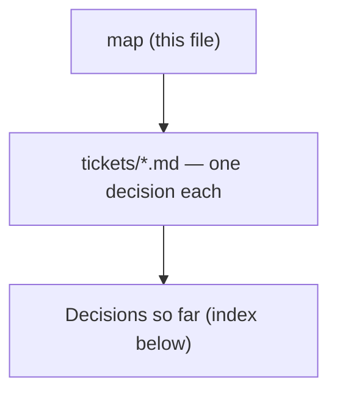

# Decision map - build the MenuNest writing-practice feature

## Destination
The writing-practice feature (7-min timer freewrite, AI correction via Claude Code over MCP, progress screen with 7-day pooled numbers and a monthly old-vs-new text comparison) is built, deployed, and usable end-to-end from the writer's personal phone, matching the specs already resolved in the learn-writing-english decision map at C:/Repo2/learn/writing english/docs/decision-map/learn-writing-english.

## Notes
Source map: learn-writing-english (home-and-tooling, daily-unit, feedback-rubric, habit-mechanics, progress-signal). Approved UI mockup: Claude Design project 'MenuNest design system', group Screens, card writing-practice-critique-loop (three frames: เขียน / ผลตรวจ / ความคืบหน้า). AI critique loop is AI-only, returns evidence never judgement, per feedback-rubric's forbidden list. Once this map's frontier is empty, hand off to grill-then-plan / writing-plans for the actual build.

## Decisions so far

<!-- decision-map:decisions:start -->
- [Correction invocation - how does the AI correction actually run?](tickets/ai-correction-invocation.md) — Correction runs via the writer's personal Claude Code over MCP, reusing the Trip-tools OAuth-proxy pattern -- no new LLM key inside MenuNest's server.
- [Done-day redefinition - does 'done' still require reading the correction the same night?](tickets/done-day-redefinition.md) — The 7-minute timer alone counts as done for this build; correction is decoupled and can happen whenever, superseding habit-mechanics' same-night pairing for this implementation.
- [Entry mutability - can a writer edit or delete a past freewrite entry after submission?](tickets/entry-mutability.md) — Full CRUD via a new History screen: entries are editable/deletable; a correction locks the text (entry still deletable); delete is soft so the monthly comparison can still read it.
- [MCP tool contract - what does the WritingTools MCP class expose?](tickets/mcp-tool-contract.md) — WritingTools exposes 4 MCP tools -- list_pending_writing_entries, get_active_target_rule, set_active_target_rule, record_writing_correction; entry creation stays in-app, never MCP.
- [One-tap access - does the build do anything about notification capture at unlock?](tickets/one-tap-access.md) — Nothing extra for v1 -- a normal page in MenuNest's existing nav; the notification-capture risk from habit-mechanics stays accepted and unsolved.
- [Target-rule rotation - who flips the monthly target grammar rule?](tickets/rule-rotation.md) — The writer flips the active target grammar rule by hand -- not an automatic calendar rotation.
- [Timer resilience - what happens to the 7-minute countdown on screen-lock or app-switch?](tickets/timer-resilience.md) — The 7-minute timer is wall-clock based and keeps running through screen-lock or app-switch; it does not pause.
<!-- decision-map:decisions:end -->

## Not yet specified

<!-- decision-map:fog:start -->
- Draft autosave/crash-recovery for the 7-minute freewrite if the phone locks hard, the browser crashes, or the battery dies mid-session - not addressed anywhere yet.
- Restoring (undo) a soft-deleted writing entry -- entry-mutability (ADR-169) only decided that delete is soft; no UI or mechanism for bringing a deleted entry back was discussed.
<!-- decision-map:fog:end -->

## Out of scope

<!-- decision-map:scope:start -->
- Path A - MenuNest's own backend calling an LLM API server-side for the correction step. Rejected in favour of Path B (Claude Code over MCP, reusing the existing Trip-tools OAuth-proxy pattern).
- Measuring work English (specs, PRs, tickets, chat) inside this feature - progress-signal already declined this ('not to measure work, just focus on correctness first'); the daily rep stays family freewrite only.
- Any streak counter or numeric goal on the progress screen - explicitly forbidden by feedback-rubric and progress-signal.
- A human reviewer or tutor entering the loop - feedback is AI-only by the writer's choice.
<!-- decision-map:scope:end -->
