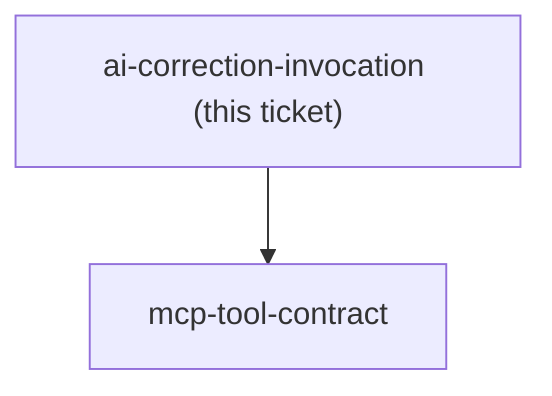
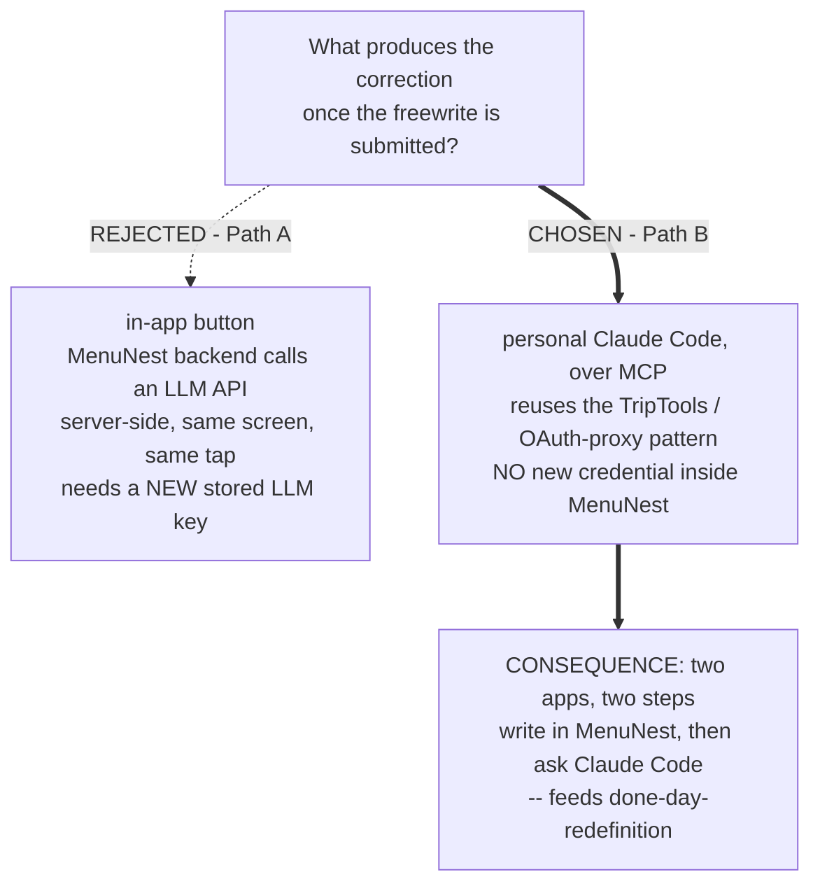

<!-- decision-map:graph:start -->

<!-- decision-map:graph:end -->

## Question

Once the 7-minute freewrite is submitted in the new MenuNest page, what produces the correction - MenuNest's backend calling an LLM API server-side (Path A), or the writer's personal Claude Code calling MCP tools MenuNest exposes (Path B)?

<!-- decision-map:resolution:start -->
## Resolution

Correction runs via the writer's personal Claude Code over MCP, reusing the Trip-tools OAuth-proxy pattern -- no new LLM key inside MenuNest's server.

# Correction invocation

**Chosen: Path B.** The writer submits the 7-minute freewrite in the new MenuNest page; the
page stores the entry and nothing else happens there. The correction step runs later, via the
writer's personal Claude Code (mobile) calling MCP tools MenuNest exposes - reusing the same
OAuth-proxy / MCP pattern already built for the Trip tools (`MenuNest.McpServer`, `TripTools`).

## The trade-off, as put to the writer

- **Path A (rejected)** - an in-app button, MenuNest's own backend calls an LLM API
  server-side, same screen, same tap. Simpler UX, but needs a new stored LLM credential inside
  MenuNest and a brand-new server-side integration.
- **Path B (chosen)** - two apps, two steps (write in MenuNest, then ask Claude Code to
  correct), but no new credential to manage and it reuses infrastructure that already exists
  and already works for Trips.

## Consequence

No new LLM API key/secret needed inside MenuNest's backend. A new `WritingTools` MCP class is
now required (see `mcp-tool-contract`). The two-step flow directly caused the follow-up
question resolved on `done-day-redefinition`.

## His answer

"b" - Path B, over MCP.

<!-- decision-map:resolution:end -->
