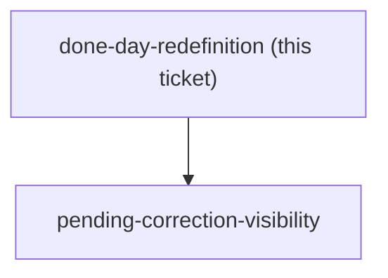
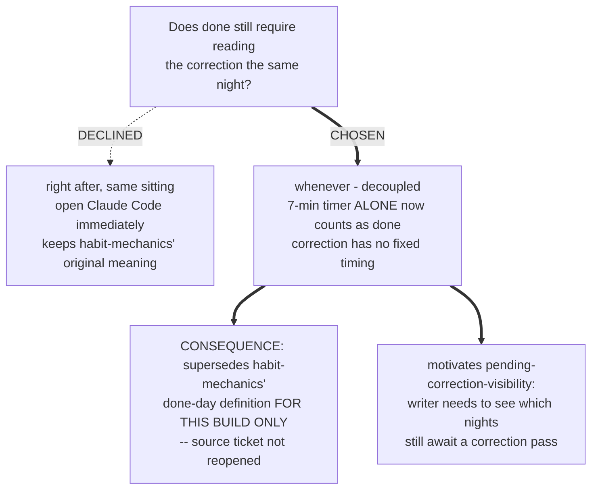

<!-- decision-map:graph:start -->

<!-- decision-map:graph:end -->

## Question

habit-mechanics defined a done day as the 7-minute timer plus reading the correction, same night, one ~12-minute sitting. With correction now a separate Claude Code/MCP step (ai-correction-invocation), does that same-night pairing still hold, or does the 7-minute timer alone now count as done?

<!-- decision-map:resolution:start -->
## Resolution

The 7-minute timer alone counts as done for this build; correction is decoupled and can happen whenever, superseding habit-mechanics' same-night pairing for this implementation.

Detail: docs/adr/173-the-seven-minute-timer-alone-makes-a-night-done-the-correction-is-decoupled.md

# Done-day redefinition

**Chosen: the 7-minute timer alone counts as done.** With correction moved to a separate
Claude Code / MCP step (`ai-correction-invocation`), the same-night ~12-minute pairing
`habit-mechanics` originally defined no longer holds for this build. Reading the correction
becomes a separate step with no fixed timing - it can happen right after writing, later that
night, or on a different day entirely.

## The trade-off, as put to the writer

- **Right after, same sitting (recommended)** - open Claude Code immediately after writing;
  still one ~12-minute block spanning two apps; keeps `habit-mechanics`' original meaning of
  "done" unchanged.
- **Whenever - decoupled (chosen)** - writing and correcting become two separate events that
  can land on different nights; "done" needed a new, narrower definition.

## Consequence

This supersedes `habit-mechanics`' done-day definition **for this implementation only** - the
source map ticket itself is not reopened or edited. It also directly motivates
`pending-correction-visibility`: if correction can lag arbitrarily, the writer needs some way
to see which nights are still waiting for one.

## His answer

"if user do 7 minutes [that] count as done" - the timer alone is done; correction is decoupled.

<!-- decision-map:resolution:end -->
