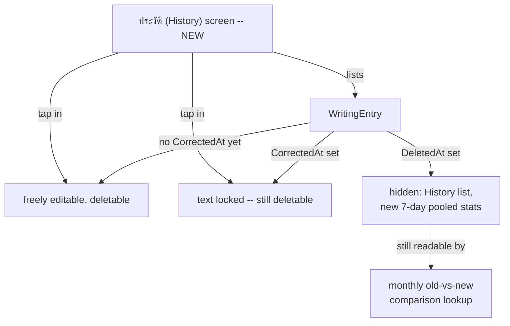

<!-- decision-map:graph:start -->

<!-- decision-map:graph:end -->

## Question

Once a 7-minute freewrite entry is submitted, can the writer edit its text or delete it entirely from the entries list -- and if so, does that reach back into an already-recorded AI correction and the 7-day/monthly progress numbers built from it?

<!-- decision-map:resolution:start -->
## Resolution

Full CRUD via a new History screen: entries are editable/deletable; a correction locks the text (entry still deletable); delete is soft so the monthly comparison can still read it.

Detail: docs/adr/169-a-corrected-entry-locks-a-deleted-entry-soft-deletes.md

A new "ประวัติ" (History) screen lists every past `WritingEntry` so the writer can open, edit or
delete any night -- the CRUD gap the user flagged directly ("มันไม่ครบ crud นะ ใช้งานยาก"): Phase 1
shipped create-only with no way to even *see* a past entry, let alone fix or remove one.

Two sub-decisions carry real trade-offs and are recorded in
[ADR-169](../../../adr/169-a-corrected-entry-locks-a-deleted-entry-soft-deletes.md):

1. **Edit locks once corrected.** An entry with no `CorrectedAt` yet is freely editable. The moment
   an AI correction is recorded, its `Text` becomes read-only -- the correction described specific
   text, and letting that text drift under it would make the recorded `HitCount`/`MissCount` lie.
   The entry can still be deleted outright even after correction.
2. **Delete is soft, not hard.** A deleted entry is hidden from the History list and from every
   stats computation from that point forward (including the current 7-day pooled window), but the
   row stays in the database rather than being physically removed -- because `progress-signal`
   (learn-writing-english) needs "text from 4 weeks ago beside tonight's" for the monthly
   comparison, and a hard-deleted night would leave that comparison with a permanent hole for
   whichever month the rotation landed on.

User's confirming answers, in order:
- "เต็มรูปแบบ: มีหน้า \"ประวัติ\" list ทุกคืน กดเข้าไปอ่าน/แก้/ลบได้ทุกอัน"
- "ตรวจแล้ว = ล็อกข้อความ แก้ต่อไม่ได้ (ลบทิ้งทั้ง entry ได้)"
- "ซ่อนเฉยๆ (ซ่อนจากประวัติ/สถิติใหม่ แต่เก็บเผื่อเพื่อ compare เดือนถัดไปได้)"

Not decided here (left open, not fog on the map -- see ADR-169 Consequences): whether a
soft-deleted entry can ever be restored. No UI for it was discussed.

<!-- decision-map:resolution:end -->
