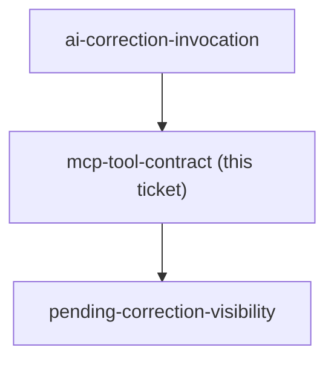
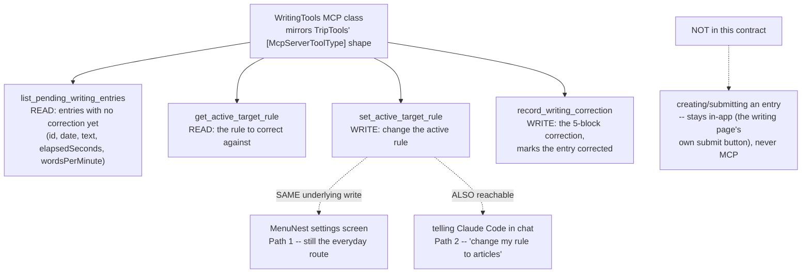

<!-- decision-map:graph:start -->

<!-- decision-map:graph:end -->

## Question

What MCP tools does a new WritingTools class (mirroring the existing TripTools pattern) expose for the writing-practice feature - submit/fetch today's entry, record a correction, get/set the active target rule - and what fields does each carry (date, text, elapsed seconds, target rule, hit/miss counts, bracketed stuck-words, words-per-minute)?

<!-- decision-map:resolution:start -->
## Resolution

WritingTools exposes 4 MCP tools -- list_pending_writing_entries, get_active_target_rule, set_active_target_rule, record_writing_correction; entry creation stays in-app, never MCP.

# WritingTools MCP contract

**Four tools, mirroring the existing `TripTools` shape** (`[McpServerToolType]` class,
thin `[McpServerTool]` methods delegating to `IMediator` commands/queries). Entry
creation itself is **not** part of this contract — the writer submits tonight's freewrite
through the MenuNest page's own submit button, not through MCP. MCP only carries the
correction step (`ai-correction-invocation`, Path B).

## 1. `list_pending_writing_entries` (read)

Returns every entry with no correction yet: `{ id, date, text, elapsedSeconds,
wordsPerMinute }`. This is how Claude Code finds *what* needs correcting without the
writer naming a date — it answers "did I write anything since the last correction?"

## 2. `get_active_target_rule` (read)

Returns the currently active target grammar rule (e.g. "third-person singular -s"),
so Claude Code knows what to grade against.

## 3. `set_active_target_rule` (write)

Changes the active rule. **Reachable two ways, both writing the same underlying
value:**
- the writer's normal route — a setting on the MenuNest app itself (a settings/progress
  screen control), and
- telling Claude Code directly in chat ("change my target rule to articles"), which
  calls this tool.

Both are kept, per the writer's own answer: Path 1 (in-app) stays the everyday route,
Path 2 (via Claude Code/MCP) is also wired up rather than left out.

## 4. `record_writing_correction` (write)

One combined call carrying everything the critique loop produces for one entry:
- `markedText` — the original text with the target rule's instances marked in place
  (hit or miss), every other word untouched
- `hitCount` / `missCount` — counted mechanically against the one target rule
- `thaiWhyLine` — one line in Thai explaining why the rule holds
- `sentenceCombiningItems` — 3-4 items built from the writer's own sentences that day
- `stuckWords` — the bracketed Thai words he got stuck on, each translated to English

Marks the entry corrected (sets a `correctedAt` timestamp), which is exactly the fact
`pending-correction-visibility` needs to tell a corrected night from a still-waiting one.

Words-per-minute and target-errors-per-100-words are **not** separate tool inputs —
MenuNest already has `elapsedSeconds` and the text at submit time, and computes both
numbers itself from what this call provides (hit/miss + word count).

## Confirming exchange

| Question | His answer |
|---|---|
| Where do you change the target rule — in the app, or by telling Claude Code? | "1 but can tell claude with mcp" — the app stays primary, but the MCP path is wired up too |

<!-- decision-map:resolution:end -->
