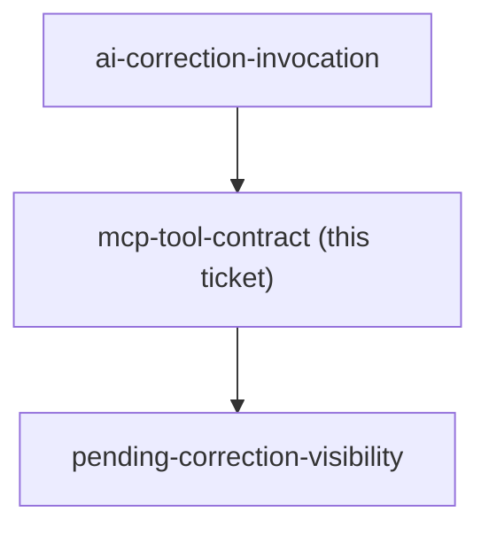

<!-- decision-map:graph:start -->

<!-- decision-map:graph:end -->

## Question

What MCP tools does a new WritingTools class (mirroring the existing TripTools pattern) expose for the writing-practice feature - submit/fetch today's entry, record a correction, get/set the active target rule - and what fields does each carry (date, text, elapsed seconds, target rule, hit/miss counts, bracketed stuck-words, words-per-minute)?
